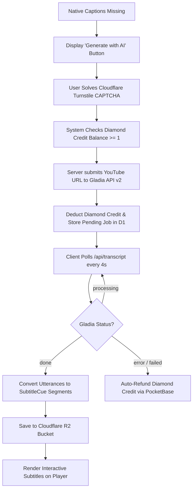

# Feature Specifications & Deep Dive

This document details the functional specifications, algorithms, and business logic governing each major feature in **Voca** (formerly LinguaTube).

---

## 1. Universal Video Player & Controls

### 1.1. URL Ingestion & Parsing
Voca accepts arbitrary YouTube video URLs:
- Standard: `https://www.youtube.com/watch?v=VIDEO_ID`
- Shortened: `https://youtu.be/VIDEO_ID`
- Embedded: `https://www.youtube.com/embed/VIDEO_ID`
- Timestamped URLs (`?t=120s`) automatically seek to the start offset.

### 1.2. Playback Architecture
- Powered by `YoutubeService`, wrapping the official YouTube IFrame Player API.
- Custom UI overlay replaces default YouTube player chrome, eliminating clutter and visual distractions.
- **Auto-Pause on Hover / Click**:
  When a user hovers over or clicks an interactive subtitle word to inspect its definition, video playback pauses automatically to prevent the learner from falling behind.

### 1.3. Controls & Interaction Matrix
| Action | Desktop Shortcut | Mobile Gesture | UI Element |
| :--- | :--- | :--- | :--- |
| **Toggle Controls Overlay** | — | Single Tap (0ms dismiss when open) | Video container overlay |
| **Play / Pause** | `Space` or `k` | Single Tap Center Button | Center Play/Pause button |
| **Seek $\pm 10$s** | `j` / `l` or Arrows | Double Tap Left / Right Wings | Cumulative pill (`+10s, +20s`) & ripple |
| **Scrubbing Preview** | Hover progress bar | Horizontal Swipe Drag | OSD time delta pill (`-0:15 / 1:45`) |
| **2x Speed Fast-Forward** | — | Long-Press & Hold | OSD "2x Speed" indicator pill |
| **Volume Up / Down** | `Up` / `Down` arrows | Swipe Up / Down (Right side) | Bottom bar volume slider |
| **Toggle Subtitles** | `c` | Tap CC Button | CC button in bottom bar |
| **Toggle Dual Subtitles** | — | Tap Languages Button | Languages button in bottom bar |
| **Dual Sub Menu** | Right-click Dual Sub | Long-Press Dual Sub Button | Quick language picker modal with circle flags |
| **Toggle Fullscreen** | `f` | Pinch Out / Rotate | Bottom bar fullscreen button |
| **Playback Speed** | `Shift` + `<` / `>` | — | Speed dropdown (0.5x – 2x) |

### 1.4. Draggable Fullscreen Subtitles
When in fullscreen mode, subtitles are rendered in `FullscreenSubtitleComponent`:
- **Computed `viewTokens` Pre-computation**: Subtitle tokens, reading annotations, display text, and vocabulary mastery levels are pre-calculated in a single `viewTokens = computed(...)` signal per cue change. This eliminates repeated O(N) vocabulary repository method calls and grammar index scans in `@for` template loops during 60fps fullscreen video playback.
- **Centered Drag Handle Bar**: A horizontal pill handle bar allows users to drag subtitles to any vertical position (`--sub-y: 8%` to `85%`).
- **Smooth Pointer Capture**: Uses `PointerEvent` tracking with `requestAnimationFrame` updates to ensure 60fps responsiveness across mobile and desktop.
- **Magnetic Snap Points**:
  - Dragging near the top snaps smoothly to `12%`.
  - Dragging near the bottom snaps to `82%`.
  - Tapping without dragging automatically toggles between top and bottom.

---

## 2. Interactive Subtitles & Tokenization Engine

### 2.1. Sticky Subtitle Synchronization Algorithm
Standard subtitle displays flicker or disappear during small natural pauses in speech. Voca implements a **Sticky Subtitle** algorithm:
1. Performs an $O(\log n)$ binary search (`findActiveCue`) to find the cue matching `currentTime`.
2. If no active cue matches (e.g. speech gap), `findStickyCue` locates the most recent ended cue within a $0.1$s tolerance window.
3. The cue remains visible until the next subtitle segment begins or playback advances beyond a maximum threshold.

### 2.2. Morphological Tokenization & Phonetics
Subtitles are segmented into interactive tokens using language-specific NLP:
- **Japanese (`ja`)**:
  - Analyzed by `@patdx/kuromoji` using IPAdic dictionaries loaded on demand via CDN.
  - Generates token surface forms, base dictionary forms, parts of speech, and Hiragana readings.
  - **5 Reading Display Modes**:
    1. `native`: Clean Japanese script.
    2. `annotated`: Ruby Furigana (`<ruby>漢<rt>かん</rt></ruby>`).
    3. `reading`: Kana reading only.
    4. `annotatedRomanized`: Kanji with Hepburn Romaji annotations.
    5. `romanized`: Hepburn Romaji only.
  - **Height & Baseline Alignment (Zero-Shift Ruby)**: When reading annotations are enabled, words without reading text (e.g. kana-only words, English words, numbers, or unannotated kanji) are wrapped in `<ruby>` with an invisible spacer `<rt class="rt-empty">&#160;</rt>`. This guarantees 100% identical card height and uniform baseline alignment across all words in the sentence, eliminating jagged jumps.
- **Chinese (`zh`)**:
  - Segmented using `Intl.Segmenter('zh', { granularity: 'word' })`.
  - Pinyin annotations generated via `pinyin-pro` with tone diacritics (e.g. `nǐ hǎo`).
- **Korean (`ko`)**:
  - Space-delimited and segment-analyzed via `Intl.Segmenter('ko')`.
  - Romanization computed using `hangul-romanization`.
- **English (`en`)**:
  - Segmented into word tokens and punctuation boundaries via `Intl.Segmenter('en')`.
- **Client Fallback Tokenizer**:
  - If network requests to backend tokenization endpoints fail or operate offline, `SubtitleService` employs a robust fallback tokenizer powered by native ECMAScript `Intl.Segmenter('zh')` and `Intl.Segmenter('ko')` to produce proper multi-character word tokens rather than crude single-character splits.

### 2.3. Subtitle Customization & Vocabulary Highlighting
- **Four Size Modes**: `small`, `medium`, `large`, and `xlarge`, dynamically responsive across mobile, tablet, and desktop layouts.
- **Vocabulary Mastery Indicators**: Interactive subtitle words reflect mastery state (`word--new`, `word--learning`, `word--known`) in both standard list/banner and fullscreen overlays.
- **Auto-Scroll & Manual Override**: Active cue autoscrolling pauses during user interaction (3s debounce) to ensure smooth browsing of full transcripts.

---

## 3. Gladia AI Transcription Fallback

When a YouTube video lacks native captions in the learner's target language:



- **SSRF Hardening**: The polling endpoint validates that all `result_url` inputs match `https://api.gladia.io/` strictly.
- **Duration Limits**: Restricted to videos $\le 20$ minutes.
- **Automated Failure Refund**: If Gladia job execution fails or errors out during transcription, the server immediately triggers `refundDiamond()`, returning the deducted Diamond credit back to the user without manual support intervention.
- **Cost Scaling**:
  - $\le 10$ minutes: **1 Diamond credit**
  - $> 10$ minutes (up to 20 mins): **2 Diamond credits**

---

## 4. Dual-Language Subtitles

- Displays the **learning language** on top and the learner's **target translation language** underneath.
- **Supported Target Languages**: English (`en`), Vietnamese (`vi`), Japanese (`ja`), Korean (`ko`), Chinese (`zh`).
- **Quick Selection Menu**: Right-click the dual-sub button or open player settings to select target translation language with high-fidelity circle flag SVGs.
- **Batch Translation Engine**: Subtitle texts are chunked into batches of 25 segments and translated via Lingva / Google Translate GTX to avoid Cloudflare 25-second serverless timeout aborts.
- **Quality Assurance**: If $< 80\%$ of segments translate successfully, caching is refused to prevent bad data persistence.
- **Permanent Caching**: Successful translations are saved to Cloudflare R2 (`translations/{videoId}/{sourceLang}_{targetLang}.json`) and indexed in D1.

---

## 5. Multi-Source Hybrid Dictionary

When a learner clicks any subtitle word token, `DictionaryService` queries `/api/dict`:

```
                 ┌────────────────────────────────┐
                 │       LEARNER CLICKS WORD      │
                 └───────────────┬────────────────┘
                                 │
                      Query /api/dict Endpoint
                                 │
      ┌──────────────────────────┼──────────────────────────┐
      ▼                          ▼                          ▼
 [ JAPANESE ]               [ CHINESE ]                [ KOREAN ]
 Jotoba API (primary)       MDBG Scraper               Naver Dict EnKo / KoVi
 Jisho.org (fallback)       Glosbe Chinese-Vietnamese  KRDict (National Inst)
 Mazii (Vietnamese)
      │                          │                          │
      └──────────────────────────┼──────────────────────────┘
                                 │
                    No Direct Bilingual Match?
                                 ▼
                 English Definitions + Google GTX Fallback
                                 ▼
                     Normalized DictionaryEntry
```

- **Authentic Dictionary Pronunciation**: Rather than using synthetic browser Web Speech API (`speechSynthesis`), audio is sourced directly from authentic native recordings from upstream dictionary providers (Naver, Mazii, FreeDictionary, Jotoba, KRDict).
- **Context-Aware CJK Kanji Detection**: When inspecting pure ideographs (`\u4E00-\u9FFF` without Kana or Hangul), `DictionaryService.detectLanguage()` checks the user's active learning language (`settings.language`) so Japanese learners query Japanese dictionaries (Jotoba/Mazii) rather than erroneously defaulting to Chinese dictionaries.
- **Isolated Screen State**: Standalone dictionary searches are decoupled from in-video subtitle clicks, ensuring subtitle queries never leak into or overwrite standalone search history or panels.
- **Multi-Entry Disambiguation**: When queries match multiple dictionary entries or homonyms, tabbed selectors allow learners to explore all matching entries.
- **Integrated Grammar Detection**: Searching words or grammatical stems also queries `GrammarService` to surface relevant grammar patterns, formation rules, and example sentences directly beneath definitions.
- **Word Popup UI**: Positioned next to clicked subtitle words with part of speech tags, definitions, language switcher, and direct save-to-vocab action.
- **Negative Caching**: Empty results are cached in an in-memory `Set` to prevent hammering external dictionary APIs.
- **Persistence**: Results cached in Cloudflare KV for 7 days, with language-scoped local search history (`linguatube_recent_searches_${lang}`).

---

## 6. Grammar Pattern Detection Engine

`GrammarService` continuously inspects tokenized sentences to identify grammatical constructions:
- **Language Coverage**:
  - **Japanese**: 1,000+ patterns across JLPT N5 through N1 (`grammar-ja.ts`).
  - **Korean**: TOPIK I and II grammar structures (`grammar-ko.ts`).
  - **Chinese**: HSK 1 through 6 grammar patterns (`grammar-zh.ts`).
  - **English**: CEFR A1 through C2 grammar rules (`grammar-en.ts`).
- **Split Pattern Handling**:
  Recognizes split correlative pairs (e.g. `虽然...但是...`, `not only...but also...`, `either...or...`).
- **Dynamic Translation Packs**:
  Grammar definitions are translated across 16 combinations (JA, KO, ZH, EN into VI, ZH, KO, JA) plus native-to-native explanations (`ja_ja`, `ko_ko`, `zh_zh`).

---

## 7. Spaced Repetition (SRS) Vocabulary Notebook

Saved vocabulary items follow the **SuperMemo-2 (SM-2)** algorithm, enhanced with sentence mining, audio pronunciation, and authentic video immersion.

### 7.1. SM-2 Algorithm Formulation & Interval Previews
When a user reviews a flashcard and provides a recall quality score $q \in [0, 5]$:

1. **Repetitions & Interval ($I$)**:
   $$\text{If } q < 3: \quad \text{repetitions} = 0, \quad I = 0 \text{ days} \ (\text{immediate recycle}), \quad \text{status} = \text{new}$$
   $$\text{If } q \ge 3: \quad \begin{cases} I_1 = 1 \text{ day} & \text{if repetitions} = 0 \\ I_2 = 6 \text{ days} & \text{if repetitions} = 1 \\ I_n = \lceil I_{n-1} \times EF \rceil & \text{if repetitions} \ge 2 \end{cases}$$

2. **Ease Factor ($EF$)**:
   $$EF' = \max(1.3, \; EF + (0.1 - (5 - q) \times (0.08 + (5 - q) \times 0.02)))$$

3. **Status Transitions**:
   - `new` $\rightarrow$ `learning` on first successful recall ($q \ge 3$).
   - `learning` $\rightarrow$ `known` once `repetitions >= 3`.

4. **Interval Preview Badges on Buttons**:
   - Using `calculateSRSPreview()`, answer buttons preview their exact calculated schedule in real time:
     - **Again (1)**: `<10m`
     - **Hard (2)**: `1d`
     - **Good (3)**: e.g. `3d` or `6d`
     - **Easy (4)**: e.g. `6d` or `2w`

### 7.2. Session Queue Recycling (Zero Forgotten Cards)
To guarantee true memory retention, cards rated "Again" ($q < 3$) are **re-queued at the end of the current session**. The session only concludes when all cards have been successfully recalled, eliminating the frustration of ending a session with failed items left unreinforced. A "Review Missed" button is also provided on the completion screen for rapid second-pass review.

### 7.3. Authentic Video Scene Jump
Every mined card captures `sourceSentence`, `sourceVideoId`, and `sourceTimestamp`. While studying, learners can tap **`[▶ Watch Scene]`** (or press key `V`) to jump directly to the exact millisecond in the authentic YouTube video where the phrase occurred.

### 7.4. Reading Spoiler Prevention & Peek Mode
To prevent passive phonetic cheating during Kanji/Hanzi recall, furigana and pinyin are **strictly hidden on the front of flashcards by default**, even if globally enabled for video subtitles. Learners who are stuck can click a subtle **"Peek reading"** button (or press `P`) for temporary assistance, while the answer face displays the full phonetic reading alongside the definitions.

### 7.5. Cloze Deletion (Fill-in-the-Blank) Sentence Practice
When "Cloze Mode" is toggled, the focus word is masked inside the context sentence (`【 ... 】`) on the front of the card. Learners recall the word from its sentence context rather than as an isolated vocabulary token.

### 7.6. Audio Auto-Play on Reveal
Learners can enable "Auto-play audio" in study settings to have authentic dictionary or TTS audio automatically trigger the moment a flashcard is flipped, training auditory comprehension concurrently with visual recall.

### 7.7. Desktop Live Session Dashboard & Keyboard Ergonomics
- **Live Sidebar Monitor**: During active study, the desktop sidebar dynamically morphs into an active session monitor displaying cards remaining in queue, live accuracy percentage, elapsed time, and a keyboard shortcuts cheat-sheet (`Space` to flip, `1-4` to grade, `R` to replay audio, `P` to peek, `V` to open scene).
- **Mobile Swipe Physics**: Enhanced swipe gestures with rotation physics and watermark feedback tags (red "Again" on left swipe, green "Good" on right swipe).

### 7.8. Streamlined Architecture & Memory Optimizations
- **Shared Reactive State**: Daily goal progress (`goalProgress`) and due-card count calculations (`getDueCountByLanguage`) are unified in `VocabularyService`, eliminating duplicate filter closures between study components and sidebars.
- **Zero-Wrapper Card Queue**: The study queue directly processes `VocabularyItem` arrays without wrapper object allocations during session initialization, failed-card recycling, or missed-card re-study.
- **Full Metadata Undo Restoration**: When a user undoes a word deletion from the notebook, all captured sentence context, audio references, source video ID, and timestamp offsets are restored without data loss.

---

## 8. Gamified Streaks & Freeze Inventory

- **Daily Tracking**: Practicing (watching videos, completing flashcard reviews) records an activity entry for the current UTC date.
- **Streak Freezes**:
  - Users have an inventory of up to 2 Streak Freezes.
  - If a user misses exactly 1 day, a freeze is consumed automatically to protect their streak.
  - Milestones at 7, 30, and 100 days reward an extra streak freeze.
- **PocketBase Server Cron (`streaks.pb.js`)**:
  A server-side webhook checks active streaks daily, consuming freezes or resetting streaks if inactive for $>1$ day.

---

## 9. Playlist & Study Queue Architecture

- **Multi-Source Playlists**: Supports user-created custom playlists, curated Community Playlists (e.g., JLPT/TOPIK/HSK listening collections), and PocketBase cloud sync.
- **Responsive Video Screen Presentation**:
  - **Desktop Unified Sidebar (`.unified-sidebar`)**: Houses a segmented control tab switcher toggling between `Playlist (N)` and `Vocabulary (N)`. Uses `.hidden` styling instead of template recreation to eliminate layout shifts when switching tabs. When a playlist has only 1 video, the playlist tab is retained on desktop to allow playlist management (editing, sharing, closing, or navigating).
  - **Mobile Playlist Bar (`.mobile-playlist-card`) & YouTube-Style Bottom Sheet**:
    - Sits directly below the video player as a sleek, non-expanding compact bar (~48px) displaying playlist title, author, index/total, and quick action buttons (Share, Loop, Shuffle, Chevron).
    - **Zero Layout Shift (0% CLS)**: Tapping the bar or chevron opens a modal `<app-bottom-sheet>` instead of expanding in-flow. The video player and subtitles beneath it remain stationary and completely undisturbed.
    - Inside the bottom sheet, the user can reorder videos (cdkDrag if owner), switch videos, toggle loop/shuffle, share, or open individual video options. Selecting a video automatically closes the sheet and navigates to the video.
  - **Navigation Guarding**: Playlist previous (`canPlayPrev`) and next (`canPlayNext`) actions are disabled when `videos.length <= 1` (unless playlist loop mode is toggled), preventing dead interactions.
- **Server-Side Recommendation Engine ("Dành cho bạn" / "For You")**:
  - Automatically queries PocketBase with targeted server-side filtering (`visibility="published" && language="${lang}" && video_count >= 2`).
  - Ranked on the server by `-is_featured, -save_count, -updated` to prioritize curated and popular community content while filtering out single-video test spam.
  - Automatically re-fetches when learning language changes and caches results in memory per language.
  - Falls back to `video_count >= 1` if a new language does not yet have multi-video collections.

---

## 10. Search Engine Optimization (SEO) & Web Discovery Architecture

- **Root Metadata & Social Protocol**:
  - `src/index.html` implements Open Graph (`og:type`, `og:title`, `og:description`, `og:image`, `og:locale`, alternate locales) and Twitter Cards (`summary_large_image`).
  - Embeds Schema.org JSON-LD structured data for `WebApplication` and `EducationalApplication`, enumerating supported languages, interactive subtitle capabilities, and free tier offers.
  - Canonical URL `<link rel="canonical">` points to `https://lingua-tube.pages.dev`.
- **Search Engine Discovery Assets**:
  - `public/robots.txt`: Explicitly permits search crawlers on learning routes (`/video`, `/dictionary`, `/study`, `/explore`, `/history`) while restricting internal serverless functions (`/api/`, `/proxy/`).
  - `public/sitemap.xml`: Declares priority and change frequencies for all public views, with `xhtml:link` multi-language `hreflang` alternates (`en`, `vi`, `ja`, `ko`, `zh`, and `x-default`).
  - `public/og-image.png`: High-resolution 1200x630 branded social share card with brand badge, typography, feature pills, and subtitle preview.
- **Dynamic Angular `SeoService` (`src/app/core/services/seo.service.ts`)**:
  - Automatically listens to Angular Router `NavigationEnd` events and updates document title, description, keywords, Open Graph, and Twitter metadata per route.
  - **Dynamic Video Metadata**: When a YouTube video is actively loaded in `VideoPageComponent`, `updateVideoSeo(title, id, desc)` updates document title (`"${videoTitle} | Voca"`), sets `og:type` to `video.other`, and sets `og:image` to the video's high-resolution YouTube thumbnail. Resets cleanly when navigating away or destroying the component.
- **PWA Discoverability & App Shortcuts**:
  - `public/manifest.webmanifest` specifies education/utilities categories, standalone display, and PWA shortcuts for instant launch into Watch, Dictionary, Flashcards, and Explore.
- **PWA Installation Flow (`PwaService`)**:
  - `src/app/core/services/pwa.service.ts`: Listens for the `beforeinstallprompt` browser event, detects standalone display mode (`(display-mode: standalone)` and `navigator.standalone`), and detects iOS devices.
  - **Mobile "More" Menu**: Users can install the PWA directly from the mobile "More" bottom sheet via the "Install App" action row. The button is automatically hidden if the user is already running the app in standalone mode.
  - **Android / Chromium / Desktop**: Triggers the native browser install dialog via `prompt()` and tracks user choice.
  - **iOS Safari Support**: Because iOS does not support programmatic install prompts, clicking "Install App" on iPhone/iPad opens a step-by-step visual bottom sheet guiding the user to tap the Safari Share button and select "Add to Home Screen".

---

## 11. Diamond Credits Multi-Tier Architecture & payOS Payment Integration

Voca features a multi-tiered credit and quota management system designed to balance user delight with edge AI cost sustainability (Gladia STT):

### 11.1. Tier Specifications & Quotas
| Tier | Trigger / Qualification | Max Credits | Regen Rate | Max AI Video Length | Daily KV Sync Policy |
| :--- | :--- | :--- | :--- | :--- | :--- |
| **`anonymous`** | Unauthenticated guest IP | 3 Diamonds | 1 credit / 20 min | $\le 10$ minutes | In-memory cached; throttled KV sync |
| **`free`** | Authenticated user (default) | 5 Diamonds | 1 credit / 15 min | $\le 15$ minutes | PocketBase record + in-memory cache |
| **`pro`** / **`premium`**| Active paid subscriber | 20 Diamonds | 1 credit / 5 min | $\le 30$ minutes | PocketBase record + instant sync |

- **Defaulting to Free**: New registered users always default to the `free` tier (awarding 5 diamonds as an onboarding reward). Upgrades to `pro` occur exclusively via verified payment or administrative grant.
- **Dynamic Cost Scaling**:
  - $\le 10$ minutes: **1 Diamond credit**
  - $10$–$20$ minutes: **2 Diamond credits**
  - $> 20$ minutes: Allowed for `pro` users (up to 30 mins, 3 Diamond credits); rejected with user guidance for free/guest tiers.
- **Automated Refund on Failure**: If Gladia fails or rejects the audio stream, credits are automatically refunded to the user's account.

### 11.2. Edge Rate Quota & Free KV Optimization (Rule 2)
- **Edge In-Memory Caching (`memDiamondsCache`)**: Cloudflare Workers maintain an in-memory cache with a 60-second TTL and a 500-entry LRU cap. Repeated credit checks do not touch Cloudflare KV, preserving free-tier write quotas (1,000 writes/day).
- **Admin Token Memoization**: PocketBase admin authentication tokens are memoized across Worker invocations with a 45-minute lifecycle, reducing redundant authentication requests by $>99\%$.

### 11.3. payOS VietQR Open Banking & Pro Upgrade
- **Why payOS?**: Zero gateway subscription fees (compared to ApiPay's 100k-150k VND/month fee), official VietQR bank transfer rails, and zero storage of raw banking credentials.
- **VietQR Payment Flow**:
  1. User selects "Upgrade to Pro" in `AiCreditsDialogComponent`.
  2. Frontend calls `/api/payment/create-order` with the chosen plan (`pro_1m` for 49,000 VND or `pro_1y` for 490,000 VND).
  3. Server signs payment payload with `HMAC-SHA256` using `PAYOS_CHECKSUM_KEY` and creates an official payment link via payOS.
  4. Frontend displays a responsive VietQR card featuring the generated QR image, payment details, and real-time polling via `PaymentService`.
  5. User scans with any Vietnamese banking app (Vietcombank, MBBank, Techcombank, etc.).
  6. Upon transfer settlement, payOS fires a secure webhook to `/api/payment/webhook`.
  7. Server verifies webhook HMAC signature, checks idempotency via Cloudflare KV (`order_processed:{orderCode}`), upgrades the user's subscription in PocketBase (`subscription_tier = 'pro'`, `diamonds = 20`), and sets expiry timestamp.
  8. Polling or next action detects the new tier, celebrates with confetti/toast, and unlocks Pro benefits immediately.

---

## 12. Video Difficulty Level Categorization & Hybrid Edge Classifier

To help language learners identify content suitable for their proficiency, Voca categorizes videos across standard linguistic frameworks:
- **Japanese (`ja`)**: JLPT N5 (Beginner) $\rightarrow$ N1 (Mastery)
- **Chinese (`zh`)**: HSK 1 (Beginner) $\rightarrow$ HSK 6 (Mastery)
- **Korean (`ko`)**: TOPIK 1 (Beginner) $\rightarrow$ TOPIK 6 (Mastery)
- **English (`en`)**: CEFR A1 (Beginner) $\rightarrow$ C2 (Mastery)

### 12.1. Three-Stage Hybrid Classification Pipeline
Evaluating complete video transcripts with heavy morphological tokenizers on every request would cause CPU timeouts on serverless edge workers. Voca uses an optimized three-stage hybrid architecture:

```
  ┌─────────────────────────────────────────────────────────┐
  │ 1. Edge & D1 Cache Check                                │
  │    • Read levels JSON column in D1 video_languages      │
  │    • Instant O(1) hit for previously assessed videos    │
  └──────────────────────────┬──────────────────────────────┘
                             │ Miss
                             ▼
  ┌─────────────────────────────────────────────────────────┐
  │ 2. Fast-Path Title & Channel Regex Matching             │
  │    • Inspect title, description, and channel keywords   │
  │    • Matches e.g. "JLPT N3", "HSK 2", "TOPIK II",       │
  │      "Beginner Korean", "Advanced Japanese"             │
  │    • Executes on serverless Worker in < 1ms             │
  └──────────────────────────┬──────────────────────────────┘
                             │ Not matched in title
                             ▼
  ┌─────────────────────────────────────────────────────────┐
  │ 3. Deep Client-Side Linguistic & Speech Rate Profiling  │
  │    • Client already segments cues for interactive UI    │
  │    • Speech Rate CPM/WPM calculation:                   │
  │      CPM = (Total Characters / Speech Duration Seconds) │
  │    • Grammar Density: Scans cues against 2,400+ rules   │
  │      in GrammarService (src/app/data/grammar-*.ts)      │
  │    • Weighted Tier Scoring & Threshold Mapping          │
  │    • Saves result to D1 via POST /api/video-level       │
  └──────────────────────────┬──────────────────────────────┘
```

### 12.2. Tier Score Weights & Speech Rate CPM Metrics
- **Speech Speed Thresholds**:
  - `ja`: Slow $\le 220$ CPM, Normal $221$–$340$ CPM, Fast $> 340$ CPM
  - `zh`: Slow $\le 160$ CPM, Normal $161$–$260$ CPM, Fast $> 260$ CPM
  - `ko`: Slow $\le 200$ CPM, Normal $201$–$320$ CPM, Fast $> 320$ CPM
  - `en`: Slow $\le 110$ WPM, Normal $111$–$160$ WPM, Fast $> 160$ WPM
- **Difficulty Score Formula**:
  $$\text{Score} = (\text{Grammar Level Tier} \times 0.7) + (\text{Speech Speed Tier} \times 0.3)$$
- **Universal Tier Normalization**:
  - `beginner`: JLPT N5/N4, HSK 1/2, TOPIK 1/2, CEFR A1/A2 (Color: Emerald `#10b981`)
  - `intermediate`: JLPT N3, HSK 3/4, TOPIK 3/4, CEFR B1 (Color: Blue `#3b82f6`)
  - `advanced`: JLPT N2, HSK 5, TOPIK 5, CEFR B2 (Color: Purple `#8b5cf6`)
  - `expert`: JLPT N1, HSK 6, TOPIK 6, CEFR C1/C2 (Color: Amber `#f59e0b`)

### 12.3. UI Integration & Popover Breakdown
- **Video Header Pill (`VideoHeaderComponent`)**: Displays dynamic tier-colored badge (e.g. `[JLPT N3]`).
- **Interactive Breakdown Popover**: Clicking the badge reveals:
  - Difficulty tier label and description.
  - Number of advanced grammar patterns detected.
  - Speech velocity (e.g. `278 char/min` or `142 words/min`).
  - Active proficiency framework badge.
- **History List Card (`HistoryListComponent`)**: Badges each completed or resumed video with its difficulty pill for rapid browsing.

---

## 13. Gamification, XP Progression & Achievement System

Voca incorporates an engaging, dopamine-positive gamification system designed to reinforce consistent daily immersion without punitive streaks or artificial grind.

### 13.1. XP Engine & Level Curve
- **Progression Formula**:
  $$\text{Level} = \left\lfloor\sqrt{\frac{\text{XP}}{100}}\right\rfloor + 1$$
- **XP Required for Level $N$**:
  $$\text{XP}_{\text{req}}(N) = (N - 1)^2 \times 100$$
- **Earning XP Actions**:
  | Action | XP Reward | Trigger Event |
  | :--- | :--- | :--- |
  | **Complete Video** | **+25 XP** | Watching $\ge 80\%$ of video duration (`HistoryService.updateProgress`) |
  | **Save Vocabulary** | **+5 XP** | Adding a word token to notebook (`VocabularyService.addWord`) |
  | **Flashcard Review** | **+10 XP** | Submitting SM-2 quality rating in Study Mode (`VocabularyService.markReviewed`) |
  | **Subtitle Quiz Mastered** | **+15 XP** | Correct answer on in-video subtitle quiz (`QuizService.checkAnswer`) |

### 13.2. Achievement Badges Portfolio (19 Achievements)
Achievements are organized into 5 core learning categories:
1. **Immersion (`immersion`)**:
   - `first_video`: First Steps — Complete your first video (+50 XP)
   - `video_5`: Video Explorer — Complete 5 videos (+100 XP)
   - `video_25`: Binge Learner — Complete 25 videos (+250 XP)
   - `video_100`: Marathon Master — Complete 100 videos (+1000 XP)
   - `watch_multilang`: Polyglot Pioneer — Watch videos in 3 or more languages (+150 XP)
2. **Vocabulary (`vocabulary`)**:
   - `word_1`: Word Collector — Save your first vocabulary word (+25 XP)
   - `word_25`: Lexicon Builder — Save 25 words (+100 XP)
   - `word_100`: Vocabulary Master — Save 100 words (+300 XP)
   - `word_500`: Living Dictionary — Save 500 words (+1000 XP)
3. **Streaks (`streak`)**:
   - `streak_3`: Consistency Starter — Maintain a 3-day streak (+50 XP)
   - `streak_7`: Habit Former — Reach a 7-day streak (+150 XP)
   - `streak_30`: Unstoppable — Maintain a 30-day streak (+500 XP)
   - `streak_100`: Streak Legend — Reach a 100-day streak (+2000 XP)
4. **Spaced Repetition (`srs`)**:
   - `srs_10`: Memory Spark — Review 10 flashcard cards (+50 XP)
   - `srs_50`: Recall Champ — Review 50 flashcard cards (+150 XP)
   - `srs_200`: Spaced Repetition Guru — Review 200 flashcard cards (+500 XP)
5. **Interactive Quizzes (`quiz`)**:
   - `quiz_1`: Quick Thinker — Answer your first subtitle quiz (+30 XP)
   - `quiz_10`: Quiz Prodigy — Complete 10 subtitle quizzes (+100 XP)
   - `quiz_50`: Sharp Mind — Master 50 subtitle quizzes (+300 XP)

### 13.3. Achievements Dialog (`AchievementsDialogComponent`)
- **Hero Level Banner**: Displays user's current level title (Novice, Apprentice, Explorer, Scholar, Polyglot, Sage, Master, Grandmaster), total accumulated XP, and an animated radial/linear level progress bar.
- **Segmented Filter Tabs**: Filter achievements by `All`, `Immersion`, `Vocabulary`, `Streaks`, `Study/SRS`, and `Quizzes` with unlocked counter pills.
- **Visual Badge States**:
  - Unlocked: Vibrant tier gradient (Emerald, Blue, Purple, Gold), unlock timestamp, and gold trophy icon.
  - Locked: High-contrast dark surface, grayscale icon, and real-time numerical progress bar (`current / target`).
- **Real-Time Celebration**: Unlocking any achievement or leveling up triggers an immediate celebration toast capsule with the badge icon and XP bounty.
