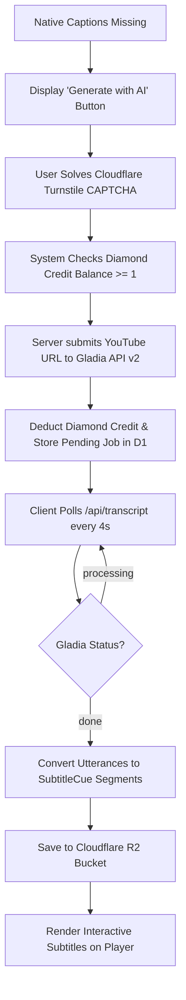

# Feature Specifications & Deep Dive

This document details the functional specifications, algorithms, and business logic governing each major feature in **Voca** (formerly LinguaTube).

---

## 1. Universal Video Player & Controls

### 1.1. URL Ingestion & Parsing
Voca accepts arbitrary YouTube video URLs:
- Standard: `https://www.youtube.com/watch?v=VIDEO_ID`
- Shortened: `https://youtu.be/VIDEO_ID`
- Embedded: `https://www.youtube.com/embed/VIDEO_ID`
- Timestamped URLs (`?t=120s`) automatically seek to the start offset.

### 1.2. Playback Architecture
- Powered by `YoutubeService`, wrapping the official YouTube IFrame Player API.
- Custom UI overlay replaces default YouTube player chrome, eliminating clutter and visual distractions.
- **Auto-Pause on Hover / Click**:
  When a user hovers over or clicks an interactive subtitle word to inspect its definition, video playback pauses automatically to prevent the learner from falling behind.

### 1.3. Controls & Interaction Matrix
| Action | Desktop Shortcut | Mobile Gesture | UI Element |
| :--- | :--- | :--- | :--- |
| **Play / Pause** | `Space` or `k` | Single Tap Center | Center button / Bottom bar |
| **Seek $\pm 5$s** | `Left` / `Right` arrows | Double Tap Left / Right | Center $\pm 5$s buttons |
| **Seek $\pm 10$s** | `j` / `l` | Double Tap Far Left/Right | — |
| **Volume Up / Down** | `Up` / `Down` arrows | Swipe Up / Down (Right side) | Bottom bar volume slider |
| **Toggle Subtitles** | `c` | Tap CC Button | CC button in bottom bar |
| **Toggle Dual Subtitles** | — | Tap Languages Button | Languages button in bottom bar |
| **Dual Sub Menu** | Right-click Dual Sub | — | Quick language picker modal with circle flags |
| **Toggle Fullscreen** | `f` | Pinch Out / Rotate | Bottom bar fullscreen button |
| **Playback Speed** | `Shift` + `<` / `>` | — | Speed dropdown (0.5x – 2x) |

### 1.4. Draggable Fullscreen Subtitles
When in fullscreen mode, subtitles are rendered in `FullscreenSubtitleComponent`:
- **Centered Drag Handle Bar**: A horizontal pill handle bar allows users to drag subtitles to any vertical position (`--sub-y: 8%` to `85%`).
- **Smooth Pointer Capture**: Uses `PointerEvent` tracking with `requestAnimationFrame` updates to ensure 60fps responsiveness across mobile and desktop.
- **Magnetic Snap Points**:
  - Dragging near the top snaps smoothly to `12%`.
  - Dragging near the bottom snaps to `82%`.
  - Tapping without dragging automatically toggles between top and bottom.

---

## 2. Interactive Subtitles & Tokenization Engine

### 2.1. Sticky Subtitle Synchronization Algorithm
Standard subtitle displays flicker or disappear during small natural pauses in speech. Voca implements a **Sticky Subtitle** algorithm:
1. Performs an $O(\log n)$ binary search (`findActiveCue`) to find the cue matching `currentTime`.
2. If no active cue matches (e.g. speech gap), `findStickyCue` locates the most recent ended cue within a $0.1$s tolerance window.
3. The cue remains visible until the next subtitle segment begins or playback advances beyond a maximum threshold.

### 2.2. Morphological Tokenization & Phonetics
Subtitles are segmented into interactive tokens using language-specific NLP:
- **Japanese (`ja`)**:
  - Analyzed by `@patdx/kuromoji` using IPAdic dictionaries loaded on demand via CDN.
  - Generates token surface forms, base dictionary forms, parts of speech, and Hiragana readings.
  - **5 Reading Display Modes**:
    1. `native`: Clean Japanese script.
    2. `annotated`: Ruby Furigana (`<ruby>漢<rt>かん</rt></ruby>`).
    3. `reading`: Kana reading only.
    4. `annotatedRomanized`: Kanji with Hepburn Romaji annotations.
    5. `romanized`: Hepburn Romaji only.
  - **Height & Baseline Alignment (Zero-Shift Ruby)**: When reading annotations are enabled, words without reading text (e.g. kana-only words, English words, numbers, or unannotated kanji) are wrapped in `<ruby>` with an invisible spacer `<rt class="rt-empty">&#160;</rt>`. This guarantees 100% identical card height and uniform baseline alignment across all words in the sentence, eliminating jagged jumps.
- **Chinese (`zh`)**:
  - Segmented using `Intl.Segmenter('zh', { granularity: 'word' })`.
  - Pinyin annotations generated via `pinyin-pro` with tone diacritics (e.g. `nǐ hǎo`).
- **Korean (`ko`)**:
  - Space-delimited and segment-analyzed via `Intl.Segmenter('ko')`.
  - Romanization computed using `hangul-romanization`.
- **English (`en`)**:
  - Segmented into word tokens and punctuation boundaries via `Intl.Segmenter('en')`.

### 2.3. Subtitle Customization & Vocabulary Highlighting
- **Four Size Modes**: `small`, `medium`, `large`, and `xlarge`, dynamically responsive across mobile, tablet, and desktop layouts.
- **Vocabulary Mastery Indicators**: Interactive subtitle words reflect mastery state (`word--new`, `word--learning`, `word--known`) in both standard list/banner and fullscreen overlays.
- **Auto-Scroll & Manual Override**: Active cue autoscrolling pauses during user interaction (3s debounce) to ensure smooth browsing of full transcripts.

---

## 3. Gladia AI Transcription Fallback

When a YouTube video lacks native captions in the learner's target language:



- **SSRF Hardening**: The polling endpoint validates that all `result_url` inputs match `https://api.gladia.io/` strictly.
- **Duration Limits**: Restricted to videos $\le 20$ minutes.
- **Cost Scaling**:
  - $\le 10$ minutes: **1 Diamond credit**
  - $> 10$ minutes (up to 20 mins): **2 Diamond credits**

---

## 4. Dual-Language Subtitles

- Displays the **learning language** on top and the learner's **target translation language** underneath.
- **Supported Target Languages**: English (`en`), Vietnamese (`vi`), Japanese (`ja`), Korean (`ko`), Chinese (`zh`).
- **Quick Selection Menu**: Right-click the dual-sub button or open player settings to select target translation language with high-fidelity circle flag SVGs.
- **Batch Translation Engine**: Subtitle texts are chunked into batches of 5 and translated via Lingva / Google Translate GTX.
- **Quality Assurance**: If $< 80\%$ of segments translate successfully, caching is refused to prevent bad data persistence.
- **Permanent Caching**: Successful translations are saved to Cloudflare R2 (`translations/{videoId}/{sourceLang}_{targetLang}.json`) and indexed in D1.

---

## 5. Multi-Source Hybrid Dictionary

When a learner clicks any subtitle word token, `DictionaryService` queries `/api/dict`:

```
                 ┌────────────────────────────────┐
                 │       LEARNER CLICKS WORD      │
                 └───────────────┬────────────────┘
                                 │
                      Query /api/dict Endpoint
                                 │
      ┌──────────────────────────┼──────────────────────────┐
      ▼                          ▼                          ▼
 [ JAPANESE ]               [ CHINESE ]                [ KOREAN ]
 Jotoba API (primary)       MDBG Scraper               Naver Dict EnKo / KoVi
 Jisho.org (fallback)       Glosbe Chinese-Vietnamese  KRDict (National Inst)
 Mazii (Vietnamese)
      │                          │                          │
      └──────────────────────────┼──────────────────────────┘
                                 │
                    No Direct Bilingual Match?
                                 ▼
                 English Definitions + Google GTX Fallback
                                 ▼
                     Normalized DictionaryEntry
```

- **Authentic Dictionary Pronunciation**: Rather than using synthetic browser Web Speech API (`speechSynthesis`), audio is sourced directly from authentic native recordings from upstream dictionary providers (Naver, Mazii, FreeDictionary, Jotoba, KRDict).
- **Isolated Screen State**: Standalone dictionary searches are decoupled from in-video subtitle clicks, ensuring subtitle queries never leak into or overwrite standalone search history or panels.
- **Multi-Entry Disambiguation**: When queries match multiple dictionary entries or homonyms, tabbed selectors allow learners to explore all matching entries.
- **Integrated Grammar Detection**: Searching words or grammatical stems also queries `GrammarService` to surface relevant grammar patterns, formation rules, and example sentences directly beneath definitions.
- **Word Popup UI**: Positioned next to clicked subtitle words with part of speech tags, definitions, language switcher, and direct save-to-vocab action.
- **Negative Caching**: Empty results are cached in an in-memory `Set` to prevent hammering external dictionary APIs.
- **Persistence**: Results cached in Cloudflare KV for 7 days, with language-scoped local search history (`linguatube_recent_searches_${lang}`).

---

## 6. Grammar Pattern Detection Engine

`GrammarService` continuously inspects tokenized sentences to identify grammatical constructions:
- **Language Coverage**:
  - **Japanese**: 1,000+ patterns across JLPT N5 through N1 (`grammar-ja.ts`).
  - **Korean**: TOPIK I and II grammar structures (`grammar-ko.ts`).
  - **Chinese**: HSK 1 through 6 grammar patterns (`grammar-zh.ts`).
  - **English**: CEFR A1 through C2 grammar rules (`grammar-en.ts`).
- **Split Pattern Handling**:
  Recognizes split correlative pairs (e.g. `虽然...但是...`, `not only...but also...`, `either...or...`).
- **Dynamic Translation Packs**:
  Grammar definitions are translated across 16 combinations (JA, KO, ZH, EN into VI, ZH, KO, JA) plus native-to-native explanations (`ja_ja`, `ko_ko`, `zh_zh`).

---

## 7. Spaced Repetition (SRS) Vocabulary Notebook

Saved vocabulary items follow the **SuperMemo-2 (SM-2)** algorithm:

### 7.1. SM-2 Algorithm Formulation
When a user reviews a flashcard and provides a recall quality score $q \in [0, 5]$:

1. **Repetitions & Interval ($I$)**:
   $$\text{If } q < 3: \quad \text{repetitions} = 0, \quad I = 1 \text{ day}, \quad \text{status} = \text{new}$$
   $$\text{If } q \ge 3: \quad \begin{cases} I_1 = 1 \text{ day} & \text{if repetitions} = 0 \\ I_2 = 6 \text{ days} & \text{if repetitions} = 1 \\ I_n = \lceil I_{n-1} \times EF \rceil & \text{if repetitions} \ge 2 \end{cases}$$

2. **Ease Factor ($EF$)**:
   $$EF' = \max(1.3, \; EF + (0.1 - (5 - q) \times (0.08 + (5 - q) \times 0.02)))$$

3. **Status Transitions**:
   - `new` $\rightarrow$ `learning` on first successful recall ($q \ge 3$).
   - `learning` $\rightarrow$ `known` once `repetitions >= 3`.

### 7.2. Contextual Sentence Memory
Every saved word retains `sourceSentence`, ensuring learners always review vocabulary in the context of the authentic video dialogue where it was found.

---

## 8. Gamified Streaks & Freeze Inventory

- **Daily Tracking**: Practicing (watching videos, completing flashcard reviews) records an activity entry for the current UTC date.
- **Streak Freezes**:
  - Users have an inventory of up to 2 Streak Freezes.
  - If a user misses exactly 1 day, a freeze is consumed automatically to protect their streak.
  - Milestones at 7, 30, and 100 days reward an extra streak freeze.
- **PocketBase Server Cron (`streaks.pb.js`)**:
  A server-side webhook checks active streaks daily, consuming freezes or resetting streaks if inactive for $>1$ day.

---

## 9. Playlist & Study Queue Architecture

- **Multi-Source Playlists**: Supports user-created custom playlists, curated Community Playlists (e.g., JLPT/TOPIK/HSK listening collections), and PocketBase cloud sync.
- **Responsive Video Screen Presentation**:
  - **Desktop Unified Sidebar (`.unified-sidebar`)**: Houses a segmented control tab switcher toggling between `Playlist (N)` and `Vocabulary (N)`. Uses `.hidden` styling instead of template recreation to eliminate layout shifts when switching tabs. When a playlist has only 1 video, the playlist tab is retained on desktop to allow playlist management (editing, sharing, closing, or navigating).
  - **Mobile Playlist Bar (`.mobile-playlist-card`) & YouTube-Style Bottom Sheet**:
    - Sits directly below the video player as a sleek, non-expanding compact bar (~48px) displaying playlist title, author, index/total, and quick action buttons (Share, Loop, Shuffle, Chevron).
    - **Zero Layout Shift (0% CLS)**: Tapping the bar or chevron opens a modal `<app-bottom-sheet>` instead of expanding in-flow. The video player and subtitles beneath it remain stationary and completely undisturbed.
    - Inside the bottom sheet, the user can reorder videos (cdkDrag if owner), switch videos, toggle loop/shuffle, share, or open individual video options. Selecting a video automatically closes the sheet and navigates to the video.
  - **Navigation Guarding**: Playlist previous (`canPlayPrev`) and next (`canPlayNext`) actions are disabled when `videos.length <= 1` (unless playlist loop mode is toggled), preventing dead interactions.
- **Server-Side Recommendation Engine ("Dành cho bạn" / "For You")**:
  - Automatically queries PocketBase with targeted server-side filtering (`visibility="published" && language="${lang}" && video_count >= 2`).
  - Ranked on the server by `-is_featured, -save_count, -updated` to prioritize curated and popular community content while filtering out single-video test spam.
  - Automatically re-fetches when learning language changes and caches results in memory per language.
  - Falls back to `video_count >= 1` if a new language does not yet have multi-video collections.

---

## 10. Search Engine Optimization (SEO) & Web Discovery Architecture

- **Root Metadata & Social Protocol**:
  - `src/index.html` implements Open Graph (`og:type`, `og:title`, `og:description`, `og:image`, `og:locale`, alternate locales) and Twitter Cards (`summary_large_image`).
  - Embeds Schema.org JSON-LD structured data for `WebApplication` and `EducationalApplication`, enumerating supported languages, interactive subtitle capabilities, and free tier offers.
  - Canonical URL `<link rel="canonical">` points to `https://lingua-tube.pages.dev`.
- **Search Engine Discovery Assets**:
  - `public/robots.txt`: Explicitly permits search crawlers on learning routes (`/video`, `/dictionary`, `/study`, `/explore`, `/history`) while restricting internal serverless functions (`/api/`, `/proxy/`).
  - `public/sitemap.xml`: Declares priority and change frequencies for all public views, with `xhtml:link` multi-language `hreflang` alternates (`en`, `vi`, `ja`, `ko`, `zh`, and `x-default`).
  - `public/og-image.png`: High-resolution 1200x630 branded social share card with brand badge, typography, feature pills, and subtitle preview.
- **Dynamic Angular `SeoService` (`src/app/core/services/seo.service.ts`)**:
  - Automatically listens to Angular Router `NavigationEnd` events and updates document title, description, keywords, Open Graph, and Twitter metadata per route.
  - **Dynamic Video Metadata**: When a YouTube video is actively loaded in `VideoPageComponent`, `updateVideoSeo(title, id, desc)` updates document title (`"${videoTitle} | Voca"`), sets `og:type` to `video.other`, and sets `og:image` to the video's high-resolution YouTube thumbnail. Resets cleanly when navigating away or destroying the component.
- **PWA Discoverability & App Shortcuts**:
  - `public/manifest.webmanifest` specifies education/utilities categories, standalone display, and PWA shortcuts for instant launch into Watch, Dictionary, Flashcards, and Explore.
- **PWA Installation Flow (`PwaService`)**:
  - `src/app/core/services/pwa.service.ts`: Listens for the `beforeinstallprompt` browser event, detects standalone display mode (`(display-mode: standalone)` and `navigator.standalone`), and detects iOS devices.
  - **Mobile "More" Menu**: Users can install the PWA directly from the mobile "More" bottom sheet via the "Install App" action row. The button is automatically hidden if the user is already running the app in standalone mode.
  - **Android / Chromium / Desktop**: Triggers the native browser install dialog via `prompt()` and tracks user choice.
  - **iOS Safari Support**: Because iOS does not support programmatic install prompts, clicking "Install App" on iPhone/iPad opens a step-by-step visual bottom sheet guiding the user to tap the Safari Share button and select "Add to Home Screen".


