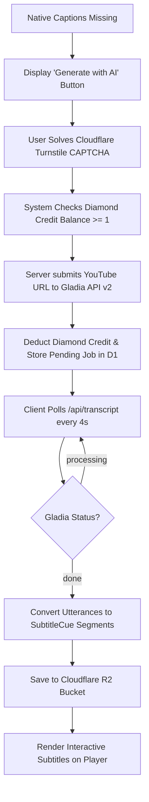

# Feature Specifications & Deep Dive

This document details the functional specifications, algorithms, and business logic governing each major feature in **LinguaTube**.

---

## 1. Universal Video Player & Controls

### 1.1. URL Ingestion & Parsing
LinguaTube accepts arbitrary YouTube video URLs:
- Standard: `https://www.youtube.com/watch?v=VIDEO_ID`
- Shortened: `https://youtu.be/VIDEO_ID`
- Embedded: `https://www.youtube.com/embed/VIDEO_ID`
- Timestamped URLs (`?t=120s`) automatically seek to the start offset.

### 1.2. Playback Architecture
- Powered by `YoutubeService`, wrapping the official YouTube IFrame Player API.
- Custom UI overlay replaces default YouTube player chrome, avoiding clutter and visual distractions.
- **Auto-Pause on Hover / Click**:
  When a user hovers over or clicks an interactive subtitle word to read its definition, video playback pauses automatically to prevent the learner from falling behind.

### 1.3. Controls & Interaction Matrix
| Action | Desktop Shortcut | Mobile Gesture | UI Element |
| :--- | :--- | :--- | :--- |
| **Play / Pause** | `Space` or `k` | Single Tap Center | Center button / Bottom bar |
| **Seek $\pm 5$s** | `Left` / `Right` arrows | Double Tap Left / Right | Center $\pm 5$s buttons |
| **Seek $\pm 10$s** | `j` / `l` | Double Tap Far Left/Right | — |
| **Volume Up / Down** | `Up` / `Down` arrows | Swipe Up / Down (Right side) | Bottom bar volume slider |
| **Toggle Subtitles** | `c` | Tap CC Button | CC button in bottom bar |
| **Toggle Fullscreen** | `f` | Pinch Out / Rotate | Bottom bar fullscreen button |
| **Playback Speed** | `Shift` + `<` / `>` | — | Speed dropdown (0.5x – 2x) |

---

## 2. Interactive Subtitles & Tokenization Engine

### 2.1. Sticky Subtitle Synchronization Algorithm
Standard subtitle displays flicker or disappear during small natural pauses in speech. LinguaTube implements a **Sticky Subtitle** algorithm:
1. Performs an $O(\log n)$ binary search (`findActiveCue`) to find the cue matching `currentTime`.
2. If no active cue matches (e.g. speech gap), `findStickyCue` locates the most recent ended cue within a $0.1$s tolerance window.
3. The cue remains visible until the next subtitle segment begins or playback advances beyond a maximum threshold.

### 2.2. Morphological Tokenization & Phonetics
Subtitles are segmented into interactive tokens using language-specific NLP:
- **Japanese (`ja`)**:
  - Analyzed by `@patdx/kuromoji` using IPAdic dictionaries loaded on demand via CDN.
  - Generates token surface forms, base dictionary forms, parts of speech, and Hiragana readings.
  - Provides dual display modes: **Furigana** (`<ruby>漢<rt>かん</rt></ruby>`) and **Hepburn Romaji** (`getJapaneseRomaji`).
- **Chinese (`zh`)**:
  - Segmented using `Intl.Segmenter('zh', { granularity: 'word' })`.
  - Pinyin annotations generated via `pinyin-pro` with tone diacritics (e.g. `nǐ hǎo`).
- **Korean (`ko`)**:
  - Space-delimited and segment-analyzed via `Intl.Segmenter('ko')`.
  - Romanization computed using `hangul-romanization`.
- **English (`en`)**:
  - Segmented into word tokens and punctuation boundaries.

### 2.3. Custom Subtitle File Import
Learners can import local files (`.srt` or `.vtt`) via `SubtitleUploadComponent`, which parses timestamps and formats text into standard `SubtitleCue` models.

---

## 3. Gladia AI Transcription Fallback

When a YouTube video lacks native captions in the learner's target language:



- **SSRF Hardening**: The polling endpoint validates that all `result_url` inputs match `https://api.gladia.io/` strictly.
- **Duration Limits**: Restricted to videos $\le 20$ minutes.
- **Cost Scaling**:
  - $\le 10$ minutes: **1 Diamond credit**
  - $> 10$ minutes (up to 20 mins): **2 Diamond credits**

---

## 4. Dual-Language Subtitles

- Displays the **learning language** on top and the learner's **native UI language** underneath.
- **Batch Translation Engine**: Subtitle texts are chunked into batches of 5 and translated via Lingva / Google Translate GTX.
- **Quality Assurance**: If $< 80\%$ of segments translate successfully, caching is refused to prevent bad data persistence.
- **Permanent Caching**: Successful translations are saved to Cloudflare R2 (`translations/{videoId}/{sourceLang}_{targetLang}.json`) and indexed in D1.

---

## 5. Multi-Source Hybrid Dictionary

When a learner clicks any subtitle word token, `DictionaryService` queries `/api/dict`:

```
                 ┌────────────────────────────────┐
                 │       LEARNER CLICKS WORD      │
                 └───────────────┬────────────────┘
                                 │
                     Query /api/dict Endpoint
                                 │
     ┌───────────────────────────┼───────────────────────────┐
     ▼                           ▼                           ▼
[ JAPANESE ]                [ CHINESE ]                 [ KOREAN ]
Jotoba API (primary)        MDBG Dictionary Scraper     Naver Dict EnKo / KoVi
Jisho.org API (fallback)    Glosbe Chinese-Vietnamese   National Institute (KRDict)
Mazii API (Vietnamese)
     │                           │                           │
     └───────────────────────────┼───────────────────────────┘
                                 │
                    No Direct Bilingual Match?
                                 ▼
                 English Definitions + Google GTX Fallback
                                 ▼
                     Normalized DictionaryEntry
```

- **Negative Caching**: Empty results are cached in an in-memory `Set` to prevent hammering external dictionary APIs for typos or non-dictionary words.
- **Persistence**: Results cached in Cloudflare KV for 7 days.

---

## 6. Grammar Pattern Detection Engine

`GrammarService` continuously inspects tokenized sentences to identify grammatical constructions:
- **Language Coverage**:
  - **Japanese**: 1,000+ patterns across JLPT N5 through N1 (`grammar-ja.ts`).
  - **Korean**: TOPIK I and II grammar structures (`grammar-ko.ts`).
  - **Chinese**: HSK 1 through 6 grammar patterns (`grammar-zh.ts`).
  - **English**: CEFR A1 through C2 grammar rules (`grammar-en.ts`).
- **Split Pattern Handling**:
  Recognizes split correlative pairs (e.g. `虽然...但是...`, `not only...but also...`, `either...or...`).
- **Lazy Loading**:
  Large grammar datasets are code-split and loaded dynamically via `import()` only when the learner activates that language.

---

## 7. Spaced Repetition (SRS) Vocabulary Notebook

Saved vocabulary items follow the **SuperMemo-2 (SM-2)** algorithm:

### 7.1. SM-2 Algorithm Formulation
When a user reviews a flashcard and provides a recall quality score $q \in [0, 5]$:

1. **Repetitions & Interval ($I$)**:
   $$\text{If } q < 3: \quad \text{repetitions} = 0, \quad I = 1 \text{ day}, \quad \text{status} = \text{new}$$
   $$\text{If } q \ge 3: \quad \begin{cases} I_1 = 1 \text{ day} & \text{if repetitions} = 0 \\ I_2 = 6 \text{ days} & \text{if repetitions} = 1 \\ I_n = \lceil I_{n-1} \times EF \rceil & \text{if repetitions} \ge 2 \end{cases}$$

2. **Ease Factor ($EF$)**:
   $$EF' = \max(1.3, \; EF + (0.1 - (5 - q) \times (0.08 + (5 - q) \times 0.02)))$$

3. **Status Transitions**:
   - `new` $\rightarrow$ `learning` on first successful recall ($q \ge 3$).
   - `learning` $\rightarrow$ `known` once `repetitions >= 3`.

### 7.2. Contextual Sentence Memory
Every saved word retains `sourceSentence`, ensuring learners always review vocabulary in the context of the authentic video dialogue where it was found.

---

## 8. Gamified Streaks & Freeze Inventory

- **Daily Tracking**: Practicing (watching videos, completing flashcard reviews) records an activity entry for the current UTC date.
- **Streak Freezes**:
  - Users have an inventory of up to 2 Streak Freezes.
  - If a user misses exactly 1 day, a freeze is consumed automatically to protect their streak.
  - Milestones at 7, 30, and 100 days reward an extra streak freeze.
- **PocketBase Server Cron (`streaks.pb.js`)**:
  A server-side webhook checks active streaks daily, consuming freezes or resetting streaks if inactive for $>1$ day.
