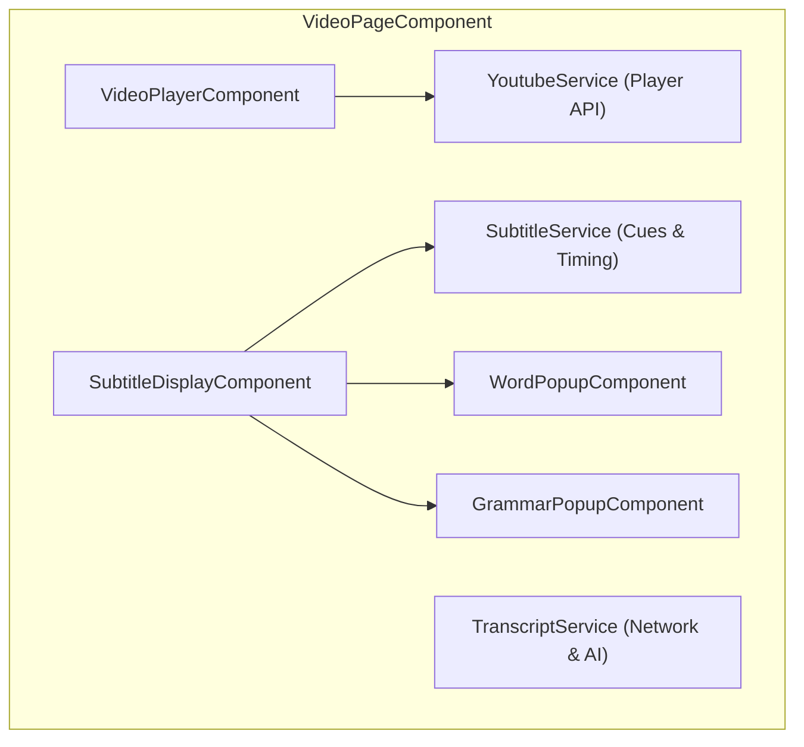
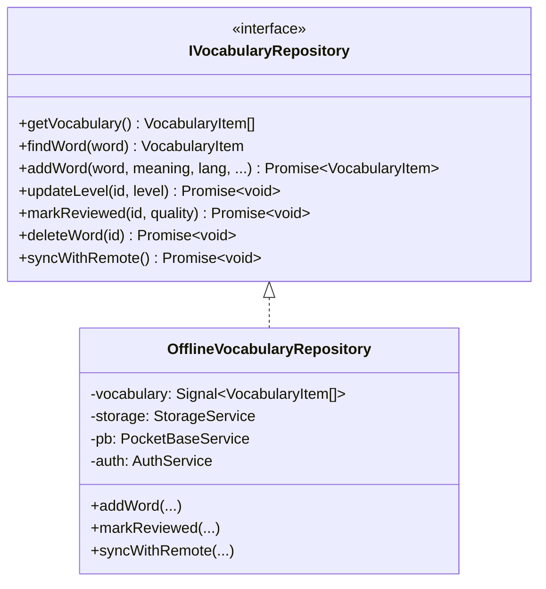

# Frontend Architecture & UI System

This document outlines the frontend design principles, Angular 19 Signal state architecture, component hierarchy, repository patterns, and UI design system for **Voca** (formerly LinguaTube).

---

## 1. Core Architectural Paradigms

```
┌────────────────────────────────────────────────────────────────────────┐
│                   ANGULAR 19 FRONTEND ARCHITECTURE                     │
└────────────────────────────────────────────────────────────────────────┘

 [ 1. Fine-Grained Reactivity ]       [ 2. Offline-First Data Layer ]
   • Angular Signals (signal, computed)  • Repository Pattern (IVocabularyRepo, etc.)
   • ChangeDetectionStrategy.OnPush      • LocalStorage + IndexedDB (lingua-tube-cache)
   • Zero Zone.js manual triggers        • PocketBase Two-Way Cloud Synchronization

 [ 3. Standalone Component Tree ]     [ 4. Cross-Platform Responsive UI ]
   • Zero NgModules                       • Mobile-First Responsive SCSS Layouts
   • Deferred Loading (loadComponent)     • Touch Gestures, Pointer Capture & RAF
   • Isolated SCSS per component          • SVG Circle Flags & Full PWA Caching
```

---

## 2. Signal-Driven State Management

Voca uses Angular Signals as the single source of truth for all synchronous and reactive state.

### 2.1. Why Signals over NgRx or Manual BehaviorSubjects?
- **Glitch-Free Computed Derivations**: `computed()` values update lazily and deterministically without diamond-dependency glitches.
- **Granular DOM Updates**: Angular's runtime updates only the specific DOM nodes bound to changed signals.
- **OnPush Compatibility**: Works seamlessly with `ChangeDetectionStrategy.OnPush` without requiring manual `ChangeDetectorRef.markForCheck()`.

### 2.2. Modern Angular 19 Primitives
- **`linkedSignal()`**: Used for form controls and dialog states (e.g. `CreatePlaylistDialogComponent`, `WordPopupComponent.targetLang`) that require an initial derivation from input signals while allowing independent user edits, eliminating manual lifecycle synchronization effects.
- **`model()`**: Implements two-way signal binding on standalone form primitives (e.g. `SwitchComponent.checked = model<boolean>(false);`).
- **`viewChild()` & `viewChild.required()`**: Query signals replacing `@ViewChild` decorator queries (e.g. `ProgressBarComponent`, `DictionaryPanelComponent`), enabling fully type-safe, reactive template references.

### 2.3. Core State Signals Examples
```typescript
// SubtitleService
readonly subtitles = signal<SubtitleCue[]>([]);
readonly currentCueIndex = signal<number>(-1);
readonly currentCue = computed(() => {
  const idx = this.currentCueIndex();
  const cues = this.subtitles();
  return idx >= 0 && idx < cues.length ? cues[idx] : null;
});

// SettingsService
readonly settings = signal<UserSettings>(DEFAULT_SETTINGS);
readonly readingDisplayMode = computed(() => 
  this.settings().readingDisplayMode
);

// VideoPlayerComponent
readonly playerSettingsView = signal<'main' | 'speed' | 'fontSize' | 'dualSub'>('main');
readonly isFullscreen = signal<boolean>(false);
readonly currentSpeed = computed(() => this.youtubeService.playbackRate());
```

---

## 3. Accessibility, Focus Management & Mobile Stability

### 3.1. Modal Focus Traps (`BottomSheetComponent`)
- **Focus Cycling**: Implements strict `keydown` listener trapping keyboard `Tab` / `Shift+Tab` cycles within the active bottom sheet modal container.
- **Focus Restoration**: Caches `document.activeElement` prior to sheet open and restores focus back to the triggering element upon dismissal, ensuring full WCAG 2.1 compliance for screen readers and keyboard users.

### 3.2. WAI-ARIA Slider Navigation (`ProgressBarComponent`)
- **Semantic Role**: Configured with `role="slider"`, `[attr.aria-valuenow]`, `[attr.aria-valuemin]="0"`, `[attr.aria-valuemax]="duration()"`, and formatted `[attr.aria-valuetext]`.
- **Keyboard Navigation**:
  - `ArrowLeft` / `ArrowRight`: Steps playback backward or forward by 5 seconds.
  - `Home` / `End`: Seeks instantly to video start (`0s`) or end (`duration`).

### 3.3. Viewport Stability & Mobile Polish
- **iOS Safari Auto-Zoom Fix**: All mobile inputs (notably `.spotlight-input` in `VideoPlayerComponent`) enforce `font-size: 1rem` (16px), eliminating WebKit's automatic zoom on focus.
- **Notch & Safe Area Protection**: Container gutters use `max(var(--space-md), env(safe-area-inset-left))` to prevent UI clipping by device camera cutouts in landscape.
- **Dynamic HTML Language Attribute**: `I18nService` runs a reactive signal effect syncing `document.documentElement.lang = lang`, ensuring screen readers and phonetic engines correctly parse active language phonemes.

---

## 3. Component Architecture & Domain Modules

### 3.1. Shell & Global Components (`src/app/components/`)
- **`SidebarComponent`**: Collapsible main navigation supporting compact icon mode and expanded text mode. Displays streak counter and diamond credit badge.
- **`SettingsSheetComponent`**: Slide-over sheet for adjusting learning languages, Furigana/Pinyin toggles, Romaji display modes, font size, playback speed, and theme.
- **`StreakDialogComponent`**: Modal displaying 7-day practice activity, streak freeze inventory, and milestone badges.
- **`AiCreditsDialogComponent`**: Details current Diamond credit count, 20-minute regeneration countdown timer, and Gladia AI limits.
- **`OnboardingComponent`**: First-time user walkthrough guiding video selection, language choices, and subtitle interactions.
- **`CommandPaletteComponent`**: Power-user modal (`Cmd+K` / `Ctrl+K`) for instant navigation, video loading, and action dispatching.

---

### 3.2. Video Experience Domain (`src/app/features/video/`)



#### VideoPageComponent (`video-page/`)
- Host shell coordinating player, subtitles, unified sidebar, and mobile queue.
- **Unified Desktop Sidebar (`.unified-sidebar`)**:
  - Encapsulates `PlaylistPanelComponent` and `VocabularyListComponent` inside a single card container with segmented tab switcher (`[Playlist (N)]` / `[Vocabulary (N)]`).
  - Retains playlist tab on desktop even for single-video playlists (`hasPlaylist`), allowing playlist management without cluttering the page.
- **Responsive Mobile Queue (`.mobile-playlist-card`)**:
  - In-flow expandable playlist bar positioned directly below the player.
  - **Single-Video Optimization**: Hidden when `videos.length <= 1` (`showMobilePlaylistCard`), freeing up 54px vertical space for subtitles.
  - **Control Guarding**: Next and previous buttons are disabled when `videos.length <= 1` (unless looping) to avoid confusing dead clicks.

#### VideoPlayerComponent (`video-player/`)
- Encapsulates the official YouTube IFrame API via `YoutubeService`.
- **Custom Player Controls Overlay**:
  - `VideoHeaderComponent`: Video title, channel info, back navigation, and playlist context.
  - `CenterControlsComponent`: Play/pause toggle, $\pm 5$s seek buttons with smooth animation.
  - `ProgressBarComponent`: Custom slider with buffered progress indicator, hover time preview, and cue segment markers.
  - `VideoBottomBarComponent`: Time display, playback speed selector, dual-subtitles toggle, audio volume slider, fullscreen trigger. Right-clicking the dual subtitles button triggers the quick language selection modal.
  - `FullscreenSubtitleComponent`: Dedicated high-contrast subtitle overlay positioned via `fullscreenSubtitleYPercent` setting.
    - Features a horizontal drag handle bar with pill indicator.
    - Drag handler scheduled via `requestAnimationFrame` with pointer capture.
    - Magnetic snap targets at `12%` (top) and `82%` (bottom), and tap-to-toggle.
- **Interaction Services**:
  - `GestureHandlerService`: Handles mobile touch gestures (swipe right/left to seek, swipe up/down for volume, double-tap left/right for $\pm 10$s jump).
  - `VideoKeyboardShortcutService`: Desktop hotkeys (`Space`, `k`, `Left`/`Right`, `j`/`l`, `Up`/`Down`, `f`, `m`, `c`).

#### SubtitleDisplayComponent (`subtitle-display/`)
- Synchronizes with video playback via a high-performance $O(\log n)$ binary search (`findActiveCue`).
- **Sticky Subtitles**: If a gap exists between cues, retains the previous cue briefly to prevent jarring visual flickering.
- **Interactive Word Segmentation**: Every word is rendered as a clickable token. Clicking opens `WordPopupComponent`.
- **5 Reading Display Modes**:
  - `native`: Original script.
  - `annotated`: Furigana / Pinyin ruby annotations.
  - `reading`: Kana-only reading.
  - `annotatedRomanized`: Kanji with Hepburn Romaji annotations.
  - `romanized`: Hepburn Romaji / Revised Romanization only.
- **Grammar Match Highlights**: Tokens matching active grammar patterns receive visual underlines; clicking opens `GrammarPopupComponent`.

---

### 3.3. Dictionary Domain (`src/app/features/dictionary/`)
- **`WordPopupComponent`**:
  - Positioned adjacent to clicked subtitle token or search query.
  - Displays headword, phonetic readings, parts of speech, English/native definitions, JLPT/HSK/TOPIK level badges, and source audio pronunciation.
  - Features high-fidelity SVG circle flags for target language selection and translation results.
  - Provides a single-click "+ Add to Vocabulary" button.
- **`GrammarPopupComponent`**:
  - Displays detected grammatical structures (e.g. `〜てはいけない`, `虽然...但是...`).
  - Shows formation rules, explanations, level badges, and contextual example sentences.
  - Automatically loads multi-language translation packs or native-to-native explanations on demand.
- **`DictionaryPageComponent` & `DictionaryPanelComponent`**:
  - Standalone full-screen dictionary search page with isolated reactive signals (`screenQuery`, `screenEntries`).
  - Supports deep linking via URL query parameter (`/dictionary?q=...`) and vocabulary word click-to-search.
  - Multi-entry disambiguation tabs for queries matching multiple homonyms.
  - Authentic dictionary audio pronunciation using HTML5 `Audio` elements with animated audio speaker buttons.
  - Integrated grammar pattern matches from `GrammarService`.
  - Language-scoped search history (`linguatube_recent_searches_${lang}`) and direct SRS level cycling in result headers.

---

### 3.4. Study & Retention Domain (`src/app/features/vocabulary/`)
- **`VocabularyListComponent`**:
  - Tabular view of saved words filterable by language (`ja`, `zh`, `ko`, `en`) and mastery status:
    - 🔵 **New**
    - 🟡 **Learning**
    - 🟢 **Known**
    - ⚪ **Ignored**
  - Inline audio playback, search filtering, and JSON export/import.
- **`StudyPageComponent` & `StudyModeComponent`**:
  - Implements the **SuperMemo-2 (SM-2)** spaced repetition flashcard review deck.
  - Displays front (target word + sentence context) and back (reading + meaning + examples).
  - Users rate recall quality from 1 to 5, updating interval, ease factor, and `nextReviewDate`.

---

### 3.5. Playlists & History Domains (`playlist/` & `history/`)
- **`PlaylistPageComponent`**: Lists user-created custom playlists alongside curated Community Playlists (e.g. "Japanese N5 Listening", "Chinese Conversational").
- **`AddToPlaylistDialogComponent`**: Modal sheet to bookmark current video into existing or new playlists.
- **`HistoryPageComponent`**: Displays watch history, percentage watched, resume timestamps, and options to clear history.

---

## 4. Offline-First Repository Architecture

All user data operations follow the **Repository Pattern** to decouple UI components from network calls and storage drivers:



### Deterministic ID Generation
To ensure zero duplicate records when syncing between local browser storage and PocketBase:
```typescript
private generateVocabId(userId: string, word: string, language: string): string {
    const raw = `${userId}|${word}|${language}`;
    return btoa(unescape(encodeURIComponent(raw)))
        .replace(/[^a-zA-Z0-9]/g, '')
        .toLowerCase()
        .slice(0, 15);
}
```

---

## 5. Internationalization System (`I18nService`)

- Static preloaded JSON dictionaries for 5 languages:
  - `src/app/i18n/en.json` (English)
  - `src/app/i18n/vi.json` (Vietnamese)
  - `src/app/i18n/ja.json` (Japanese)
  - `src/app/i18n/ko.json` (Korean)
  - `src/app/i18n/zh.json` (Chinese)
- Simple, type-safe lookup with interpolation:
  ```typescript
  // Translation call
  i18n.t('streak.milestoneMessage', { count: 7 });
  ```

---

## 6. Styling & Design System

The application styling is organized using modular SCSS located in `src/styles/`:

- **`_variables.scss`**: Design tokens, font stacks (system, Noto Sans JP/KR/SC), color palette, spacing, z-index layers.
- **`_base.scss`**: CSS reset, root typography, scrollbar styling, mobile tap-highlight resets.
- **`_layout.scss`**: Main grid, sidebar layouts, topbar header, safe area padding (`--bottom-nav-safe-area`, `env(safe-area-inset-bottom)`).
- **`_components.scss`**: Badges, modals, dialog backdrops, pill tags, buttons.
- **`_buttons.scss` & `_forms.scss`**: Standardized button variants (primary, secondary, danger, ghost) and input fields.
- **Dark/Light Theming**:
  Theme switching is controlled via `data-theme="dark"` or `data-theme="light"` on the `<html>` root, referencing CSS variables:
  ```scss
  [data-theme="dark"] {
    --bg-primary: #0f172a;
    --bg-secondary: #1e293b;
    --text-primary: #f8fafc;
    --accent-color: #38bdf8;
  }
  ```

### Card & Panel Design Conventions
- **Clean Surface Architecture**: All cards (`.card`, `.sidebar-card`, `.vocab-panel`, `.dict-panel`, `.playlist-panel`, `.history-panel`) share unified surface tokens: `background: var(--bg-card);`, `border: 1px solid var(--border-color);`, and `border-radius: var(--border-radius-lg);`.
- **Divider-Free Modern Layout**: Card headers (`.panel-header`, `.vocab-header`, `.playlist-header`, `.result-header`) and toolbars do NOT use hard divider lines (`border-bottom: 1px solid var(--border-color)`). Visual hierarchy and clean separation are achieved through consistent whitespace and flex gaps (`var(--space-md)`, `var(--space-sm)`), preventing fragmented card slices.

### Material Design 3 Mobile Navigation Bar (`.bottom-nav`)
- **Structure & Ergonomics**: A 5-tab responsive navigation bar constrained to `max-width: 32rem` (`margin: 0 auto`) with `--bottom-nav-height: 4rem` (64px) + full iOS/Android safe area padding (`--bottom-nav-safe-area: var(--safe-area-bottom)`).
- **M3 Blooming Pill Indicator**: Uses a capsule active indicator (`.bottom-nav__icon-wrap::before`, `width: 56px`, `height: 32px`, `border-radius: 9999px`) that expands horizontally using the official M3 Emphasized Decelerate curve (`cubic-bezier(0.05, 0.7, 0.1, 1)`) from `scaleX(0.32)` to `scale(1)` with `opacity: 1` in brand tint `rgba(var(--accent-primary-rgb), 0.16)`.
- **Outline vs. Solid Icon Duality**: Navigation tabs display outline icons when inactive (`play-circle`, `graduation-cap`, `book-open`, `list-video`, `more-horizontal`) and dynamically switch to solid filled variants when active (`play-circle-filled`, `graduation-cap-filled`, etc.).
- **Frosted Glass Surface**: Container uses `rgba(var(--bg-card-rgb), 0.88)` with `backdrop-filter: blur(20px) saturate(180%)` to provide a native frosted-glass blur over scrolling page content.
- **Landscape Phone Optimization**: On compact landscape viewports (`max-height: 500px`), the bottom navigation bar is automatically hidden (`display: none !important`), freeing up ~20% vertical space for video playback and synchronized subtitles.
- **Safe Session Handling**: Tapping the active "Watch" tab while watching a video preserves the current playback state and smoothly scrolls to top rather than resetting the active session.

---

## 7. Progressive Web App (PWA) & Mobile Installation

### 7.1. Installation Architecture (`PwaService`)
- Located in `src/app/core/services/pwa.service.ts`.
- Captures browser `beforeinstallprompt` event, saves the prompt, and maintains reactive signals:
  - `canInstall`: Computed signal verifying the app is not already running standalone (`(display-mode: standalone)` and `navigator.standalone`), and either has an available install prompt or is running on iOS.
  - `isStandalone`: Reactive signal tracking standalone display state.
  - `isIOS`: Identifies Apple iOS devices (iPhone/iPad/iPod).
- Triggered seamlessly from the **Mobile "More" sheet** (`app.component.ts`), and automatically hidden when the user is already operating in standalone PWA mode.
- **iOS Safari Support**: Because WebKit on iOS does not support programmatic install prompts, clicking "Install App" triggers an iOS guidance modal showing visual steps to tap the Safari "Share" button and select "Add to Home Screen".

### 7.2. Brand Identity & Vector Iconography (Kikyo Kamon)
- **Heritage Design**: The app icon is modeled after the authentic Japanese **Kikyo Kamon (桔梗紋 / Bellflower Crest)**, a celebrated samurai family crest (Akechi Mitsuhide) representing elegance, focus, and cultural scholarship.
- **Mathematical 5-Fold Symmetry**: Crafted with 5-fold rotational symmetry ($72^\circ$ intervals), defining a single master petal rotated around origin `(256, 256)` and smoothly capped by a concentric circular pistil ring.
- **Colorway & Container**: Features Voca's signature Coral (`#D95C64`) squircle container (`rx="115"` on 512x512) framing a warm Cream (`#F5F0E8`) flower.
- **Multi-Resolution PWA Icons**: Full suite of 11 raster resolutions rendered via native `sips` in `public/icons/` (`icon-72x72.png` through `icon-512x512.png`, `apple-icon-180.png`, and full-bleed `manifest-icon-*.maskable.png` with 80% safe zone padding).
- **Universal Application**: Unified across `src/favicon.svg`, `src/assets/icon.svg`, the desktop sidebar header (`sidebar.component.html`), the iOS install sheet (`app.component.ts`), and the Open Graph card (`public/og-image.png`).

