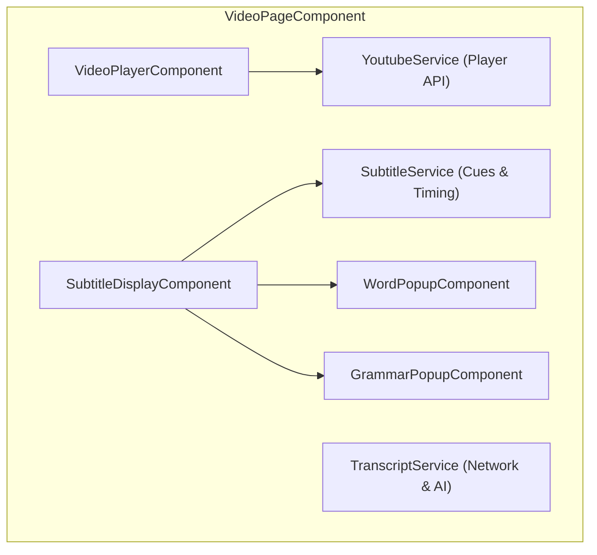
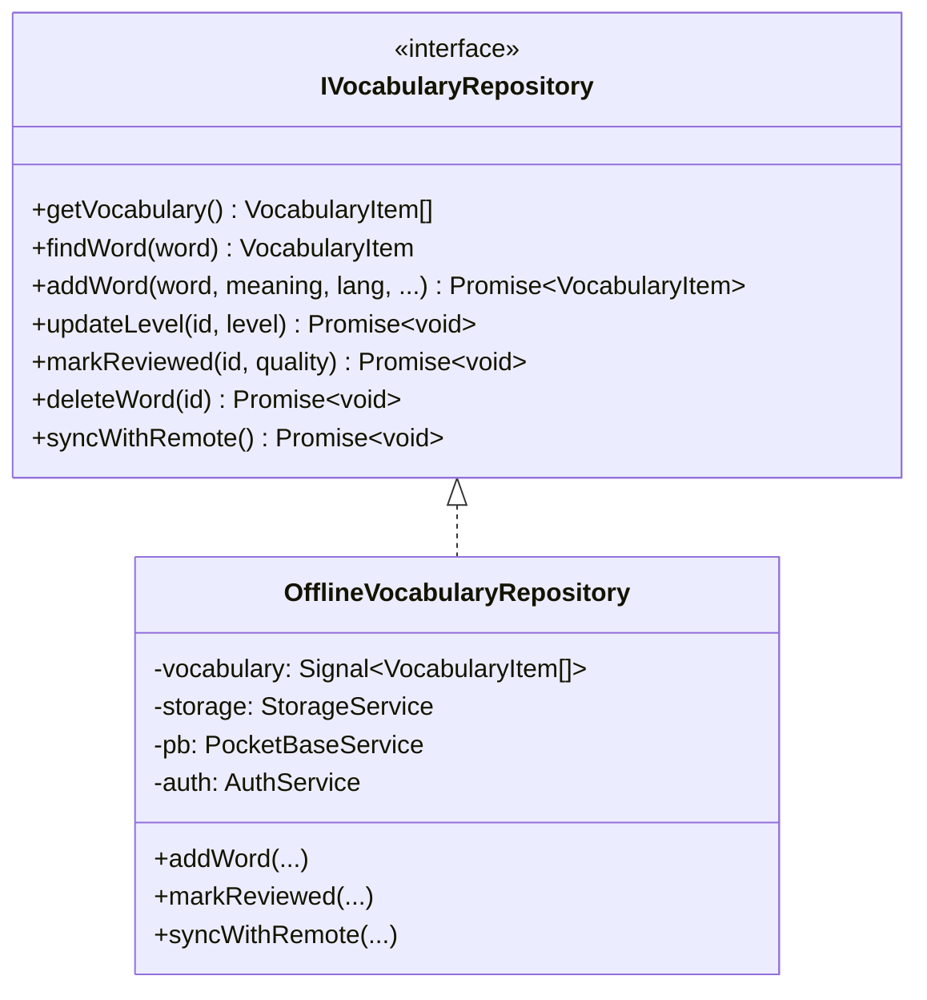

# Frontend Architecture & UI System

This document outlines the frontend design principles, Angular 19 Signal state architecture, component hierarchy, repository patterns, and UI design system for **Voca** (formerly LinguaTube).

---

## 1. Core Architectural Paradigms

```
┌────────────────────────────────────────────────────────────────────────┐
│                   ANGULAR 19 FRONTEND ARCHITECTURE                     │
└────────────────────────────────────────────────────────────────────────┘

 [ 1. Fine-Grained Reactivity ]       [ 2. Offline-First Data Layer ]
   • Angular Signals (signal, computed)  • Repository Pattern (IVocabularyRepo, etc.)
   • ChangeDetectionStrategy.OnPush      • LocalStorage + IndexedDB (lingua-tube-cache)
   • Zero Zone.js manual triggers        • PocketBase Two-Way Cloud Synchronization

 [ 3. Standalone Component Tree ]     [ 4. Cross-Platform Responsive UI ]
   • Zero NgModules                       • Mobile-First Responsive SCSS Layouts
   • Deferred Loading (loadComponent)     • Touch Gestures, Pointer Capture & RAF
   • Isolated SCSS per component          • SVG Circle Flags & Full PWA Caching
```

---

## 2. Signal-Driven State Management

Voca uses Angular Signals as the single source of truth for all synchronous and reactive state.

### 2.1. Why Signals over NgRx or Manual BehaviorSubjects?
- **Glitch-Free Computed Derivations**: `computed()` values update lazily and deterministically without diamond-dependency glitches.
- **Granular DOM Updates**: Angular's runtime updates only the specific DOM nodes bound to changed signals.
- **OnPush Compatibility**: Works seamlessly with `ChangeDetectionStrategy.OnPush` without requiring manual `ChangeDetectorRef.markForCheck()`.

### 2.2. Modern Angular 19 Primitives
- **`linkedSignal()`**: Used for form controls and dialog states (e.g. `CreatePlaylistDialogComponent`, `WordPopupComponent.targetLang`) that require an initial derivation from input signals while allowing independent user edits, eliminating manual lifecycle synchronization effects.
- **`model()`**: Implements two-way signal binding on standalone form primitives (e.g. `SwitchComponent.checked = model<boolean>(false);`).
- **`viewChild()` & `viewChild.required()`**: Query signals replacing `@ViewChild` decorator queries (e.g. `ProgressBarComponent`, `DictionaryPanelComponent`), enabling fully type-safe, reactive template references.

### 2.3. Core State Signals Examples
```typescript
// SubtitleService
readonly subtitles = signal<SubtitleCue[]>([]);
readonly currentCueIndex = signal<number>(-1);
readonly currentCue = computed(() => {
  const idx = this.currentCueIndex();
  const cues = this.subtitles();
  return idx >= 0 && idx < cues.length ? cues[idx] : null;
});

// SettingsService
readonly settings = signal<UserSettings>(DEFAULT_SETTINGS);
readonly readingDisplayMode = computed(() => 
  this.settings().readingDisplayMode
);

// VideoPlayerComponent
readonly playerSettingsView = signal<'main' | 'speed' | 'fontSize' | 'dualSub'>('main');
readonly isFullscreen = signal<boolean>(false);
readonly currentSpeed = computed(() => this.youtubeService.playbackRate());
```

---

## 3. Accessibility, Focus Management & Mobile Stability

### 3.1. Modal Focus Traps & Smooth Dynamic Height Transitions (`BottomSheetComponent` & `VideoPlayerComponent`)
- **Focus Cycling**: Implements strict `keydown` listener trapping keyboard `Tab` / `Shift+Tab` cycles within the active bottom sheet modal container.
- **Focus Restoration**: Caches `document.activeElement` prior to sheet open and restores focus back to the triggering element upon dismissal, ensuring full WCAG 2.1 compliance for screen readers and keyboard users.
- **Unified `SmoothHeightAnimator` (`src/app/shared/utils/smooth-height.animator.ts`)**:
  - Encapsulates dynamic height animation across both `BottomSheetComponent` (mobile sheets & desktop dialogs) and `VideoPlayerComponent` (desktop settings popups), eliminating duplicate animation code.
  - **ResizeObserver Driven**: Watches intrinsic content size updates via an unconstrained `.sheet-content-inner` wrapper in `BottomSheetComponent` and `#settingsPopupInner` in `VideoPlayerComponent` using native `ResizeObserver`.
  - **Subpixel & Reflow Suppression**: Filters out horizontal width-only reflows and subpixel layout jitter (`Math.abs(contentHeight - lastContentHeight) <= 1`) so toggling scrollbar classes (`.animating-height`) does not self-cancel in-flight transitions.
  - **Web Animations API**: Smoothly interpolates the container's rendered height (`element.animate([{ height: `${old}px` }, { height: `${new}px` }], { duration: 220, easing: 'cubic-bezier(0.32, 0.72, 0, 1)' })`).
  - **Submenu View Transitions**: When navigating between player settings submenus (`main`, `speed`, `fontSize`, `dualSub`), container heights dynamically animate without visual snapping across both desktop popups and mobile bottom sheets.
  - **Seamless Interruption**: If content resizes again mid-animation (e.g. rapid accordion toggle, async search results, or translation changes), the active animation is sampled at its exact mid-flight height (`element.getBoundingClientRect().height`) and smoothly redirected to the new target height without visual pop.
  - **Scrollbar Flicker Suppression**: Applies `.animating-height` class during transitions with `overflow-y: hidden` on `.sheet-content` to prevent horizontal text reflow and unsightly scrollbar flashing.
  - **Gesture & Lifecycle Coordination**: Automatically bypasses height transitions during entrance animations (`mobileSlideUp`/`scaleIn`), cancels cleanly on drag-to-dismiss touch start (`onTouchStart`), suppresses animations during window resizing/orientation shifts, and respects user accessibility preferences (`prefers-reduced-motion: reduce`).


### 3.2. WAI-ARIA Slider Navigation (`ProgressBarComponent`)
- **Semantic Role**: Configured with `role="slider"`, `[attr.aria-valuenow]`, `[attr.aria-valuemin]="0"`, `[attr.aria-valuemax]="duration()"`, and formatted `[attr.aria-valuetext]`.
- **Keyboard Navigation**:
  - `ArrowLeft` / `ArrowRight`: Steps playback backward or forward by 5 seconds.
  - `Home` / `End`: Seeks instantly to video start (`0s`) or end (`duration`).

### 3.3. Viewport Stability & Mobile Polish
- **iOS Safari Auto-Zoom Fix**: All mobile inputs (notably `.spotlight-input` in `VideoPlayerComponent`) enforce `font-size: 1rem` (16px), eliminating WebKit's automatic zoom on focus.
- **Notch & Safe Area Protection**: Container gutters use `max(var(--space-md), env(safe-area-inset-left))` to prevent UI clipping by device camera cutouts in landscape.
- **Dynamic HTML Language Attribute**: `I18nService` runs a reactive signal effect syncing `document.documentElement.lang = lang`, ensuring screen readers and phonetic engines correctly parse active language phonemes.

---

## 3. Component Architecture & Domain Modules

### 3.1. Shell & Global Components (`src/app/components/`)
- **`SidebarComponent`**: Collapsible main navigation supporting compact icon mode and expanded text mode. Displays motivation stats bar featuring daily streak counter, gamification rank level (with trophy icon opening Achievements), and diamond credit badge.
- **`SettingsSheetComponent`**: Slide-over sheet for adjusting learning languages, Furigana/Pinyin toggles, Romaji display modes, font size, playback speed, and theme. Includes mobile-responsive motivation stats pills (`Streak`, `Level`, `AI Credits`).
- **`MoreMenuSheet` (in `AppComponent`)**: Mobile personal library & settings sheet accessible via the bottom navigation bar. Features a 3-column top quick stats bar (`🔥 Streak`, `🏆 Level`, `💎 AI Credits` - tapping Level opens the Achievements modal) alongside personal library and settings action rows (`Playlists`, `History`, `Install App`, `Settings`).
- **Mobile Bottom Navigation (`.bottom-nav`)**: 5-item mobile navigation bar featuring `Xem` (Watch), `Ôn tập` (SRS Review), an elevated central `(+)` squircle CTA button with Voca's signature coral accent gradient (`linear-gradient(135deg, var(--accent-primary), #e04848)`) for instantaneous YouTube video URL entry, `Từ vựng` (Dictionary), and `Thêm` (More).
- **`AchievementsDialogComponent`**: Interactive gamification modal showcasing user level, total XP progress bar, unlocked and in-progress achievement badges across Immersion, Vocabulary, Daily Streaks, Flashcards, and Quizzes, and global leaderboard rankings.
- **`StreakDialogComponent`**: Modal displaying 7-day practice activity, streak freeze inventory, and milestone badges.
- **`AiCreditsDialogComponent`**: Interactive diamond quota modal showcasing current credit balance, dynamic tier badge (`Anonymous`, `Free`, `Pro`), dynamic regen timer (5m / 15m / 20m), video duration pricing breakdown ($\le 10$m = 1 credit, $10$–$20$m = 2 credits, $> 20$m Pro-only), and a dedicated Pro teaser card linking directly to `ProUpgradeDialogComponent`.
- **`ProUpgradeDialogComponent`**: Dedicated subscription upgrade bottom sheet designed with consistent modal styling. Features a monthly/annual plan selector with discount badge, feature comparison showcase, responsive VietQR payment card with raw EMVCo parsing, copyable bank details, live payment polling via `PaymentService`, and automatic tier activation upon settlement.
- **`OnboardingComponent`**: First-time user walkthrough guiding video selection, language choices, and subtitle interactions.
- **`CommandPaletteComponent`**: Power-user modal (`Cmd+K` / `Ctrl+K`) for instant navigation, video loading, and action dispatching.
- **`ToastComponent`**: Root-mounted adaptive status capsule (`ToastService`), displaying bottom/top HUD notifications with spring physics, thumb-zone mobile ergonomics, semantic status icons, and interactive action/undo buttons without frosted glass.

---

### 3.2. Video Experience Domain (`src/app/features/video/`)



#### VideoPageComponent (`video-page/`)
- Host shell coordinating player, subtitles, unified sidebar, and mobile queue.
- **Home Dashboard & "For You" Discovery (`.home-dashboard`)**:
  - Displayed when no video is loaded (`showLearnHome`).
  - Features a segmented control switching between **Recommended Videos** (videos with verified transcripts in Cloudflare D1/R2) and **Curated Playlists**.
  - **Difficulty Level Filter**: Interactive `OptionPickerComponent` chip (`[🏅 Level ▾]`) in `.home-toolbar` allowing users to filter recommendations by language-specific proficiency tiers (JLPT N5–N1, HSK 1–6, TOPIK 1–6, CEFR A1–C2+).
  - Powered by `VideoRecommendationService` retrieving genuine transcribed videos directly from Cloudflare D1 (`video_languages`, `transcripts`, `video_meta`) and R2 (`transcripts/{videoId}/{lang}.json`).
  - Clean video row cards (`.home-row-item`) display duration badges, channel, target language circular flag, and proficiency level tier badges (`VideoLevelService`) with streamlined typography.
- **Unified Desktop Sidebar (`.unified-sidebar`)**:
  - Encapsulates `PlaylistPanelComponent` and `VocabularyListComponent` inside a single card container with segmented tab switcher (`[Playlist (N)]` / `[Vocabulary (N)]`).
  - Retains playlist tab on desktop even for single-video playlists (`hasPlaylist`), allowing playlist management without cluttering the page.
- **Responsive Mobile Queue (`.mobile-playlist-card`)**:
  - In-flow expandable playlist bar positioned directly below the player.
  - **Single-Video Optimization**: Hidden when `videos.length <= 1` (`showMobilePlaylistCard`), freeing up 54px vertical space for subtitles.
  - **Control Guarding**: Next and previous buttons are disabled when `videos.length <= 1` (unless looping) to avoid confusing dead clicks.

#### VideoPlayerComponent (`video-player/`)
- Encapsulates the official YouTube IFrame API via `YoutubeService`.
- **Custom Player Controls Overlay**:
  - `VideoHeaderComponent`: Video title, channel info, back navigation, and playlist context.
  - `CenterControlsComponent`: Play/pause toggle, $\pm 5$s seek buttons with smooth animation.
  - `ProgressBarComponent`: Custom slider with buffered progress indicator, hover time preview, and cue segment markers.
  - `VideoBottomBarComponent`: Time display, playback speed selector, dual-subtitles toggle, audio volume slider, fullscreen trigger.
    - **Unified Volume Control & Left Hierarchy**: Volume control is consistently placed on the left edge before the time display (`[Volume] [0:00 / 4:13]`), eliminating awkward trailing mute buttons on mobile while preserving the desktop hover slider.
    - **Portrait Mobile Adaptation**: On portrait mobile viewports ($\le 768\text{px}$), the bottom bar adaptively replaces the redundant CC toggle button with an "Add to Playlist" action (`.save-playlist-btn` with Lucide `list-plus` icon), keeping CC in landscape and fullscreen overlays where the external queue is inaccessible.
    - **Normalized Optical Icon Sizing & Indicators**: Normalized SVG icons (`languages`, `list-plus`, `settings`, `maximize`) to uniform `stroke-width: 1.5`, aligned `.time-display` to 36px height matching control buttons, and refined active CC/Dual-Sub indicator pill with non-colliding spacing.
    - **Deeper Bottom Scrim Gradient**: Enhanced linear gradient overlay to ensure high-contrast button readability and occlude YouTube iframe watermarks.
  - `PlayerSettings`: Shared YouTube-style menu template projected into `.player-settings-popup` on desktop and `<app-bottom-sheet>` on mobile:
    - **Uniform Row Layouts & Responsive Typography**: Items maintain 40px desktop context menu heights and comfortable 48px touch heights (44px in compact landscape) with legible typography (1rem/16px headers, 0.9375rem/15px rows), uniform 18px icons, and consistent indentations. In landscape orientation, bottom sheets are capped to proportional widths (`min(92%, 460px)`) rather than stretching across wide displays.
    - **Smooth Height Animations**: Smoothly animates container height via native Web Animations API during submenu view transitions.
  - `FullscreenSubtitleComponent`: Dedicated high-contrast subtitle overlay positioned via `fullscreenSubtitleYPercent` setting.
    - Features a horizontal drag handle bar with ergonomic hit target ($\ge 32\text{px}$) and pill indicator.
    - Drag handler scheduled via `requestAnimationFrame` with pointer capture and soft magnetic anchoring at `12%` (top) and `78%` (bottom).
    - Mobile landscape typography optimization via `max-height: 520px` query, safe-area inset protection, and widescreen container clamping (`min(90%, 960px)`).
    - Full learning integration via `WordPopupComponent` in fullscreen (meanings, machine translations, audio/TTS, and level selector).
    - **Cinematic Immersion & Subtle Grammar Accents**: Words render cleanly on the translucent backdrop. Grammar tokens in fullscreen use a subtle, faint dotted underline without any background box or solid borders, preserving cinematic reading flow while remaining interactive.
- **Interaction Services**:
  - `GestureHandlerService`: Handles mobile touch gestures (single tap for controls toggle with zero-latency dismissal when controls are showing, double-tap left/right wings for $\pm 10$s seek with feedback pill & ripple, horizontal swipe for scrubbing preview, and long-press for $2\times$ playback speed).
  - `VideoKeyboardShortcutService`: Desktop hotkeys (`Space`, `k`, `Left`/`Right`, `j`/`l`, `Up`/`Down`, `f`, `m`, `c`, `d`, `v`, `[`/`]`, `Shift+s`).

#### SubtitleDisplayComponent (`subtitle-display/`)
- Synchronizes with video playback via a high-performance $O(\log n)$ binary search (`findActiveCue`).
- **Sticky Subtitles**: If a gap exists between cues, retains the previous cue briefly to prevent jarring visual flickering.
- **Interactive Word Segmentation**: Every word is rendered as a clickable token. Clicking opens `WordPopupComponent`.
- **Zero-Shift Punctuation & Baseline Alignment**:
  - Punctuation tokens (`、`, `。`, `,`, `.`, `...`) are wrapped in `<ruby>` elements with an empty `<rt class="rt-empty">&#160;</rt>` when reading annotations are active.
  - Standardized `vertical-align: baseline` and matching vertical padding across Japanese, Chinese, Korean, and English ensure punctuation marks sit perfectly flush with surrounding word tokens.
- **Distinct Grammar Highlights**: Tokens matching active grammar patterns are highlighted with a crisp mint/emerald green underline palette (`var(--color-grammar, #2dd4bf)` in dark mode, `#10b981` in light mode, with subtle translucent tint background and inherited text color), clearly separating grammar rules from vocabulary mastery tiers (`new`, `learning`, `known`) without box borders.
- **Streamlined Waiting & Dual-Sub Loading Indicators**: Both the primary subtitle waiting state and the dual-subtitle translation loading state feature minimal 3-dot pulsing animations (`···`) without redundant text, nested pills, or heavy skeleton boxes.
- **5 Reading Display Modes**:
  - `native`: Original script.
  - `annotated`: Furigana / Pinyin ruby annotations.
  - `reading`: Kana-only reading.
  - `annotatedRomanized`: Kanji with Hepburn Romaji annotations.
  - `romanized`: Hepburn Romaji / Revised Romanization only.
- **Unified Dual Subtitles Integration & UI Locale Synchronization**:
  - Delegates all dual subtitle translation state and fetching to `SubtitleService`.
  - Dynamically synchronizes target translation language with changes to the application UI locale (`i18n.currentLanguage()`).
  - Seamlessly renders secondary translations both in the fullscreen video player overlay and within the scrolling `.subtitle-list` (`.cue-item > .cue-body > .cue-text + .cue-translation-text`).
  - Supports English learners alongside Japanese, Chinese, and Korean (`['ja', 'zh', 'ko', 'en']`).
- **Grammar Match Highlights**: Tokens matching active grammar patterns receive visual underlines; clicking opens `GrammarPopupComponent`.
- **Refined Responsive Controls Toolbar**:
  - `Loop`: Toggles cue loop playback with active iteration indicator (`1/5`).
  - `Added Words`: Minimalist responsive counter pill (`.ctrl-count`) using subtle theme-adaptive styling (`var(--bg-hover)`) that collapses to `[bookmark-plus icon] {count}` on mobile when words are saved, completely preventing text truncation (`Đã thê...`) and eliminating intrusive red alert badges.
  - `Quiz`: Launches interactive video subtitle quiz.
  - `Options`: Opens subtitle configuration sheet.

#### SubtitleService Centralized Dual Subtitle Orchestration (`subtitle.service.ts`)
- Serves as the single source of truth for all dual-language subtitle state across the entire application:
  - `cueTranslations = signal<Map<number, string>>(new Map())`: Reactive map of cue index to translated text.
  - `isDualCached = signal<boolean>(false)`: Indicates full dual transcript availability in R2 or local cache.
  - `isTranslatingDual = signal<boolean>(false)`: Indicates active translation batch processing.
  - `dualSubError = signal<string | null>(null)`: Captures translation errors for user feedback.
- **Cache-First Fast Start (`initDualSubtitles`)**:
  - Queries `/api/dual-subtitles?onlyCache=true`. If pre-translated transcripts exist in R2, populates the entire map instantaneously (`isDualCached: true`).
  - If a cache miss occurs, avoids blocking playback by immediately requesting on-demand translation of only the first batch (cues 0–35), unlocking immediate playback start.
- **Sliding-Window Lazy Translation & Auto-Persistence (`lazyLoadUpcomingCuesIfNeeded`)**:
  - As playback advances, `updateCurrentCue` checks the current cue position.
  - Automatically fetches the next batch of cues in the background before the user reaches them, minimizing latency and eliminating duplicate API calls.
  - **Auto-Persistence to R2**: Once translated cue coverage reaches $\ge 80\%$, `SubtitleService` automatically invokes `saveDualSubtitles()` to commit the complete transcript into Cloudflare R2 (`translations/{videoId}/{sourceLang}-{targetLang}.json`) and D1 `translation_meta`. Future views of the video load the dual subtitles instantaneously (<50ms) from R2 cache with \$0 translation cost.
- **Lifecycle & Cleanup**:
  - Exposes `cancelDualSubtitles()`, `toggleDualSubtitles()`, `setDualSubtitleTargetLang()`, and cleanly clears in-flight requests and maps on video change or unload via `clear()`.

---

### 3.3. Dictionary Domain (`src/app/features/dictionary/`)
- **`WordPopupComponent`**:
  - Positioned adjacent to clicked subtitle token or search query.
  - Displays headword, phonetic readings, parts of speech, English/native definitions, JLPT/HSK/TOPIK level badges, and source audio pronunciation.
  - Features high-fidelity SVG circle flags for target language selection and translation results.
  - Provides a single-click "+ Add to Vocabulary" button.
- **`GrammarPopupComponent`**:
  - Displays detected grammatical structures (e.g. `〜てはいけない`, `虽然...但是...`).
  - Shows formation rules, explanations, level badges, and contextual example sentences.
  - Automatically loads multi-language translation packs or native-to-native explanations on demand.
- **`DictionaryPageComponent` & `DictionaryPanelComponent`**:
  - Dual-mode segmented view switching between **Dictionary & Grammar Search** (`activeTab = 'dictionary'`) and **Saved Vocabulary Notebook** (`activeTab = 'vocab'`).
  - Supports deep linking via URL query parameters (`/dictionary?q=...` for word search, `/dictionary?tab=vocab` for notebook view).
  - Standalone full-screen dictionary search panel with isolated reactive signals (`screenQuery`, `screenEntries`).
  - Multi-entry disambiguation tabs for queries matching multiple homonyms.
  - Authentic dictionary audio pronunciation via `AudioService` (HTML5 `Audio` elements with animated speaker buttons, zero browser TTS dependencies).
  - Integrated grammar pattern matches from `GrammarService`.
  - Language-scoped search history (`linguatube_recent_searches_${lang}`) and level option picker bottom-sheet in result headers.
  - Embedded `VocabularyListComponent` with search, level filter chips (`All`, `New`, `Learning`, `Known`, `Ignored`), inline dictionary audio playback, and export (JSON/Anki) / import capabilities.

---

### 3.4. Study & Retention Domain (`src/app/features/vocabulary/`)
- **`VocabularyListComponent`**:
  - Tabular view of saved words filterable by language (`ja`, `zh`, `ko`, `en`) and mastery status:
    - 🔵 **New**
    - 🟡 **Learning**
    - 🟢 **Known**
    - ⚪ **Ignored**
  - Interactive filter chips to narrow word lists by specific mastery levels.
  - Interactive level badge opening an `<app-option-picker>` bottom sheet to directly select or change mastery status.
  - Shift-free mobile layout with fixed badge width, top-anchored action group, and automatic suppression of redundant reading chips when identical to surface word.
  - Inline authentic dictionary audio playback button on every card.
  - Search filtering and JSON export/import.
- **`StudyPageComponent` & `StudyModeComponent`**:
  - Implements the **SuperMemo-2 (SM-2)** spaced repetition flashcard review deck.
  - Features streamlined start screen with interactive deck toggles (New, Learning, Known), session size pills (`5`, `10`, `20`, `all`), reverse mode, audio auto-play, and cloze mode.
  - **SM-2 Interval Forecasting**: Grading buttons display real-time calculated intervals via `calculateSRSPreview()` (`<10m`, `1d`, `3d`, `6d`).
  - **Failed Card Session Recycling**: Cards graded "Again" ($q < 3$) are recycled to the end of the session queue until recalled successfully, preventing incomplete learning.
  - **Authentic Video Scene Replay**: Captures `sourceVideoId` and `sourceTimestamp` upon saving words from subtitles, providing a 1-click `[▶ Watch Scene]` (shortcut `V`) link back to the exact video moment.
  - **Anti-Spoiler Front Face & Peek Reading**: Furigana/pinyin are hidden on the front by default to enforce kanji/hanzi recall, with a subtle "Peek reading" button (shortcut `P`) for temporary hints.
  - **Cloze Deletion Sentence Mode**: Automatically masks the target word (`【 ... 】`) in the context sentence on the front face.
  - **Auto-Play Audio on Reveal**: Automatically triggers authentic dictionary audio or TTS upon card reveal.
  - **Dynamic Desktop Sidebar**: Seamlessly transitions from static mastery overview to an active **Live Session Dashboard** showing remaining queue, live accuracy %, elapsed timer, and keyboard shortcuts (`Space`, `1-4`, `R`, `P`, `V`).
  - **Post-Session Actions**: Confetti celebration, streak extension, and a 1-click "Review Missed (X)" action for failed cards.

---

### 3.5. Playlists & History Domains (`playlist/` & `history/`)
- **`PlaylistPageComponent`**:
  - Lists user-created custom playlists alongside curated Community Playlists with responsive view tabs (`Community`, `Featured`, `My Playlists`), language filtering, and difficulty level filtering (`Beginner`, `Elementary`, `Intermediate`, `Upper Intermediate`, `Advanced`).
  - **Structured Two-Tier Toolbar**: Two-row hierarchy separating navigation tabs and primary CTA (`+ Create playlist`) on the top row from search input and filter chips (`Language`, `Level`) on the second row, preventing text truncation or button clipping.
  - **Difficulty Level Badges**: Each playlist card displays a difficulty level badge (`[JLPT N5]`, `[HSK 2]`, etc.) resolved from explicit settings, video cues, constituent videos, or target language defaults.
  - **Curated / Featured Discovery ("Nổi bật")**: Surfaces playlists flagged with `is_featured: true` by moderators, with custom empty states for curated, community, and personal views.
  - **Playlist Search & Video Management**: Integrated real-time search filtering across title, description, and author, plus track removal (`trash-2`) for owned playlists.
  - Detail view tracks video watch progress via `HistoryService`, showing green checkmark icons and progress bars on watched items.
- **`AddToPlaylistDialogComponent`**: Modal sheet to bookmark current video into existing or new playlists.
- **`HistoryPageComponent`**:
  - Displays watch history, percentage watched, resume timestamps, and options to clear history.
  - **History Search Bar & Filters**: Real-time toolbar search filtering items by video title or channel name, alongside language and proficiency level filtering.
  - Features an in-progress **"Continue Learning" (Resume Hero Banner)** for one-tap resumption of unfinished study sessions.
  - Provides multi-language filtering pills (`All`, `JA`, `ZH`, `KO`, `EN`) and level picker via `OptionPickerComponent`.
  - Clear history confirmation dialog with explanatory warning text and instant Undo toast.

---

## 4. Offline-First Repository Architecture

All user data operations follow the **Repository Pattern** to decouple UI components from network calls and storage drivers:



### Deterministic ID Generation & Login Normalization
To ensure zero duplicate records when syncing between local browser storage and PocketBase:
```typescript
private generateVocabId(userId: string, word: string, language: string): string {
    const raw = `${userId}|${word}|${language}`;
    return btoa(unescape(encodeURIComponent(raw)))
        .replace(/[^a-zA-Z0-9]/g, '')
        .toLowerCase()
        .slice(0, 15);
}
```
- **Login Normalization**: When a user signs in, `OfflineVocabularyRepository` automatically scans cached items created anonymously under the `'local'` pseudo-user ID and deterministically remaps them to `${userId}` IDs prior to remote synchronization. This prevents duplicate records in PocketBase while ensuring seamless offline-to-online transition.

### 4.2. Clean Session Teardown & Cross-Account Isolation
To eliminate cross-user data leakage when switching accounts or signing out on shared devices:
- `AuthService` emits a centralized `logoutEvent: Subject<void>` during `signOut()`.
- **Repository Subscriptions**:
  - `OfflineVocabularyRepository`: Clears the in-memory vocabulary signal, deletes the `linguatube_vocabulary` LocalStorage key, and clears pending deletion tombstones.
  - `OfflineStreakRepository`: Resets daily streak state to defaults and wipes `linguatube_streak`.
  - `OfflineHistoryRepository`: Cancels pending debounced history saves, clears the history signal, and deletes `linguatube_history`.
  - `OfflinePlaylistRepository`: Resets user-created playlist collections and wipes `linguatube_custom_playlists`.
  - `GamificationService`: Resets user XP, rank level, unlocked achievement badges, and wipes `linguatube_gamification`.
  - `TranscriptService`: Auto-refreshes diamond credit quotas and resets tier back to anonymous defaults.

### 4.3. Google OAuth Account Selection & Popup Loading UX
To give users full control over account switching rather than automatically authenticating into the browser's active Google session:
- **Forced Account Chooser (`prompt=select_account`)**: In `AuthService.loginWithGoogle`, the Google OAuth authorization URL is enriched with `prompt=select_account`. This instructs Google's identity server to always display the account picker screen ("Choose an account"), allowing users to easily choose between accounts or sign in with another account.
- **Initial Popup Loading State**: When the OAuth popup initially opens synchronously to avoid popup blockers, it renders an immediate dark-themed loading placeholder ("Connecting to Google... Preparing account selection...") until the OAuth redirect finishes, eliminating blank white window flashes.
- **Interactive UI Feedback**: The settings sheet displays an active button spinner and an informative guidance banner (`chooseAccountPrompt`) directing the user to complete their account selection in the popup window.

### 4.4. Payment & Subscription Management (`PaymentService`)
Located at `src/app/core/services/payment.service.ts`:
- **State Signals**:
  - `activeOrder`: Signal holding active pending payment order (`PaymentOrderInfo | null`).
  - `isLoading`: Signal tracking payment creation or status checking in flight.
  - `isPolling`: Signal indicating background payment resolution polling.
- **Order Lifecycle & Polling**:
  - `createOrder(planId)`: Initiates payment with `/api/payment/create-order`, sets active order state, and triggers `pollOrderStatus()`.
  - `pollOrderStatus(orderCode)`: Polls `/api/payment/check-status` every 3 seconds (up to 5 minutes) until the status resolves to `PAID` or `CANCELLED`.
  - Automatic celebration on success: triggers `ToastService.success()`, clears the order state, and re-fetches user diamonds and tier.
  - Exposes `cancelOrder()` for user cancellation or cleanup on dialog close.

### 4.5. HTTP Interceptor Pipeline (`src/app/interceptors/`)
Configured in `src/main.ts` via `provideHttpClient(withInterceptors([...]))`:
- **`authInterceptor`**:
  - Automatically attaches PocketBase Bearer token (`Authorization: Bearer <token>`) to all internal `/api/*` endpoints whenever a valid user session exists, while strictly isolating external URLs from token exposure.
  - **401 Unauthorized Interception**: Intercepts `401 Unauthorized` responses from backend APIs, automatically clearing stale tokens via `PocketBaseService.clear()` and triggering `AuthService.signOut()` to gracefully reset application state and prompt re-authentication.
- **`timeoutInterceptor`**: Guards against hung connections with a 30s default timeout (and 120s extended timeout for heavy AI transcription tasks like `/api/transcript` and `/api/dual-subtitles`).
- **`cacheInterceptor`**: Caches dictionary lookups (5-minute TTL) and deduplicates concurrent in-flight HTTP requests.

---

## 5. Internationalization System (`I18nService`)

- Static preloaded JSON dictionaries for 5 languages:
  - `src/app/i18n/en.json` (English)
  - `src/app/i18n/vi.json` (Vietnamese)
  - `src/app/i18n/ja.json` (Japanese)
  - `src/app/i18n/ko.json` (Korean)
  - `src/app/i18n/zh.json` (Chinese)
- Simple, type-safe lookup with interpolation:
  ```typescript
  // Translation call
  i18n.t('streak.milestoneMessage', { count: 7 });
  ```

---

## 6. Styling & Design System

The application styling is organized using modular SCSS located in `src/styles/`:

- **`_variables.scss`**: Design tokens, font stacks (system, Noto Sans JP/KR/SC), color palette, spacing, z-index layers. Standardizes `--success` to `#22c55e` across light/dark themes, provides gamification RGB tokens (`--color-fire-rgb`, `--color-diamond-rgb`), tier gradients (`--gradient-pro`, `--gradient-premium`), and radius tokens (`--border-radius-xs: 8px`, `--sidebar-width: 15.75rem`).
- **`_base.scss` & `_utilities.scss`**: CSS reset, root typography, `@mixin no-scrollbar` / `.no-scrollbar` utility, mobile tap-highlight resets.
- **`_layout.scss`**: Main grid, sidebar layouts, topbar header, safe area padding (`--bottom-nav-safe-area`, `env(safe-area-inset-bottom)`).
- **`_components.scss`**: Badges, modals, dialog backdrops, pill tags, buttons.
- **`_buttons.scss` & `_forms.scss`**: Standardized button variants (primary, secondary, danger, ghost) and input fields.
- **Dark/Light Theming**:
  Theme switching is controlled via `data-theme="dark"` or `data-theme="light"` on the `<html>` root, referencing CSS variables:
  ```scss
  [data-theme="dark"] {
    --bg-primary: #0f172a;
    --bg-secondary: #1e293b;
    --text-primary: #f8fafc;
    --accent-color: #38bdf8;
  }
  ```

### 6.1. Z-Index Layering Architecture

To eliminate stacking collisions and guarantee that toasts, modals, and navigation never occlude each other unpredictably, all layout layers adhere to a monotonic, semantic z-index scale defined in `src/styles/_variables.scss`:

| Token | Value | Target UI Elements & Stacking Semantics |
| :--- | :--- | :--- |
| `--z-sticky` | `100` | Sticky page toolbars (`.playlist-toolbar`, `.history-toolbar`, `.vocab-toolbar`), list headers |
| `--z-fixed` | `200` | In-page floating action buttons, local progress tracks |
| `--z-dropdown` | `500` | In-page dropdown selectors, speed menus, option pickers |
| `--z-popover` | `600` | Context menus (`.playlist-dropdown-menu`, `.dropdown-backdrop`) |
| `--z-tooltip` | `700` | Progress seek tooltips, action hover tooltips |
| `--z-nav` | `1000` | Global application navigation: Desktop Sidebar (`app-sidebar :host`) & Mobile Bottom Nav (`.bottom-nav`) |
| `--z-fullscreen` | `1100` | In-app CSS fullscreen video player (`.video-container.is-fullscreen`). Covers page nav, yet sits cleanly *below* modals |
| `--z-modal-backdrop` | `1150` | Scrim backdrop for modals and bottom-sheets |
| `--z-modal` | `1200` | Base modal layer for `app-bottom-sheet`, settings, and word popups. Automatically stacks: `1200 + depth * 10` |
| `--z-modal-top` | `1300` | Spotlight search & Command Palette (`CommandPaletteComponent`, `Cmd+K`), always floating above open sheets |
| `--z-google-signin` | `20000` | Third-party Google One-Tap auth container (`#credential_picker_container`) & full-screen Onboarding guide |
| `--z-toast` | `100000` | Global HUD notification toasts (`ToastComponent`). Always sits at the absolute apex, teleported to `document.fullscreenElement \|\| document.body` |

### 6.2. Card & Panel Design Conventions
- **Clean Surface Architecture & Single-Document Scrolling**: All cards (`.card`, `.sidebar-card`, `.vocab-panel`, `.dict-panel`, `.playlist-panel`, `.history-panel`) share unified surface tokens: `background: var(--bg-card);`, `border: 1px solid var(--border-color);`, and `border-radius: var(--border-radius-lg);`. Cards wrap their contents naturally when items are few (avoiding artificial empty-space stretching or `min-height` voids).
- **Single-Document vs Bounded Scrolling Best Practice**: Standalone pages (`/playlist`, `/history`, and full-screen dictionary/vocabulary views) avoid arbitrary `max-height: calc(100vh - 260px)` container scrolling. Instead, toolbars (`.playlist-toolbar`, `.history-toolbar`, `.vocab-toolbar`) are configured as `position: sticky; top: 0; z-index: 10; backdrop-filter: blur(12px)`, while the list items flow naturally within the single page document. This prevents nested scroll traps, preserves native mobile touch momentum, and guarantees URL bar collapse behavior. Viewport-bounded scrolling (`overflow-y: auto`) is reserved strictly for embedded panels (`:host-context(.sidebar-pane)` in `VocabularyListComponent` or multi-pane sidebars) where list length must not expand the outer player layout.
- **Divider-Free Modern Layout**: Card headers (`.panel-header`, `.vocab-header`, `.playlist-header`, `.result-header`) and toolbars do NOT use hard divider lines (`border-bottom: 1px solid var(--border-color)`). Visual hierarchy and clean separation are achieved through consistent whitespace and flex gaps (`var(--space-md)`, `var(--space-sm)`), preventing fragmented card slices.
- **Unified App Search Bar (`.app-search-box`)**: 36px fixed-height pill input (`border-radius: var(--border-radius-pill)`) with integrated search icon, clear button (`.clear-btn`), and iOS Safari auto-zoom prevention (`font-size: 16px` under `@media (max-width: 480px)`). Shared identically across Dictionary, Vocabulary, History, and Playlist screens.
- **Unified Filter Chips (`.filter-chip`)**: Standardized 36px height pill buttons with constant `font-weight: 600` and zero font-size/dimension jumps when activated (`.active`). Supports level indicators (`.level-dot`), circular flags (`.circle-flag`), and badge counts (`.chip-count`, `.tab-badge`).
- **Circular Flag Language System (`.circle-flag`)**: Replaces plain uppercase text badges (`JA`, `ZH`, `KO`, `EN`) and redundant filter labels with standard 16px circular SVG flags (`https://hatscripts.github.io/circle-flags/flags/{jp,cn,kr,gb,vn}.svg`). Styled with `border-radius: 50%`, `object-fit: cover`, and subtle border outline `box-shadow: 0 0 0 1px var(--border-color)` ensuring high-contrast visibility for white flags (like Japan) across light and dark themes. Supports modifiers `.circle-flag--sm` (14px) and `.circle-flag--lg` (20px). Centralized via `getLanguageFlagUrl()` in `src/app/models/language.constants.ts`.
- **Dictionary & Vocabulary Symmetry**: Both dictionary results and vocabulary list items share identical design language:
  - Header word heading with language-specific font family (`text-ja`, `text-zh`, `text-ko`).
  - Phonetic readings (`.result-reading`, `.vocab-item__reading`) with dedicated `--pinyin` and `--romaji` modifier tags.
  - Authentic audio playback buttons (`.audio-btn`, `.audio-btn--sm`) with primary accent background tint and pulsing animation during active audio streaming via `AudioService`.
  - Level pill badges (`.save-badge-btn`, `.level-badge-btn`) cycling seamlessly between `'new'`, `'learning'`, `'known'`, and `'ignored'`.
  - Empty-state action prompts enabling instant cross-navigation (`searchInDictionary`) to look up and save new words directly.

### Unified Skeleton Loading System (`_skeletons.scss`)
All asynchronous loading states (History, Playlist, Vocabulary, and Dictionary Word Popup) are standardized through `src/styles/_skeletons.scss`:
- **Directional Wave Shimmer (`@keyframes skeletonWave`)**: Uses a high-performance linear gradient sweep (`linear-gradient(90deg, rgba(var(--text-primary-rgb), 0.04) 0%, rgba(var(--text-primary-rgb), 0.09) 50%, rgba(var(--text-primary-rgb), 0.04) 100%)`) animating smoothly across `background-position: 200% 0` to `-200% 0` over 1.6 seconds.
- **Accessibility & Screen Reader Guards**: Skeleton containers enforce `role="status"` and `aria-busy="true"` with `aria-label="Loading..."`, while individual placeholder shapes are marked `aria-hidden="true"`.
- **Reduced Motion Support**: When `@media (prefers-reduced-motion: reduce)` is detected, the wave shimmer animation is completely disabled (`animation: none`), falling back to a static neutral low-contrast background.
- **Modular Utility Classes**: Standardizes shapes across the application:
  - `.skeleton`: Base shimmer block with rounded corners.
  - `.skeleton-text`: Emulates typographic lines with standard 12px / 16px heights.
  - `.skeleton-avatar`, `.skeleton-badge`, `.skeleton-btn`: Emulates round avatars, pill chips, and rectangular button shapes.
  - `.skeleton-card`: Pre-assembled card template mirroring the structural dimensions of `HistoryCard`, `PlaylistCard`, and `VocabItem`.

### Modal & Bottom Sheet Standardization Conventions
All modals and sheets throughout Voca (both desktop centered modals and mobile bottom sheets) adhere strictly to unified ergonomics:
- **Header Structure & Clearance**: Left-aligned header with accent-colored icon inside a title group (`gap: 0.5rem`). Title typography is `1.125rem`, `font-weight: 800`, `letter-spacing: -0.01em`. All modal headers feature dedicated right clearance (`padding-right: 2.5rem`, or `2.75rem` for centered popups) preventing any collision with the top-right `sheet-close-btn`.
- **Card Containers & Item Lists**: Interactive options and lists are enclosed in `.card` (`background: var(--bg-surface); border: 1px solid var(--border-color); border-radius: var(--border-radius-lg); overflow: hidden;`) with `1px solid var(--border-color)` inner dividers.
- **Touch Target Ergonomics**: All interactive rows have minimum `48px` - `52px` height with subtle active transform feedback (`transform: scale(0.99)`). Action buttons have `min-height: 2.75rem`, `font-weight: 600`, and `border-radius: var(--border-radius-md)`.
- **Safe Area Insets**: Modal content containers enforce dynamic safe area bottom padding: `calc(var(--space-lg) + env(safe-area-inset-bottom, 0px))` with standard `max-width: 440px` (or `480px`) centered via `margin: 0 auto`.

### Material Design 3 Mobile Navigation Bar (`.bottom-nav`)
- **Structure & Ergonomics**: A 5-tab responsive navigation bar constrained to `max-width: 32rem` (`margin: 0 auto`) with `--bottom-nav-height: 4rem` (64px) + full iOS/Android safe area padding (`--bottom-nav-safe-area: var(--safe-area-bottom)`).
- **M3 Blooming Pill Indicator**: Uses a capsule active indicator (`.bottom-nav__icon-wrap::before`, `width: 56px`, `height: 32px`, `border-radius: 9999px`) that expands horizontally using the official M3 Emphasized Decelerate curve (`cubic-bezier(0.05, 0.7, 0.1, 1)`) from `scaleX(0.32)` to `scale(1)` with `opacity: 1` in brand tint `rgba(var(--accent-primary-rgb), 0.16)`.
- **Outline vs. Solid Icon Duality**: Navigation tabs display outline icons when inactive (`play-circle`, `graduation-cap`, `book-open`, `list-video`, `more-horizontal`) and dynamically switch to solid filled variants when active (`play-circle-filled`, `graduation-cap-filled`, etc.).
- **Frosted Glass Surface**: Container uses `rgba(var(--bg-card-rgb), 0.88)` with `backdrop-filter: blur(20px) saturate(180%)` to provide a native frosted-glass blur over scrolling page content.
- **Landscape Phone Optimization**: On compact landscape viewports (`max-height: 500px`), the bottom navigation bar is automatically hidden (`display: none !important`), freeing up ~20% vertical space for video playback and synchronized subtitles.
- **Safe Session Handling**: Tapping the active "Watch" tab while watching a video preserves the current playback state and smoothly scrolls to top rather than resetting the active session.

### Adaptive Status Capsule Toast System (`.toast`)
All transient notification feedback (link copying, playlist changes, deletion with Undo, vocabulary imports, payment confirmations, and network errors) is rendered through the centralized `.toast` status capsule:
- **Ergonomic Bottom-First Placement**: By default, toasts float smoothly near the bottom of the viewport (`bottom: 2rem; left: 50%; transform: translateX(-50%)`), completely avoiding covering YouTube video playback, search bars, or top dialog headers.
- **Mobile Thumb-Zone Clearance**: On mobile viewports ($\le 768$px), toasts dynamically float just above the Material 3 navigation bar (`bottom: calc(var(--bottom-nav-total-height, 4rem) + 12px)`), making one-tap "Undo" buttons immediately accessible within the natural thumb zone. In compact landscape phone mode, it adapts to safe area insets (`bottom: calc(env(safe-area-inset-bottom, 0px) + 12px)`).
- **Configurable Top Placement**: For flows requiring top positioning, `ToastOptions.position: 'top'` can be specified (`toast--top`), placing the capsule below the notch (`top: calc(env(safe-area-inset-top, 0px) + 1rem)`).
- **Solid Punchy Surface (No Frosted Glass)**: Constructed with a solid opaque dark surface (`#111318`), crisp high-contrast white typography (`font-weight: 700`, `--font-sans`, `letter-spacing: -0.01em`), subtle `1px solid rgba(255, 255, 255, 0.12)` border, and clean drop shadow (`0 10px 30px -4px rgba(0, 0, 0, 0.45), 0 4px 10px -2px rgba(0, 0, 0, 0.25)`).
- **Tactile Spring Dynamics**: Uses directional spring physics (`@keyframes toastInBottom` and `@keyframes toastInTop` with `cubic-bezier(0.34, 1.56, 0.64, 1)`) with subtle overshoot, shrinking cleanly on exit (`@keyframes toastOutBottom` / `toastOutTop`), with reduced motion overrides (`@media (prefers-reduced-motion: reduce)`).
- **Global Stacking Supremacy (`--z-toast: 100000`)**: Defined at the absolute apex of the application z-index scale, above third-party Google Sign-In (`20000`), fullscreen video overlays (`9998`), fullscreen player settings sheets (`9999`), page context dropdowns (`2000`), and modal dialogs/bottom-sheets (`1200`), guaranteeing that toasts are never obscured or buried behind any view, popup, or media player.
- **First-Class Interactive Actions**: Features `.toast__action-btn` (`border-radius: var(--border-radius-pill); font-weight: 700; background: rgba(255, 255, 255, 0.2)`) with instant touch scale feedback (`transform: scale(0.95)`), enabling one-tap "Undo" across History and Vocabulary removal.
- **Semantic Indicators**: Dedicated semantic accent colors for success (`var(--success-green, #22c55e)`), error (`var(--error, #ff4b4b)`), warning (`var(--warning, #ffc800)`), and info (`var(--info, #1cb0f6)`).

### Unified Card Headers, Toolbars, Badges & Action Buttons
To maintain complete visual, structural, and functional harmony across all primary views (`Playlist`, `History`, `Dictionary` / `Vocabulary`, `Study` / `Flashcards`, and `Video Dashboard`), all panel cards, subcards, and toolbars share standardized design tokens in `src/styles/_components.scss`:
- **Panel Header Standard (`.panel-header`)**:
  - Structured with `.panel-header__row` (enforcing `display: flex; align-items: center; justify-content: space-between; gap: var(--space-xs);`).
  - Contains `.panel-header__left` (`display: flex; align-items: center; gap: var(--space-xs);`) with accent-colored icon (`.panel-header__icon`, 20px / 18px) and card title (`.panel-header__title`, 1.0625rem / 0.9375rem).
  - Contains `.panel-badges` aligned to the right (`margin-left: auto; display: flex; align-items: center; gap: var(--space-xs);`):
    - Primary count/metric badge: `<span class="badge badge--primary">...</span>` (e.g. total items, due cards).
    - Secondary metadata badges: `<span class="badge badge--accent">...</span>` (language, readings) and `<span class="badge badge--warning">...</span>` (study streaks).
    - Action/navigation links: `<a class="panel-header__link">...</a>` aligned cleanly alongside badges.
  - Subtitle line (`.panel-header__subtitle`, 0.8125rem muted) standardized across all views in all 5 supported languages (`en`, `vi`, `ja`, `ko`, `zh`).
- **Surface Integrity & Dark-Box Inset Prevention**:
  - Sticky toolbars positioned inside `.card` containers (`.history-toolbar`, `.playlist-toolbar`, `.dict-toolbar`, and embedded `.vocab-toolbar`) MUST use `background: var(--bg-card); backdrop-filter: blur(12px);` rather than `var(--bg-primary)`.
  - This prevents the dark inset cutout bug in dark mode where child toolbars with `#0f1117` background clashed with parent card containers (`#212121`).
- **Segmented View Tabs & Badges (`.filter-chip`)**:
  - Full-width mobile distribution: View tabs on narrow screens enforce `flex: 1 1 0px; min-width: 0; text-align: center;` so tabs distribute evenly across the toolbar width without awkward right-side gaps.
  - Standardized tab counter badges: both `.chip-count` and `.tab-badge` share unified pill dimensions, `font-size: 0.6875rem`, `font-weight: 700`, and seamless color transitions.
- **Unified Card Action Buttons (`.action-btn`)**:
  - Consistent dimensions: circular 32px $\times$ 32px (`border-radius: var(--border-radius-round)`), centered flexbox, transparent border and background by default.
  - Tactile states: smooth hover tint (`background: var(--bg-hover); color: var(--text-primary)`), active depression (`transform: scale(0.92)`).
  - Modifiers:
    - `.action-btn--surface`: Subtle card surface background with border (used in panel toolbar action buttons).
    - `.action-btn--favorite`: Heart toggle with accent glow and playful spring pop animation (`@keyframes heartPop`).
    - `.action-btn--delete`: Trash removal with soft error red hover background (`rgba(var(--error-rgb), 0.12)`) and color.
    - `.action-btn--audio`: Pronunciation speaker button with accent tint and rhythmic audio wave pulse animation (`@keyframes pulseAudio`), standardized across Dictionary search results, Vocabulary list items, and Study flashcards.
- **Standardized Card Play Overlay (`.card-play-overlay`)**:
  - Centered over 16:9 thumbnails (`inset: 0; background: rgba(0, 0, 0, 0.35);`).
  - Standardized 32px circular play icon (`.play-icon-circle`, `background: var(--accent-primary); color: #ffffff; box-shadow: 0 2px 8px rgba(0,0,0,0.3);`).
  - Smooth hover reveal: fades in from `opacity: 0` to `1` and scales from `0.9` to `1` on card hover across `.playlist-item`, `.history-item`, `.resume-hero`, `.video-card`, and `.recent-preview`.

---

## 7. Progressive Web App (PWA) & Mobile Installation

### 7.1. Installation Architecture (`PwaService`)
- Located in `src/app/core/services/pwa.service.ts`.
- Captures browser `beforeinstallprompt` event, saves the prompt, and maintains reactive signals:
  - `canInstall`: Computed signal verifying the app is not already running standalone (`(display-mode: standalone)` and `navigator.standalone`), and either has an available install prompt or is running on iOS.
  - `isStandalone`: Reactive signal tracking standalone display state.
  - `isIOS`: Identifies Apple iOS devices (iPhone/iPad/iPod).
- Triggered seamlessly from the **Mobile "More" sheet** (`app.component.ts`), and automatically hidden when the user is already operating in standalone PWA mode.
- **iOS Safari Support**: Because WebKit on iOS does not support programmatic install prompts, clicking "Install App" triggers an iOS guidance modal showing visual steps to tap the Safari "Share" button and select "Add to Home Screen".

### 7.2. Brand Identity & Vector Iconography (Kikyo Kamon)
- **Heritage Design**: The app icon is modeled after the authentic Japanese **Kikyo Kamon (桔梗紋 / Bellflower Crest)**, a celebrated samurai family crest (Akechi Mitsuhide) representing elegance, focus, and cultural scholarship.
- **Mathematical 5-Fold Symmetry**: Crafted with 5-fold rotational symmetry ($72^\circ$ intervals), defining a single master petal rotated around origin `(256, 256)` and smoothly capped by a concentric circular pistil ring.
- **Colorway & Container**: Features Voca's signature Coral (`#D95C64`) squircle container (`rx="115"` on 512x512) framing a warm Cream (`#F5F0E8`) flower.
- **Multi-Resolution PWA Icons**: Full suite of 11 raster resolutions rendered via native `sips` in `public/icons/` (`icon-72x72.png` through `icon-512x512.png`, `apple-icon-180.png`, and full-bleed `manifest-icon-*.maskable.png` with 80% safe zone padding).
- **Universal Application**: Unified across `src/favicon.svg`, `src/assets/icon.svg`, the desktop sidebar header (`sidebar.component.html`), the iOS install sheet (`app.component.ts`), and the Open Graph card (`public/og-image.png`).

---

## 8. Gamification & Video Difficulty Level Frontend Architecture

### 8.1. `GamificationService` (`src/app/core/services/gamification.service.ts`)
- **Signal-First State**: Maintains reactive state via `readonly userState = signal<UserGamificationState>(...)`.
- **Derived Computed Metrics**:
  - `readonly currentLevel = computed(() => this.userState().level)`: Current learner rank.
  - `readonly currentXp = computed(() => this.userState().xp)`: Total accumulated XP.
  - `readonly levelTitle = computed(...)`: Rank title (Novice $\rightarrow$ Grandmaster).
  - `readonly nextLevelXp = computed(...)`: XP needed for next milestone.
  - `readonly progressPercent = computed(...)`: Linear $0$–$100\%$ progress towards next level.
  - `readonly achievements = computed(...)`: Full portfolio of 19 achievement records with live unlocked states.
  - `readonly unlockedCount = computed(...)`: Number of completed milestones.
- **Action Triggers & XP Gains**:
  - `recordVideoCompleted()`: Awards $+25$ XP, advances immersion counters, evaluates milestone achievements.
  - `recordWordSaved()`: Awards $+5$ XP, increments vocab count.
  - `recordFlashcardReviewed()`: Awards $+10$ XP, increments SRS review count.
  - `recordQuizCompleted()`: Awards $+15$ XP, increments quiz count.
  - `recordStreakUpdated(streak)`: Synchronizes streak count and unlocks streak milestones.
- **Offline-First Persistence**: Optimistically written to `linguatube_gamification` in LocalStorage on every mutation.
- **Celebration Feedback**: Triggers `ToastService.show({ message, type: 'achievement' })` upon earning new badges or leveling up.

### 8.2. `VideoLevelService` (`src/app/core/services/video-level.service.ts`)
- **Signal & Cache Store**: Maintains in-memory cache and persists to LocalStorage (`linguatube_video_levels`).
- **Hybrid Assessment Pipeline**:
  1. `cached = this.cache[videoId]?.[targetLang]`: Returns cached assessment immediately.
  2. `detectFastLevel(title, channelTitle, description)`: Quick title regex matching.
  3. `assessLevel(videoId, targetLang, cues, videoMeta)`:
     - Scans subtitle tokens with `GrammarService.detectGrammarPatterns()`.
     - Calculates speech speed in CPM (CJK) or WPM (English).
     - Derives weighted score and maps to `ProficiencyLevelTier` (`beginner`, `intermediate`, `advanced`, `expert`).
     - Dispatches asynchronous background persistence to `POST /api/video-level`.

### 8.3. `AchievementsDialogComponent` (`src/app/components/achievements-dialog/`)
- **Design System & Structure**:
  - Hosted inside standard `BottomSheetComponent` for seamless mobile and desktop accessibility.
  - **Level Hero Card**: Large rank icon, level number, level title, and dual progress markers (`current / next XP`).
  - **Filter Chips**: Segmented category selection (`all`, `immersion`, `vocabulary`, `streak`, `srs`, `quiz`) with unlocked badge counters.
  - **Achievement Grid**: High-density responsive card layout with tier glow, radial progress borders for locked items, and gold trophy checkmarks for unlocked milestones.
  - **OnPush Change Detection**: Completely signal-driven without unnecessary zone rerenders.

### 8.4. UI Badges & Visual Tokens
- **Video Header Pill (`VideoHeaderComponent`)**:
  - Tier-colored pill badge (`.video-level-pill`) with hover/click trigger.
  - Dynamic breakdown popover (`.video-level-popover`) detailing framework (JLPT/HSK/TOPIK/CEFR), grammar complexity count, and speech velocity.
- **History Cards (`HistoryListComponent`)**:
  - Pill badge (`.level-badge--pill`) visually demarcating difficulty directly on thumbnails and list cards.
- **Sidebar Header Stats Bar (`SidebarComponent`) & Mobile More Menu / Settings Sheet (`AppComponent`, `SettingsSheetComponent`)**:
  - Level badge button displaying current user level and trophy icon, with click handler opening the Achievements & Leaderboard bottom sheet on both desktop and mobile.

---

## 9. Unified Toolbar, Search Box & Action Button Specifications

To ensure consistent vertical rhythm, heights, and tactile interactions across all main feature views (`/playlist`, `/history`, `/dictionary`, and embedded vocabulary views), the following specifications are strictly enforced:

### 9.1. Vertical Spacing Rhythm
- **Panel Header $\rightarrow$ Toolbar / Tabs**: `16px` (`var(--space-md)`). Standard across all cards (`.panel-header` margin-bottom).
- **Segmented Tabs $\rightarrow$ Search Bar**: `12px` (`var(--space-sm)`). Enforced on `.dict-toolbar` above embedded search controls.
- **Search Bar $\rightarrow$ Content List**: `16px` (`var(--space-md)`). Applied to `.playlist-toolbar`, `.history-toolbar`, and `.dict-filters`.
- **Search Bar $\rightarrow$ Filter Chips**: `8px` (`var(--space-xs)`). Applied between `.vocab-toolbar` and `.vocab-level-chips` for cohesive grouping.
- **Filter Chips $\rightarrow$ Content List**: `16px` (`var(--space-md)`). Applied to `.vocab-level-chips` margin-bottom.

### 9.2. Control Dimensions & Geometry
- **App Search Box (`.app-search-box`)**:
  - Height: `36px` (`min-height: 36px; max-height: 36px`).
  - Shape: `border-radius: var(--border-radius-pill)`.
  - Padding: `0 10px 0 12px`.
  - Search Icon: `14px` (`app-icon[size="14"]`).
  - Clear Button Icon: `12px` (`app-icon[size="12"]`).
- **Pill Buttons (`.filter-chip`, `.create-playlist-btn`, `.search-btn`, `.clear-all-btn`)**:
  - Height: `36px` (`min-height: 36px; max-height: 36px`).
  - Shape: `border-radius: var(--border-radius-pill)`.
  - Padding: `0 14px` (or `0 10px` in compact mobile viewports $\le 768px$).
  - Font: `0.8125rem`, weight `600`, line-height `1`, gap `6px`.
- **Circular Action Buttons (`.menu-btn`)**:
  - Dimensions: `36px` $\times$ `36px`.
  - Shape: `border-radius: var(--border-radius-pill)`.

### 9.3. Embedded Container Rule
When feature components (`app-dictionary-panel`, `app-vocabulary-list`) are embedded inside parent page cards:
- Panels MUST declare `gap: 0;` and `padding: 0;` to prevent compounding flex gaps with child margins.
- Embedded toolbars MUST declare `position: static; padding: 0; background: transparent; backdrop-filter: none;` to eliminate colliding sticky headers with the top-level page tab bar.

