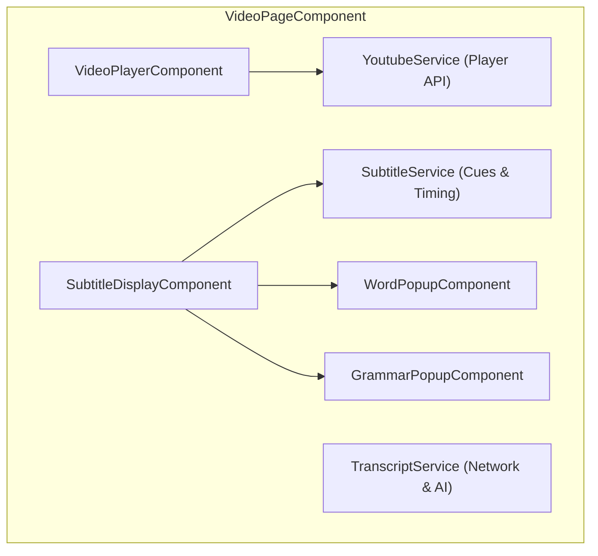
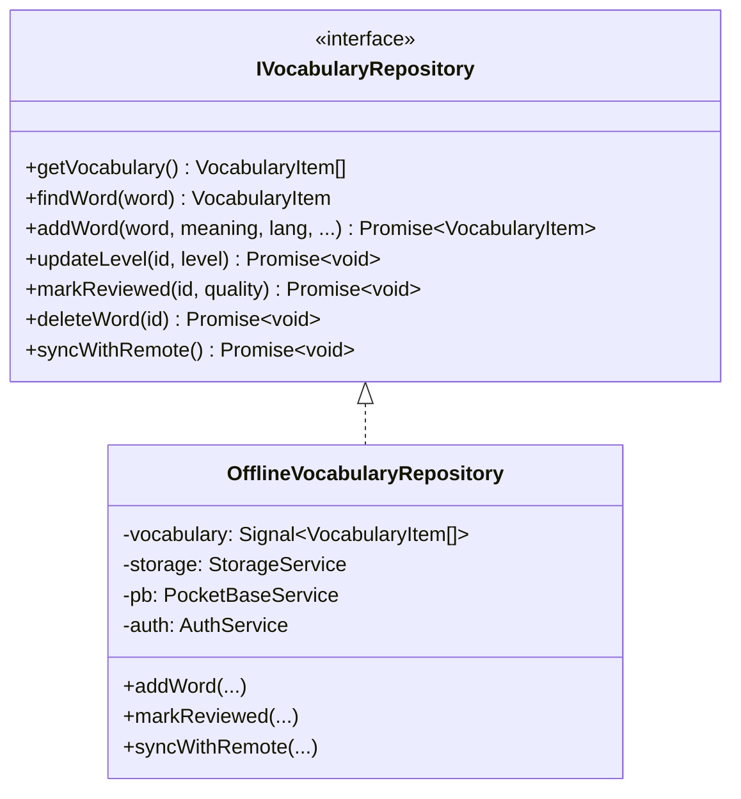

# Frontend Architecture & UI System

This document outlines the frontend design principles, Angular 19 Signal state architecture, component hierarchy, repository patterns, and UI design system for **Voca** (formerly LinguaTube).

---

## 1. Core Architectural Paradigms

```
┌────────────────────────────────────────────────────────────────────────┐
│                   ANGULAR 19 FRONTEND ARCHITECTURE                     │
└────────────────────────────────────────────────────────────────────────┘

 [ 1. Fine-Grained Reactivity ]       [ 2. Offline-First Data Layer ]
   • Angular Signals (signal, computed)  • Repository Pattern (IVocabularyRepo, etc.)
   • ChangeDetectionStrategy.OnPush      • LocalStorage + IndexedDB (lingua-tube-cache)
   • Zero Zone.js manual triggers        • PocketBase Two-Way Cloud Synchronization

 [ 3. Standalone Component Tree ]     [ 4. Cross-Platform Responsive UI ]
   • Zero NgModules                       • Mobile-First Responsive SCSS Layouts
   • Deferred Loading (loadComponent)     • Touch Gestures, Pointer Capture & RAF
   • Isolated SCSS per component          • SVG Circle Flags & Full PWA Caching
```

---

## 2. Signal-Driven State Management

Voca uses Angular Signals as the single source of truth for all synchronous and reactive state.

### 2.1. Why Signals over NgRx or Manual BehaviorSubjects?
- **Glitch-Free Computed Derivations**: `computed()` values update lazily and deterministically without diamond-dependency glitches.
- **Granular DOM Updates**: Angular's runtime updates only the specific DOM nodes bound to changed signals.
- **OnPush Compatibility**: Works seamlessly with `ChangeDetectionStrategy.OnPush` without requiring manual `ChangeDetectorRef.markForCheck()`.

### 2.2. Core State Signals Examples
```typescript
// SubtitleService
readonly subtitles = signal<SubtitleCue[]>([]);
readonly currentCueIndex = signal<number>(-1);
readonly currentCue = computed(() => {
  const idx = this.currentCueIndex();
  const cues = this.subtitles();
  return idx >= 0 && idx < cues.length ? cues[idx] : null;
});

// SettingsService
readonly settings = signal<UserSettings>(DEFAULT_SETTINGS);
readonly readingDisplayMode = computed(() => 
  this.settings().readingDisplayMode
);

// VideoPlayerComponent
readonly playerSettingsView = signal<'main' | 'speed' | 'fontSize' | 'dualSub'>('main');
readonly isFullscreen = signal<boolean>(false);
```

---

## 3. Component Architecture & Domain Modules

### 3.1. Shell & Global Components (`src/app/components/`)
- **`SidebarComponent`**: Collapsible main navigation supporting compact icon mode and expanded text mode. Displays streak counter and diamond credit badge.
- **`SettingsSheetComponent`**: Slide-over sheet for adjusting learning languages, Furigana/Pinyin toggles, Romaji display modes, font size, playback speed, and theme.
- **`StreakDialogComponent`**: Modal displaying 7-day practice activity, streak freeze inventory, and milestone badges.
- **`AiCreditsDialogComponent`**: Details current Diamond credit count, 20-minute regeneration countdown timer, and Gladia AI limits.
- **`OnboardingComponent`**: First-time user walkthrough guiding video selection, language choices, and subtitle interactions.
- **`CommandPaletteComponent`**: Power-user modal (`Cmd+K` / `Ctrl+K`) for instant navigation, video loading, and action dispatching.

---

### 3.2. Video Experience Domain (`src/app/features/video/`)



#### VideoPageComponent (`video-page/`)
- Host shell coordinating player, subtitles, unified sidebar, and mobile queue.
- **Unified Desktop Sidebar (`.unified-sidebar`)**:
  - Encapsulates `PlaylistPanelComponent` and `VocabularyListComponent` inside a single card container with segmented tab switcher (`[Playlist (N)]` / `[Vocabulary (N)]`).
  - Retains playlist tab on desktop even for single-video playlists (`hasPlaylist`), allowing playlist management without cluttering the page.
- **Responsive Mobile Queue (`.mobile-playlist-card`)**:
  - In-flow expandable playlist bar positioned directly below the player.
  - **Single-Video Optimization**: Hidden when `videos.length <= 1` (`showMobilePlaylistCard`), freeing up 54px vertical space for subtitles.
  - **Control Guarding**: Next and previous buttons are disabled when `videos.length <= 1` (unless looping) to avoid confusing dead clicks.

#### VideoPlayerComponent (`video-player/`)
- Encapsulates the official YouTube IFrame API via `YoutubeService`.
- **Custom Player Controls Overlay**:
  - `VideoHeaderComponent`: Video title, channel info, back navigation, and playlist context.
  - `CenterControlsComponent`: Play/pause toggle, $\pm 5$s seek buttons with smooth animation.
  - `ProgressBarComponent`: Custom slider with buffered progress indicator, hover time preview, and cue segment markers.
  - `VideoBottomBarComponent`: Time display, playback speed selector, dual-subtitles toggle, audio volume slider, fullscreen trigger. Right-clicking the dual subtitles button triggers the quick language selection modal.
  - `FullscreenSubtitleComponent`: Dedicated high-contrast subtitle overlay positioned via `fullscreenSubtitleYPercent` setting.
    - Features a horizontal drag handle bar with pill indicator.
    - Drag handler scheduled via `requestAnimationFrame` with pointer capture.
    - Magnetic snap targets at `12%` (top) and `82%` (bottom), and tap-to-toggle.
- **Interaction Services**:
  - `GestureHandlerService`: Handles mobile touch gestures (swipe right/left to seek, swipe up/down for volume, double-tap left/right for $\pm 10$s jump).
  - `VideoKeyboardShortcutService`: Desktop hotkeys (`Space`, `k`, `Left`/`Right`, `j`/`l`, `Up`/`Down`, `f`, `m`, `c`).

#### SubtitleDisplayComponent (`subtitle-display/`)
- Synchronizes with video playback via a high-performance $O(\log n)$ binary search (`findActiveCue`).
- **Sticky Subtitles**: If a gap exists between cues, retains the previous cue briefly to prevent jarring visual flickering.
- **Interactive Word Segmentation**: Every word is rendered as a clickable token. Clicking opens `WordPopupComponent`.
- **5 Reading Display Modes**:
  - `native`: Original script.
  - `annotated`: Furigana / Pinyin ruby annotations.
  - `reading`: Kana-only reading.
  - `annotatedRomanized`: Kanji with Hepburn Romaji annotations.
  - `romanized`: Hepburn Romaji / Revised Romanization only.
- **Grammar Match Highlights**: Tokens matching active grammar patterns receive visual underlines; clicking opens `GrammarPopupComponent`.

---

### 3.3. Dictionary Domain (`src/app/features/dictionary/`)
- **`WordPopupComponent`**:
  - Positioned adjacent to clicked subtitle token or search query.
  - Displays headword, phonetic readings, parts of speech, English/native definitions, JLPT/HSK/TOPIK level badges, and source audio pronunciation.
  - Features high-fidelity SVG circle flags for target language selection and translation results.
  - Provides a single-click "+ Add to Vocabulary" button.
- **`GrammarPopupComponent`**:
  - Displays detected grammatical structures (e.g. `〜てはいけない`, `虽然...但是...`).
  - Shows formation rules, explanations, level badges, and contextual example sentences.
  - Automatically loads multi-language translation packs or native-to-native explanations on demand.
- **`DictionaryPageComponent`**:
  - Standalone full-screen dictionary search page with search history, language selectors, and comprehensive definitions.

---

### 3.4. Study & Retention Domain (`src/app/features/vocabulary/`)
- **`VocabularyListComponent`**:
  - Tabular view of saved words filterable by language (`ja`, `zh`, `ko`, `en`) and mastery status:
    - 🔵 **New**
    - 🟡 **Learning**
    - 🟢 **Known**
    - ⚪ **Ignored**
  - Inline audio playback, search filtering, and JSON export/import.
- **`StudyPageComponent` & `StudyModeComponent`**:
  - Implements the **SuperMemo-2 (SM-2)** spaced repetition flashcard review deck.
  - Displays front (target word + sentence context) and back (reading + meaning + examples).
  - Users rate recall quality from 1 to 5, updating interval, ease factor, and `nextReviewDate`.

---

### 3.5. Playlists & History Domains (`playlist/` & `history/`)
- **`PlaylistPageComponent`**: Lists user-created custom playlists alongside curated Community Playlists (e.g. "Japanese N5 Listening", "Chinese Conversational").
- **`AddToPlaylistDialogComponent`**: Modal sheet to bookmark current video into existing or new playlists.
- **`HistoryPageComponent`**: Displays watch history, percentage watched, resume timestamps, and options to clear history.

---

## 4. Offline-First Repository Architecture

All user data operations follow the **Repository Pattern** to decouple UI components from network calls and storage drivers:



### Deterministic ID Generation
To ensure zero duplicate records when syncing between local browser storage and PocketBase:
```typescript
private generateVocabId(userId: string, word: string, language: string): string {
    const raw = `${userId}|${word}|${language}`;
    return btoa(unescape(encodeURIComponent(raw)))
        .replace(/[^a-zA-Z0-9]/g, '')
        .toLowerCase()
        .slice(0, 15);
}
```

---

## 5. Internationalization System (`I18nService`)

- Static preloaded JSON dictionaries for 5 languages:
  - `src/app/i18n/en.json` (English)
  - `src/app/i18n/vi.json` (Vietnamese)
  - `src/app/i18n/ja.json` (Japanese)
  - `src/app/i18n/ko.json` (Korean)
  - `src/app/i18n/zh.json` (Chinese)
- Simple, type-safe lookup with interpolation:
  ```typescript
  // Translation call
  i18n.t('streak.milestoneMessage', { count: 7 });
  ```

---

## 6. Styling & Design System

The application styling is organized using modular SCSS located in `src/styles/`:

- **`_variables.scss`**: Design tokens, font stacks (system, Noto Sans JP/KR/SC), color palette, spacing, z-index layers.
- **`_base.scss`**: CSS reset, root typography, scrollbar styling, mobile tap-highlight resets.
- **`_layout.scss`**: Main grid, sidebar layouts, topbar header, safe area padding (`--bottom-nav-safe-area`, `env(safe-area-inset-bottom)`).
- **`_components.scss`**: Badges, modals, dialog backdrops, pill tags, buttons.
- **`_buttons.scss` & `_forms.scss`**: Standardized button variants (primary, secondary, danger, ghost) and input fields.
- **Dark/Light Theming**:
  Theme switching is controlled via `data-theme="dark"` or `data-theme="light"` on the `<html>` root, referencing CSS variables:
  ```scss
  [data-theme="dark"] {
    --bg-primary: #0f172a;
    --bg-secondary: #1e293b;
    --text-primary: #f8fafc;
    --accent-color: #38bdf8;
  }
  ```
