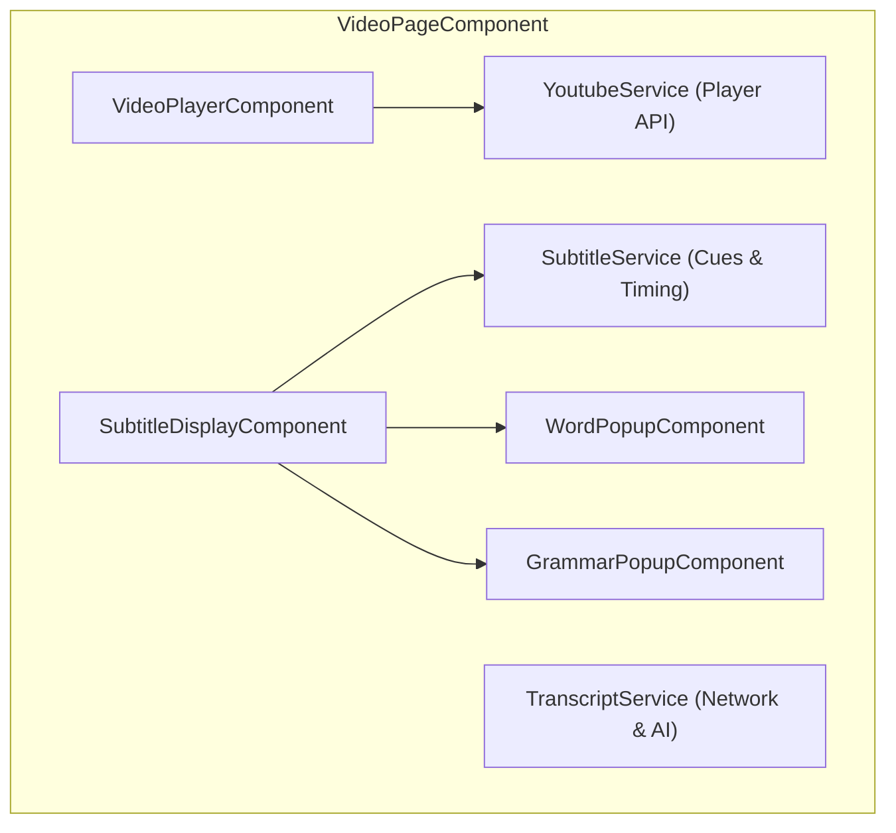
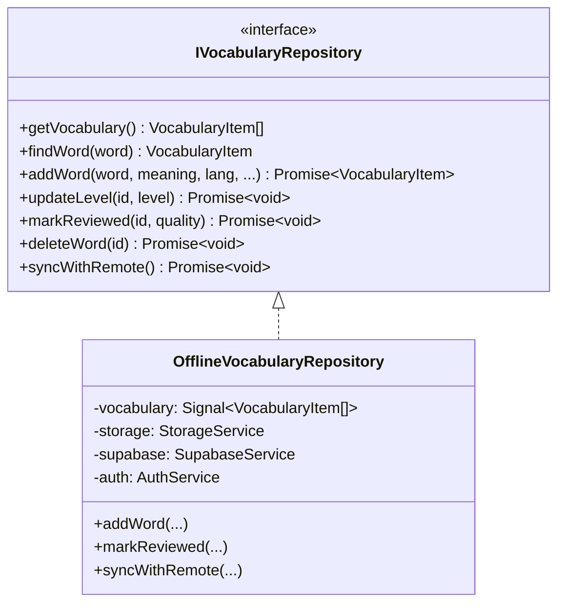

# Frontend Architecture & UI System

This document outlines the frontend design principles, Angular 19 Signal state architecture, component hierarchy, repository patterns, and UI design system for **Voca** (formerly LinguaTube).

---

## 1. Core Architectural Paradigms

```
┌────────────────────────────────────────────────────────────────────────┐
│                   ANGULAR 19 FRONTEND ARCHITECTURE                     │
└────────────────────────────────────────────────────────────────────────┘

 [ 1. Fine-Grained Reactivity ]       [ 2. Offline-First Data Layer ]
   • Angular Signals (signal, computed)  • Repository Pattern (IVocabularyRepo, etc.)
   • ChangeDetectionStrategy.OnPush      • LocalStorage + IndexedDB (lingua-tube-cache)
   • Zero Zone.js manual triggers        • Supabase Two-Way Cloud Synchronization

 [ 3. Standalone Component Tree ]     [ 4. Cross-Platform Responsive UI ]
   • Zero NgModules                       • Mobile-First Responsive SCSS Layouts
   • Preloaded Bundles (PreloadAllModules)• Touch Gestures, Pointer Capture & RAF
   • Isolated SCSS per component          • SVG Circle Flags & Full PWA Caching
```

---

## 2. Signal-Driven State Management

Voca uses Angular Signals as the single source of truth for all synchronous and reactive state.

### 2.1. Why Signals over NgRx or Manual BehaviorSubjects?
- **Glitch-Free Computed Derivations**: `computed()` values update lazily and deterministically without diamond-dependency glitches.
- **Granular DOM Updates**: Angular's runtime updates only the specific DOM nodes bound to changed signals.
- **OnPush Compatibility**: Works seamlessly with `ChangeDetectionStrategy.OnPush` without requiring manual `ChangeDetectorRef.markForCheck()`.

### 2.2. Modern Angular 19 Primitives
- **`linkedSignal()`**: Used for form controls and dialog states (e.g. `CreatePlaylistDialogComponent`, `WordPopupComponent.targetLang`) that require an initial derivation from input signals while allowing independent user edits, eliminating manual lifecycle synchronization effects.
- **`model()`**: Implements two-way signal binding on standalone form primitives (e.g. `SwitchComponent.checked = model<boolean>(false);`).
- **`viewChild()` & `viewChild.required()`**: Query signals replacing `@ViewChild` decorator queries (e.g. `ProgressBarComponent`, `DictionaryPanelComponent`), enabling fully type-safe, reactive template references.

### 2.3. Core State Signals Examples
```typescript
// SubtitleService
readonly subtitles = signal<SubtitleCue[]>([]);
readonly currentCueIndex = signal<number>(-1);
readonly currentCue = computed(() => {
  const idx = this.currentCueIndex();
  const cues = this.subtitles();
  return idx >= 0 && idx < cues.length ? cues[idx] : null;
});

// SettingsService
readonly settings = signal<UserSettings>(DEFAULT_SETTINGS);
readonly readingDisplayMode = computed(() => 
  this.settings().readingDisplayMode
);

// VideoPlayerComponent
readonly playerSettingsView = signal<'main' | 'speed' | 'fontSize' | 'dualSub' | 'reading' | 'grammar' | 'sleepTimer'>('main');
readonly isFullscreen = signal<boolean>(false);
readonly currentSpeed = computed(() => this.youtubeService.playbackRate());
```

---

## 3. Accessibility, Focus Management & Mobile Stability

### 3.1. Modal Focus Traps, Stacking & Dynamic Height Transitions (`BottomSheetComponent` & `VideoPlayerComponent`)
- **Focus Cycling & Restoration**: Implements strict `keydown` listener trapping keyboard `Tab` / `Shift+Tab` cycles within the active bottom sheet container. Caches `document.activeElement` prior to sheet open and restores focus back to the triggering element (with fallbacks to `.cue-item--active, .subtitle-panel, main`) upon dismissal.
- **Multi-Sheet Stacking & Accessibility Isolation**: When sheets stack (e.g. Settings Sheet -> Streak Dialog -> Upgrade Sheet), `BottomSheetService.isTopmost(sheetId)` coordinates stacking order. Non-topmost background sheets receive `[attr.inert]=""` and `[attr.aria-hidden]="true"`, completely preventing background tab navigation and screen-reader leakage without tearing down modal state.
- **Race-Free Idempotent Dismissal**: Dismissal calls (`close()`, backdrop click, drag dismiss) track an explicit timeout ID (`closeTimeoutId`), cancelling pending timers and guarding `unregister(id)` against duplicate execution.
- **Safe Area & Virtual Keyboard Clamping**: Max height is strictly clamped via `min(var(--max-height, 85vh), calc(var(--app-height, 100dvh) - 16px))`, preventing virtual keyboards from pushing sheet action headers off-screen. Bottom padding on `.sheet-content` is zeroed when the inner content wrapper supplies safe-area insets, eliminating unsightly 68px double-padding stacking on iOS devices.
- **Unified `SmoothHeightAnimator` (`src/app/shared/utils/smooth-height.animator.ts`)**:
  - Encapsulates dynamic height animation across both `BottomSheetComponent` (mobile sheets & desktop dialogs) and `VideoPlayerComponent` (desktop settings popups), eliminating duplicate animation code.
  - **ResizeObserver Driven**: Watches intrinsic content size updates via an unconstrained `.sheet-content-inner` wrapper in `BottomSheetComponent` and `#settingsPopupInner` in `VideoPlayerComponent` using native `ResizeObserver`.
  - **Subpixel & Reflow Suppression**: Filters out horizontal width-only reflows and subpixel layout jitter (`Math.abs(contentHeight - lastContentHeight) <= 1`) so toggling scrollbar classes (`.animating-height`) does not self-cancel in-flight transitions.
  - **Web Animations API**: Smoothly interpolates the container's rendered height (`element.animate([{ height: `${old}px` }, { height: `${new}px` }], { duration: 220, easing: 'cubic-bezier(0.32, 0.72, 0, 1)' })`).
  - **Submenu View Transitions**: When navigating between player settings submenus (`main`, `speed`, `fontSize`, `dualSub`, `reading`, `grammar`), container heights dynamically animate without visual snapping across both desktop popups and mobile bottom sheets.
  - **Seamless Interruption**: If content resizes again mid-animation (e.g. rapid accordion toggle, async search results, or translation changes), the active animation is sampled at its exact mid-flight height (`element.getBoundingClientRect().height`) and smoothly redirected to the new target height without visual pop.
  - **Scrollbar Flicker Suppression**: Applies `.animating-height` class during transitions with `overflow-y: hidden` on `.sheet-content` to prevent horizontal text reflow and unsightly scrollbar flashing.
  - **Gesture & Lifecycle Coordination**: Automatically bypasses height transitions during entrance animations (`mobileSlideUp`/`scaleIn`), cancels cleanly on drag-to-dismiss touch start (`onTouchStart`), suppresses animations during window resizing/orientation shifts, and respects user accessibility preferences (`prefers-reduced-motion: reduce`).

### 3.2. WAI-ARIA Slider Navigation & Interactive State Controls
- **Accessible Progress Bar (`ProgressBarComponent`)**: Configured with `role="slider"`, `[attr.aria-valuenow]`, `[attr.aria-valuemin]="0"`, `[attr.aria-valuemax]="duration()"`, and formatted `[attr.aria-valuetext]`. Supports `ArrowLeft`/`ArrowRight` (5s seek) and `Home`/`End` (0s / end seek).
- **Accessible Volume Slider (`VideoBottomBarComponent`)**: Fully compliant `role="slider"` with `[attr.aria-valuenow]`, `[attr.aria-valuemin]="0"`, `[attr.aria-valuemax]="100"`, and `[attr.aria-label]`. Global `document` mouse/touch dragging listeners are cleanly torn down via dedicated cleanup callbacks to prevent memory leaks and listener accumulation.
- **Button Toggle States (`SubtitleDisplayComponent`)**: Subtitle utility buttons (`Loop Cue`, `Quiz Mode`, `Reading Mode`, `Grammar Highlights`) implement `[attr.aria-pressed]` reflecting active signal state to assistive tech.
- **Screen Reader Skeletons (`role="status"`)**: Skeleton containers maintain `role="status"` and `aria-busy="true"` with visually-hidden fallback text (`<span class="sr-only">`), avoiding conflicting `aria-hidden="true"` attributes that would otherwise silence loading state announcements.
- **Player Embed Error Fallback (`VideoPlayerComponent`)**: When videos restrict third-party embeds (YouTube error codes 101/150), an accessible alert banner (`role="alert"`) displays with informative guidance and an explicit "Watch on YouTube" action link, preventing silent video stall.

### 3.3. Viewport Stability, CJK Typography & Zero-CLS Architecture
- **PWA Root Overscroll Lockout (`overscroll-behavior-y: none`)**: Set globally on `html, body` to suppress native mobile Chrome and Safari pull-to-refresh gestures.
- **Tokenized Playback Pause Lock Coordinator (`YoutubeService`)**: Provides an idempotent token-based pause lock (`acquirePauseLock(token)` / `releasePauseLock(token)`). When a learner clicks or hovers over a word to inspect its definition, the video reliably holds the paused state across both mobile and desktop, automatically resuming only when all registered locks (e.g. `'word-lookup'`) are freed.
- **Passive Scroll & Throttled Time Tracking Outside NgZone**: Window scroll handlers are detached from Angular's zone (`ngZone.runOutsideAngular()`) to avoid hundreds of redundant change detection ticks during user scrolling. Video playback time tracking is throttled to 150ms intervals, balancing smooth subtitle highlighting with minimal CPU and battery consumption.
- **Native CJK Multi-Script Typography**:
  - **Japanese & Chinese (`.text-ja`, `.text-zh`)**: `line-break: strict;` enforces strict East Asian typesetting line-breaking rules, preventing small kana (っ, ょ) and punctuation (。、) from appearing at line starts.
  - **Korean (`.text-ko`)**: `word-break: keep-all; overflow-wrap: break-word;` preserves whole Hangul words across lines without mid-word character splits, wrapping cleanly on word boundaries.
  - **Word Tokens (`.word`)**: `max-width: 100%; overflow-wrap: break-word;` prevents long compound words or phonetic annotations from overflowing parent containers on narrow mobile viewports.
- **Pre-Allocated Subtitle Container Height (Zero CLS)**: Subtitle container height (`11.5rem` desktop / `10.5rem` mobile) is pre-allocated synchronously whenever dual subtitles are active in settings, eliminating the jarring 6rem layout shift when the transcript arrives. Cue list items employ `content-visibility: auto; contain-intrinsic-size: auto 56px;` to virtualize off-screen DOM rendering.
- **Resume Hero Skeletons & Navigation Guard**: The History page features a synchronized `.resume-hero--skeleton` placeholder matching the exact 90px height and border-radius of the resume card, eliminating CLS upon async history load. `SidebarComponent` renders synchronously on desktop without `@defer (on idle)`, eradicating initial 252px content shifts. Landscape phone bottom-nav hiding is strictly scoped to active video playback (`.video-active`, `.is-fullscreen`), preventing landscape page navigation blackouts.
- **iOS Safari Auto-Zoom Fix**: All mobile inputs (notably `.spotlight-input` in `VideoPlayerComponent` and `CommandPaletteComponent`) enforce `font-size: 1rem` (16px !important), eliminating WebKit's automatic zoom on focus.
- **Notch & Safe Area Protection**: Container gutters use `max(var(--space-md), env(safe-area-inset-left))` to prevent UI clipping by device camera cutouts in landscape.
- **Dynamic HTML Language Attribute**: `I18nService` runs a reactive signal effect syncing `document.documentElement.lang = lang`, ensuring screen readers and phonetic engines correctly parse active language phonemes.

---

## 3. Component Architecture & Domain Modules

- **`SidebarComponent`**: Collapsible main navigation supporting compact icon mode and expanded text mode. Features dynamic brand title typography ('Pro', 'Premium', or 'Voca') matching the user's active tier, and a 3-bar animated sound equalizer now-playing indicator for active video sessions.
  - **Motivation Stats Bar (`stats-bar`) & Collapsed Popover Card (`stats-popover-card`)**: Available to both guest and authenticated users in alignment with Voca's offline-first architecture (`🔥 Streak`, `🏆 Level` with Achievements modal trigger, and `💎 AI Credits`). In expanded mode, renders as a single horizontal pill (`.stats-bar`). In collapsed mode, the rail remains purely iconic (40×40px items: Flag and Avatar with a neatly docked flame badge `🔥`), while clicking the avatar smoothly opens a floating card (`.stats-popover-card`) anchored to the bottom-left displaying the user profile, hero streak banner, XP overview, AI diamonds, settings, and sign-out actions. Harmonized with the sidebar and main content using `var(--bg-card)` for the card container and `var(--bg-primary)` for internal widget tiles to eliminate muddy contrast in both Light and Dark themes.
  - **Authenticated State (`auth.isLoggedIn()`)**: Displays Pro/Premium upgrade button (if eligible) and user profile row with subscription tier ring and settings trigger.
  - **Guest State (`!auth.isLoggedIn()`)**: Omits premature 👑 Pro upsell button. In expanded mode, displays the learning language picker, a welcoming Google sign-in card with vocabulary sync prompt, and settings button. In collapsed mode, displays the learning language flag and clean guest avatar, with cloud sync CTA in the popover card.
- **`SettingsSheetComponent`**: Slide-over sheet for adjusting learning languages, Furigana/Pinyin toggles, Romaji display modes, font size, playback speed, and theme. Includes mobile-responsive motivation stats pills (`Streak`, `Level`, `AI Credits`).
- **`MoreMenuSheet` (in `AppComponent`)**: Mobile personal library & settings sheet accessible via the bottom navigation bar. Features a 3-column top quick stats bar (`🔥 Streak`, `🏆 Level`, `💎 AI Credits` - tapping Level opens the Achievements modal) alongside personal library and settings action rows (`Playlists`, `History`, `Install App`, `Settings`).
- **Mobile Bottom Navigation (`.bottom-nav`)**: 5-item mobile navigation bar featuring `Xem` (Watch), `Ôn tập` (SRS Review), an elevated central `(+)` squircle CTA button with Voca's signature coral accent gradient (`linear-gradient(135deg, var(--accent-primary), #e04848)`) for instantaneous YouTube video URL entry, `Từ vựng` (Dictionary), and `Thêm` (More).
- **`AchievementsDialogComponent`**: Interactive gamification modal showcasing user level, total XP progress bar, unlocked and in-progress achievement badges across Immersion, Vocabulary, Daily Streaks, Flashcards, and Quizzes, and global leaderboard rankings.
- **`StreakDialogComponent`**: Modal displaying 7-day practice activity, streak freeze inventory, and milestone badges.
- **`AiCreditsDialogComponent`**: Interactive diamond quota modal showcasing current credit balance, dynamic tier badge (`Anonymous`, `Free`, `Pro`), dynamic regen timer (5m / 15m / 20m), video duration pricing breakdown ($\le 10$m = 1 credit, $10$–$20$m = 2 credits, $> 20$m Pro-only), and a dedicated Pro teaser card linking directly to `ProUpgradeDialogComponent`.
- **`ProUpgradeDialogComponent`**: Dedicated subscription upgrade bottom sheet designed with consistent modal styling. Features a monthly/annual plan selector with discount badge, feature comparison showcase, responsive VietQR payment card with raw EMVCo parsing, copyable bank details, live payment polling via `PaymentService`, and automatic tier activation upon settlement.
- **`OnboardingComponent`**: First-time user walkthrough guiding video selection, language choices, and subtitle interactions.
- **`CommandPaletteComponent`**: Modern Spotlight navigation hub (`Cmd+K` / `Ctrl+K`) for instant app navigation, quick action dispatching (Watch, Study, Dictionary, Playlists, History, Theme Toggle), keyboard arrow navigation (`↑`/`↓`/`Enter`), and YouTube URL / video ID loading.
- **`ToastComponent`**: Root-mounted adaptive status capsule (`ToastService`), displaying bottom/top HUD notifications with spring physics, thumb-zone mobile ergonomics, semantic status icons, and interactive action/undo buttons without frosted glass.

---

### 3.2. Video Experience Domain (`src/app/features/video/`)



#### VideoPageComponent (`video-page/`)
- Host shell coordinating player, subtitles, unified sidebar, and mobile queue.
- **Home Dashboard & "For You" Discovery (`.home-dashboard`)**:
  - Displayed when no video is loaded (`showLearnHome`).
  - **YouTube Homepage Feed**: Responsive card grid (`.yt-video-grid` and `.yt-video-card`) with clean 16:9 thumbnails (unobstructed by badges, with bottom-right duration pill), channel avatars, 2-line clamped titles, and metadata tags.
  - **Interleaved Playlists in Feed**: Curated and community playlists are recommended directly within the main discovery stream (every 4 videos) with stacked thumbnail card physics, playlist count overlays, and one-tap playback (`startPlaylist`).
  - **Coordinated Feed Loading & Zero Layout Shift (CLS = 0)**: Video and playlist recommendation streams are strictly synchronized; 8 YouTube-style shimmer skeleton cards (`.yt-video-card--skeleton`) with dual title lines (`skeleton-line--title` and `skeleton-line--title-short`) and `skeletonWave` linear-gradient shimmer keep the grid completely filled and eliminate layout shift when actual videos load.
  - **Persistent Feed State & Precision Double-RAF Scroll Restoration**:
    - The Home Dashboard (`.home-dashboard`) preserves its loaded video cards in memory across miniplayer toggles, while seamlessly toggling `.hidden` (`display: none !important`) when in full watch mode to eliminate any background bleed, gaps, or ghost scrolling.
    - **Zero Layout Shifts & Level Switching Skeletons**: Feed items are retained in memory when returning from playback to prevent layout shifts. When switching to an uncached difficulty tier or performing a cold load, `isFeedLoading` cleanly displays the 8-card skeleton placeholder grid while server-side recommendations are in flight, transitioning smoothly to the newly loaded videos without stale card flashes or layout jumps. Cached levels swap instantaneously with zero loading latency.
    - **Double-RAF Scroll Restoration**: Uses `@HostListener('window:scroll')` to passively track feed scroll positions while browsing. When minimizing or closing a video, a double `requestAnimationFrame` loop atomically restores `window.scrollTo` to the exact scroll position with sub-pixel accuracy, guarded by navigation flags to prevent race conditions.
    - **Atomic Video Teardown & Flicker Elimination**: Calling `closeVideo()` resets playback state atomically before player view mode, ensuring `showLearnHome` transitions cleanly without intermediate state flickers. Recommendations `effect()` reactions are decoupled via `untracked()`, preventing redundant playlist fetches on player minimize/expand.
  - **YouTube-Style Touch Pull-to-Refresh (`.yt-pull-refresh`)**:
    - At the top of the home feed (`window.scrollY <= 2`), pulling downwards reveals a floating circular refresh bubble with an arrow rotating proportionally to drag distance.
    - Pulling past threshold triggers a coordinated refresh of recommended videos and playlists, complete with a spinning indicator and toast confirmation, without triggering a disruptive browser white-screen reload.
    - Pull-to-refresh touch tracking is completely disabled while watching a video to prevent any interference with subtitle scrolling or video scrubbing.
  - **Clean Sticky Category Chips Carousel (`.yt-chips-bar`)**: Full-width horizontal sticky YouTube-style chips bar (`All`, `Playlists`, level badges e.g. `JLPT N5`–`N1`) with smooth touch scrolling, fixed pill dimensions, and an integrated refresh button.
  - **Native-Grade Feed Refreshing (Tap-to-Refresh & Browser Reload)**:
    - **Bottom Nav Tap-to-Refresh**: Tapping the active "Watch" tab in the bottom bar smoothly scrolls to top (if scrolled down) or triggers an instant feed refresh with subtle haptic feedback (if already at top), mimicking native YouTube/Twitter UX.
    - **Header & Browser Refresh**: Explicit refresh button in the chips bar and touch pull-to-refresh automatically fetch freshly shuffled catalog videos with `Cache-Control: no-cache, no-store, must-revalidate`.
    - **Smart De-duplication & Catalog Rotation**: Sourced from an expanded 120-video pool in D1 (`functions-src/data/video-info-db.js`), prioritizing unwatched videos first via `HistoryService` so every refresh brings novel practice material.
  - **Clean Metadata Sub-Row Badges**: Proficiency level badges (`.level-badge--pill`, e.g. `JLPT N4`, `HSK 2`, `TOPIK 1`, `CEFR B1`) sit cleanly beside subtitle badges (`[CC]`) in the metadata row beneath the channel name, keeping the thumbnail artwork pristine.
  - **Infinite Scrolling Discovery & Seamless Prefetching**: Powered by an `IntersectionObserver` sentinel element (`.feed-sentinel`) with 600px root margin for frictionless YouTube-style prefetching and `VideoRecommendationService.loadMoreRecommendedVideos(...)`, automatically appending 12-video batches as the user scrolls. Employs a centered `.spinner.spinner--lg` indicator during pagination with zero animation delay on appended cards to eliminate layout jumps.
  - **Unified Global Spinner Component (`.spinner`)**: Standardized CSS spinner design token in `_components.scss` with multiple size (`--sm`, `--md`, `--lg`, `--xl`) and theme (`--white`, `--current`) variants, animated with smooth `spin` keyframes and respecting `prefers-reduced-motion`.
  - **Modern Video Iconography**: Unified on sleek `play-circle` and `list-video` icons across tabs, cards, and empty states.
  - Powered by `VideoRecommendationService` and `PlaylistService` retrieving genuine transcribed videos and multi-video playlists directly from Cloudflare D1/R2 and Supabase.
- **Reactive Target Language Switch Effect**:
  - Distinguishes between explicit mismatch modal confirmations (`skipNextMismatchDialog: true`, which keeps the player active and refetches subtitles in the detected language) and user-initiated learning language changes in the sidebar/settings.
  - When the user changes target learning language while watching a video, the effect resets the player, clears current subtitles/transcripts, clears the active playlist, and navigates to `/video` to present the Home Feed recommendations for the newly selected language.
- **Unified Desktop Sidebar (`.unified-sidebar`)**:
  - Encapsulates `PlaylistPanelComponent` and `VocabularyListComponent` inside a single card container with segmented tab switcher (`[Playlist (N)]` / `[Vocabulary (N)]`).
  - Retains playlist tab on desktop even for single-video playlists (`hasPlaylist`), allowing playlist management without cluttering the page.
  - **Encapsulated Vocabulary Management**: `VocabularyListComponent` manages its own vocabulary options menu (JSON/Anki export, JSON import) and deletion confirmation with animated exit and instant undo toast, removing ~140 lines of duplicate menu templates and dialog logic previously scattered across `VideoPageComponent` and `DictionaryPageComponent`.
- **Feed Error Recovery & Resilience**:
  - `VideoRecommendationService` tracks network/API failures with a reactive `hasError` signal.
  - `VideoPageComponent` renders an accessible, interactive error empty-state card with a "Retry" CTA (`refreshRecommendations()`), allowing seamless recovery from transient network issues.
- **Responsive Mobile Queue (`.mobile-playlist-card`) & Sheet Header**:
  - In-flow compact playlist bar (~48px) positioned directly below the player with playlist metadata and expand chevron.
  - Tapping opens the mobile `<app-bottom-sheet>` featuring a sticky `.mobile-playlist-sheet-header` with playlist info and full action toolbar (`[Shuffle]`, `[Repeat]`, `[Share]`), completely decluttering the video screen and maximizing vertical space for subtitles.
  - **Control Guarding**: Next and previous buttons are disabled when `videos.length <= 1` (unless looping) to avoid confusing dead clicks.

#### VideoPlayerComponent (`video-player/`)
- Encapsulates the official YouTube IFrame API via `YoutubeService`.
- **Custom Player Controls Overlay**:
  - `VideoHeaderComponent`: Video title (strictly clamped to a single line with `text-overflow: ellipsis` on all viewports), channel info, proficiency level badge, and streamlined header action buttons (`Subtitle Tracks`, `Share Video`, `Close Video`).
    - Save to Playlist has been relocated into the Player Settings / More Menu to declutter the mobile header and eliminate accidental taps near the Close Video button.
    - Clicking the proficiency level badge opens the dedicated `VideoLevelDialogComponent` sheet/modal.
    - Clicking the Subtitle Tracks button opens the `Subtitle Tracks` bottom sheet using the exact same `OptionPickerComponent` as the Learning Language Switcher. Tracks are presented as `OptionItem` entries inside a unified card with circular country flags (`getLanguageFlagUrl`), language labels, subtitle track descriptions (`JA • Native Subtitles` or `JA • Whisper AI`), subtle accent selection highlights, and an active circular checkmark badge (`.option-picker-item__check-badge`). The header Subtitle Tracks button maintains neutral styling matching the Share button (`btn-header-action`). In addition to native and existing AI tracks, the sheet presents multi-language AI transcription options (`__generate_ai:${code}__`) for all candidate learning languages (`ja`, `zh`, `ko`, `en`), sorted with the user's active learning language first.
    - **Multi-Language AI Transcription & Language Switching**: In the AI Generation confirmation modal, users can interactively select any of the 4 supported languages via language chips (`.ai-lang-chips`). When transcription completes, the app automatically switches the active learning language context (`learningLanguage.switchLanguage(lang, { navigateHome: false })`) without page navigation, immediately initializing tokenizers, furigana/pinyin/romaji, and dictionaries for the new language.
    - **Speech Waveform Icon (`subtitles-ai`)**: Dynamically switches the header tracks button and player CC toggle to the `subtitles-ai` speech waveform caption box whenever an AI-generated track is currently playing. Inside the sheet, native tracks and AI-transcribed tracks display their corresponding language flags and metadata chips.
  - `CenterControlsComponent`: Play/pause toggle, $\pm 5$s seek buttons with smooth animation.
  - `ProgressBarComponent`: Custom slider with buffered progress indicator, hover time preview, and cue segment markers.
  - `VideoBottomBarComponent`: Time display, dual-subtitles toggle, audio volume hover slider (desktop-only), settings trigger, and fullscreen trigger.
    - **Desktop & Mobile Standard Hierarchy**: CC button is hidden in standard (non-fullscreen) view on both desktop and mobile to avoid redundancy with the Subtitle Tracks button in the header. Playback speed is accessed directly inside the Player Settings menu (`settings`), keeping the bottom bar minimal and spacious.
    - **Fullscreen Mode**: In fullscreen mode, the bottom bar renders the dedicated CC button (`@if (isFullscreen())`) with dynamic `subtitles-ai` waveform icon and diamond bar indicator when an AI track is active.
    - **Player Settings / More Menu**: Contains Playback Speed (with current speed badge, e.g. `1x`), Dual Subtitles language selection, Reading Display (Furigana / Pinyin / Romaji with typography icon `type`), Grammar Mode toggle, Sleep Timer, and Save to Playlist.
    - **Normalized Optical Icon Sizing & Indicators**: Normalized SVG icons (`languages`, `settings`, `maximize`) to uniform `stroke-width: 1.5`, aligned `.time-display` to 36px height matching control buttons, and refined active Dual-Sub indicator pill with non-colliding spacing.
    - **Deeper Bottom Scrim Gradient**: Enhanced linear gradient overlay to ensure high-contrast button readability and occlude YouTube iframe watermarks.
  - `PlayerSettings`: Shared YouTube-style menu template projected into `.player-settings-popup` on desktop and `<app-bottom-sheet>` on mobile:
    - **Comprehensive Controls (Bridging Fullscreen Gaps)**: Includes Sleep Timer, Playback Speed, Subtitle Font Size, Dual Subtitles Language, Reading Annotations (Furigana / Pinyin / Romaji), Grammar Pattern Highlighting, Share Video, Save to Playlist, and Keyboard Shortcuts (intelligently omitted in fullscreen mode).
    - **Sleep Timer Scheduler**: Features options for `Off`, `10m`, `15m`, `30m`, `45m`, `60m`, and `End of video` with dynamic countdown label and automatic video pause upon expiration.
    - **Uniform Row Layouts & Responsive Typography**: Items maintain 40px desktop context menu heights and comfortable 48px touch heights (44px in compact landscape) with legible typography (1rem/16px headers, 0.9375rem/15px rows), uniform 18px icons, and consistent indentations. In landscape orientation, bottom sheets are capped to proportional widths (`min(92%, 460px)`) rather than stretching across wide displays.
    - **Smooth Height Animations**: Smoothly animates container height via native Web Animations API during submenu view transitions.
  - `FullscreenSubtitleComponent`: Dedicated high-contrast subtitle overlay positioned via `fullscreenSubtitleYPercent` setting (default `94%`, bounds `10%`–`95%`).
    - **Bottom-Anchored Vertical Expansion**: Positioned via `transform: translate(-50%, calc(-100% + var(--drag-y, 0px)))` (or `translate(-50%, calc(0px + var(--drag-y, 0px)))` when at the top) following Netflix and YouTube subtitle engineering, so multi-line text and dual translations expand upward rather than causing jarring two-way vertical jumps.
    - **Natural Caption Positioning**: Standard bottom placement sits at `94%` (matching authentic streaming captions right above the bottom margin), eliminating excessive blank space. Legacy storage values of `84%` are automatically migrated to `94%`.
    - Features a horizontal drag handle bar with ergonomic hit target and pill indicator, supporting one-touch tap toggle between Top (`12%`) and Bottom (`94%`) as well as fluid swipe/drag gestures.
    - Drag handler runs completely outside Angular Zone (`NgZone.runOutsideAngular`) mutating `--drag-y` CSS variable directly on the DOM with pointer capture, ensuring locked 60fps/120fps fluid tracking with zero change detection cycles and eliminating anchor-flip jump bugs at 50%.
    - **Adaptive Controls Clearance**: Automatically detects `.controls-visible.is-near-bottom` and smoothly glides upward by 3.25rem (2.5rem on mobile) via CSS transforms, keeping subtitles cleanly hovering right above the player controls when controls appear, and smoothly dropping back to 94% when controls fade.
    - Mobile landscape typography optimization via `max-height: 520px` query, safe-area inset protection, and widescreen container clamping (`min(90%, 960px)`).
    - Full learning integration via `WordPopupComponent` in fullscreen (meanings, machine translations, audio/TTS, and level selector).
    - **Cinematic Immersion & Subtle Grammar Accents**: Words render cleanly on the translucent backdrop. Grammar tokens in fullscreen use a subtle, faint dotted underline without any background box or solid borders, preserving cinematic reading flow while remaining interactive.
- **Interaction Services**:
  - `GestureHandlerService`: Handles mobile touch gestures (single tap for controls toggle with zero-latency dismissal when controls are showing, double-tap left/right wings for $\pm 10$s seek with feedback pill & ripple, horizontal swipe for scrubbing preview, and long-press for $2\times$ playback speed).
  - `KeyboardShortcutService`: Centralized, mobile-gated hotkey event dispatcher running outside `NgZone` (`NgZone.runOutsideAngular`) with zero listeners on touch/mobile devices (`(pointer: coarse) and (hover: none)` or viewport width $\le 768\text{px}$). Dispatches global hotkeys (`Cmd/Ctrl+K` for command palette), video playback controls (`Space`, `k`, `j`/`l` $\pm 10$s seek, `Left`/`Right` $\pm 5$s fine seek, `Up`/`Down` volume, `f` fullscreen, `m` mute, `c` subtitles, `d` dual subtitles, `v` subtitle position, `[`/`]` subtitle font size, `Shift+s` playback speed), `Shift+L` cue looping, and flashcard review hotkeys (`Space`/`Enter` to flip card, `1`–`4` for SRS rating, `R` to replay audio pronunciation). `VideoKeyboardShortcutService` re-exports it for backward compatibility.

#### SubtitleDisplayComponent (`subtitle-display/`)
- Synchronizes with video playback via a high-performance $O(\log n)$ binary search (`findActiveCue`).
- **Sticky Subtitles**: If a gap exists between cues, retains the previous cue briefly to prevent jarring visual flickering.
- **Interactive Word Segmentation**: Every word is rendered as a clickable token. Clicking opens `WordPopupComponent` featuring instant dictionary definitions, native one-touch audio pronunciation (Edge Neural TTS with 0ms preloaded playback), multi-language definition translations, and 1-click vocabulary notebook saving.
- **Zero-Shift Punctuation & Typographic Baseline Alignment**:
  - Punctuation tokens (`、`, `。`, `,`, `.`, `...`) and word tokens share an identical box model (`border: 1px solid transparent; box-sizing: border-box; vertical-align: baseline;`) with matching vertical padding and margins, guaranteeing that all text and punctuation rest on the exact same typographic baseline without 1px–2px step jitter.
  - Ruby `<rt>` and empty `<rt class="rt-empty">` tags are strictly locked to `height: 1.15em; line-height: 1.15;`, ensuring identical line box dimensions whether reading annotations are active, empty, or switched off.
  - Grammar underlines use an inline `text-underline-offset: 2px` constrained within token padding to prevent line box vertical expansion.
  - **English Typographic Refinement & Natural Reading Flow**: English subtitles (`.text-en`) bypass CJK ruby-inflated line-heights (`2.0`–`2.1`), operating at a natural, legible reading rhythm (`1.48` on desktop, `1.44` on mobile). Word tokens feature unified, balanced interactive chip affordances (`rgba(accent, 0.07)` in light mode, `0.12` in dark mode) with compact padding (`2px 5px`). Grammar patterns stand out prominently with a distinct mint teal background (`rgba(color-grammar, 0.16)`), border, and underline. Trailing punctuation automatically pulls flush against preceding tokens with negative margin compensation (`.word + .punctuation { margin-left: -3px; }`), eliminating artificial punctuation gaps while preserving full click-to-lookup interactivity.
- **Stable Card Height & Zero-Shift Typography**:
  - The `.current-subtitle` container maintains a rock-solid, stable height (`9.5rem` on desktop, `11.5rem` with dual subtitles; `8.5rem` / `10.5rem` on mobile) eliminating vertical layout jitter as dialogue shifts between 1-line and multi-line cues.
  - Inner container `.current-subtitle__inner` uses `flex: 1; min-height: 0; overflow-y: auto` with modern floating pill scrollbars.
  - Bulletproof vertical centering via `margin: auto 0` on `.subtitle-center-wrapper`: short cues center automatically, while long cues naturally anchor to the top and scroll downward with zero top-clipping.
  - **Dual Subtitle Layout Stabilization (Zero-CLS Architecture)**:
    - Pre-allocates a fixed two-line bounding box for `.subtitle-translation-wrapper` (`calc(font-size * 2.8 + 6px)`) across normal, small, large, and xlarge font sizes.
    - Whether translations are loading (dots), 1 line, 2 lines, or empty, the bounding height remains strictly immutable, preventing the primary learning subtitle above from jumping up and down.
    - Transitions use a clean opacity fade (`translationFade`) rather than vertical translate transforms (`translateY`), eliminating visual jump sensation.
    - In the transcript list (`.subtitle-list`), `.cue-translation-skeleton` preserves row heights while batch translations are in flight, completely eliminating list scroll jumps.
    - In `FullscreenSubtitleComponent`, `.fs-subtitle-translation-wrapper` locks to a 2-line minimum height with an empty placeholder fallback, ensuring fullscreen cards never jump upward.
- **Refined Minimalist AI Design System**:
  - Replaced legacy wand icons and purple/pink rotating conic gradients with Voca's signature coral accent tokens (`--accent-primary`, `rgba(var(--accent-primary-rgb), ...)`).
  - The AI transcription state features a sleek, high-precision circular accent spinner and minimal `sparkles` glyph.
  - Subtitle panel in AI mode uses a soft, ambient coral border glow rather than distracting pulsating corner animations.
- **Apple Music / Spotify Style Transcript List with Continuous Fluid Centering**:
  - The `.subtitle-list` displays upcoming and past dialogue with comfortable `14rem` height (`12rem` on mobile), Apple Music-inspired smooth dissolve fade masks at top and bottom edges (`mask-image`), and clean hidden scrollbars (`scrollbar-width: none;`).
  - Active cues feature a refined, calm "spotlight" highlight: soft ambient accent wash (`rgba(var(--accent-primary-rgb), 0.07)`), an elegant 3px vertical accent indicator bar, crisp high-contrast typography, and a clean monospace timestamp without heavy colored pill borders or drop shadows.
  - Inactive dialogue maintains comfortable readable opacity (0.65 for upcoming, 0.45 for past), eliminating visual clutter while preserving effortless legibility.
  - Compact padding (`padding: 6px 0;`) ensures the dialogue begins cleanly at the top of the transcript without dead empty space.
  - Continuous fluid auto-scrolling gently glides the active cue to the focal center (~46% from top) on every cue advance via `requestAnimationFrame` without jarring multi-line jumps.
  - If the learner scrolls away to inspect other cues (detected via wheel or touch), auto-scroll pauses and an elegant floating `[ ⏱ Jump to current ]` pill appears; clicking it smoothly centers the active cue and re-engages synchronization.
- **5 Reading Display Modes**:
  - `native`: Original script.
  - `annotated`: Furigana / Pinyin ruby annotations.
  - `reading`: Kana-only reading.
  - `annotatedRomanized`: Kanji with Hepburn Romaji annotations.
  - `romanized`: Hepburn Romaji / Revised Romanization only.
- **Unified Dual Subtitles Integration & UI Locale Synchronization**:
  - Delegates all dual subtitle translation state and fetching to `SubtitleService`.
  - Dynamically synchronizes target translation language with changes to the application UI locale (`i18n.currentLanguage()`).
  - Seamlessly renders secondary translations both in the fullscreen video player overlay and within the scrolling `.subtitle-list` (`.cue-item > .cue-body > .cue-text + .cue-translation-text`).
  - Supports English learners alongside Japanese, Chinese, and Korean (`['ja', 'zh', 'ko', 'en']`).
- **Grammar Match Highlights**: Tokens matching active grammar patterns receive visual underlines; clicking opens `GrammarPopupComponent`.
- **Refined Responsive Controls Toolbar**:
  - `Loop`: Toggles cue loop playback with active iteration indicator (`1/5`).
  - `Added Words`: Minimalist responsive counter pill (`.ctrl-count`) using subtle theme-adaptive styling (`var(--bg-hover)`) that collapses to `[bookmark-plus icon] {count}` on mobile when words are saved, completely preventing text truncation (`Đã thê...`) and eliminating intrusive red alert badges.
  - `Quiz`: Launches interactive video subtitle quiz.
  - `Options`: Opens subtitle configuration sheet.

#### SubtitleService Centralized Dual Subtitle Orchestration (`subtitle.service.ts`)
- Serves as the single source of truth for all dual-language subtitle state across the entire application:
  - `cueTranslations = signal<Map<number, string>>(new Map())`: Reactive map of cue index to translated text.
  - `isDualCached = signal<boolean>(false)`: Indicates full dual transcript availability in R2 or local cache.
  - `isTranslatingDual = signal<boolean>(false)`: Indicates active translation batch processing.
  - `dualSubError = signal<string | null>(null)`: Captures translation errors for user feedback.
- **Cache-First Fast Start with Two-Tier Urgent Micro-Batching (`initDualSubtitles`)**:
  - Queries `/api/dual-subtitles?onlyCache=true`. If pre-translated transcripts exist in R2, populates the entire map instantaneously (`isDualCached: true`).
  - If a cache miss occurs, immediately triggers an urgent micro-batch translating only the active cue and 2 lookahead cues with `high` priority (< 200ms latency), completely eliminating playback freeze and user waiting.
  - Subsequently launches background streaming for the remainder of the rolling window without blocking playback.
- **Sliding-Window Lazy Translation & Auto-Persistence (`lazyLoadUpcomingCuesIfNeeded`)**:
  - As playback advances, `updateCurrentCue` checks the current cue position.
  - Automatically fetches upcoming batches in the background before the user reaches them, minimizing latency and eliminating duplicate API calls.
  - **Circuit-Breaker & Exponential Backoff**: Prevents tight 3s retry loops upon encountering upstream rate limits (429/503), backing off progressively (5s $\rightarrow$ 10s $\rightarrow$ 30s) and self-healing when connectivity recovers.
  - **Auto-Persistence to R2**: Once translated cue coverage reaches $\ge 80\%$, `SubtitleService` automatically invokes `saveDualSubtitles()` to commit the complete transcript into Cloudflare R2 (`translations/{videoId}/{sourceLang}-{targetLang}.json`) and D1 `translation_meta`. Future views of the video load the dual subtitles instantaneously (<50ms) from R2 cache with $0 translation cost.
- **Lifecycle & Cleanup**:
  - Exposes `cancelDualSubtitles()`, `toggleDualSubtitles()`, `setDualSubtitleTargetLang()`, and cleanly clears in-flight requests and maps on video change or unload via `clear()`.
  - Automatically listens to window `online` events to immediately resume paused background streams once the device reconnects.

---

### 3.3. Dictionary Domain (`src/app/features/dictionary/`)
- **`WordPopupComponent`**:
  - Positioned adjacent to clicked subtitle token or search query.
  - Displays headword, phonetic readings, parts of speech, English/native definitions, JLPT/HSK/TOPIK level badges, and source audio pronunciation.
  - Features high-fidelity SVG circle flags for target language selection and translation results.
  - Provides a single-click "+ Add to Vocabulary" button.
- **`GrammarPopupComponent`**:
  - Displays detected grammatical structures (e.g. `〜てはいけない`, `虽然...但是...`).
  - Shows formation rules, explanations, level badges, and contextual example sentences.
  - Automatically loads multi-language translation packs or native-to-native explanations on demand.
- **`DictionaryPageComponent` & `DictionaryPanelComponent`**:
  - Dual-mode segmented view switching between **Dictionary & Grammar Search** (`activeTab = 'dictionary'`) and **Saved Vocabulary Notebook** (`activeTab = 'vocab'`).
  - Supports deep linking via URL query parameters (`/dictionary?q=...` for word search, `/dictionary?tab=vocab` for notebook view).
  - Standalone full-screen dictionary search panel with isolated reactive signals (`screenQuery`, `screenEntries`).
  - Multi-entry disambiguation tabs for queries matching multiple homonyms.
  - Authentic dictionary audio pronunciation via `AudioService` (HTML5 `Audio` elements with animated speaker buttons, resilient 3-tier fallback to neural stream and native `speechSynthesis`).
  - Integrated grammar pattern matches from `GrammarService`.
  - Language-scoped search history (`linguatube_recent_searches_${lang}`) and level option picker bottom-sheet in result headers.
  - Embedded `VocabularyListComponent` with search, level filter chips (`All`, `New`, `Learning`, `Known`, `Ignored`), inline dictionary audio playback, and export (JSON/Anki) / import capabilities.

---

### 3.4. Study & Retention Domain (`src/app/features/vocabulary/`)
- **`VocabularyListComponent`**:
  - Tabular view of saved words filterable by language (`ja`, `zh`, `ko`, `en`) and mastery status:
    - 🔵 **New**
    - 🟡 **Learning**
    - 🟢 **Known**
    - ⚪ **Ignored**
  - Interactive filter chips to narrow word lists by specific mastery levels.
  - Interactive level badge opening an `<app-option-picker>` bottom sheet to directly select or change mastery status.
  - Shift-free mobile layout with fixed badge width, top-anchored action group, and automatic suppression of redundant reading chips when identical to surface word.
  - Inline authentic dictionary audio playback button on every card.
  - Search filtering and JSON export/import.
- **`StudyPageComponent` & `StudyModeComponent`**:
  - Implements the **SuperMemo-2 (SM-2)** spaced repetition flashcard review deck.
  - **Unified Panel & Design Hierarchy**: Employs the standardized `.card.study-panel` structure matching `dict-panel`, `playlist-panel`, and `history-panel` with consistent `var(--space-md)` padding and responsive `var(--space-sm)` on mobile.
  - **Panel Header**: Features clean graduation cap icon, title, and streak counter badge (`.badge.badge--warning`), keeping the header focused and distraction-free.
  - **Streamlined Practice Launcher**: Direct 1-view launcher eliminating redundant queue tabs, letting learners immediately pick decks and launch flashcards without clutter.
  - **Compact Due Alert**: When cards are due today, displays an alert banner with clock icon, due count, and a 1-click "Review Due Now" button.
  - **Minimalist 3-Deck Cards**: Elevated deck selector cards (**New**, **Learning**, **Known**) with clean badges, active checkmark circles, and large counts, positioned directly for immediate selection.
  - **Unified Settings Card**: Consolidated study configuration containing session size pills (`5`, `10`, `20`, `all`) and a balanced 2x2 grid of preference toggles (**Due Only**, **Reverse Mode**, **Auto-Play Audio**, **Cloze Mode**).
  - **Distraction-Free Flashcard Mode**: Clean rating buttons with real-time SM-2 interval previews (`<10m`, `1d`, `3d`, `6d`), smooth swipe gestures, audio and video scene actions, and zero layout shift.
  - **Intuitive Completion Flow**: Confetti celebration, streak celebration, and a primary **"Done" (Hoàn tất)** action calling `endSession()` to return to the overview.

---

### 3.5. Playlists & History Domains (`playlist/` & `history/`)
- **Unified YouTube-Style Grid & Infinite Scroll Architecture**:
  - History (`/history`) and Playlists (`/explore`) utilize the standardized multi-column card grid layout (`.yt-video-grid` and `.yt-video-card`), identical to the "For You" feed.
  - **IntersectionObserver Infinite Scroll**: Employs an invisible `#scrollSentinel` element with `rootMargin: '600px 0px'`. As users scroll near the bottom, batches of 24 items are progressively loaded and rendered seamlessly without manual pagination or click-to-load buttons.
  - Features a subtle bottom loading spinner (`.feed-loading-more .spinner`) during progressive batch transitions.
- **`PlaylistPageComponent`**:
  - Lists user-created custom playlists alongside curated Community Playlists with responsive view tabs (`Community`, `Featured`, `My Playlists`), language filtering, and difficulty level filtering (`Beginner`, `Elementary`, `Intermediate`, `Upper Intermediate`, `Advanced`).
  - **Structured Two-Tier Toolbar**: Two-row hierarchy separating navigation tabs and primary CTA (`+ Create playlist`) on the top row from search input and filter chips (`Language`, `Level`) on the second row, preventing text truncation or button clipping.
  - **Difficulty Level Badges**: Each playlist card displays a difficulty level badge (`[JLPT N5]`, `[HSK 2]`, etc.) resolved from explicit settings, video cues, constituent videos, or target language defaults.
  - **Curated / Featured Discovery ("Nổi bật")**: Surfaces playlists flagged with `is_featured: true` by moderators, with custom empty states for curated, community, and personal views.
  - **Playlist Search & Video Management**: Integrated real-time search filtering across title, description, and author, plus track removal (`trash-2`) for owned playlists.
  - Detail view tracks video watch progress via `HistoryService`, showing green checkmark icons and progress bars on watched items.
- **`AddToPlaylistDialogComponent`**: Modal sheet to bookmark current video into existing or new playlists.
- **`HistoryPageComponent` & `HistoryListComponent`**:
  - Displays watch history, percentage watched, resume timestamps, and options to clear history.
  - **Contextual Empty States**: Intelligently differentiates between zero watch history (with a direct "Browse videos" CTA navigating to `/video`) and active filters yielding zero matches (with a 1-tap "Clear filters" action resetting search, language, and level filters).
  - **Deduplicated Clear History Actions**: Removed redundant "Clear all" buttons in desktop overview cards, consolidating clear history into the single contextual toolbar action.
  - **History Search Bar & Filters**: Real-time toolbar search filtering items by video title or channel name, alongside language and proficiency level filtering.
  - Features an in-progress **"Continue Learning" (Resume Hero Banner)** for one-tap resumption of unfinished study sessions.
  - Provides multi-language filtering pills (`All`, `JA`, `ZH`, `KO`, `EN`) and level picker via `OptionPickerComponent`.
  - Clear history confirmation dialog with explanatory warning text and instant Undo toast.

---

## 4. Offline-First Repository Architecture

All user data operations follow the **Repository Pattern** to decouple UI components from network calls and storage drivers:



### Deterministic ID Generation & Login Normalization
To ensure zero duplicate records when syncing between local browser storage and Supabase:
```typescript
private generateVocabId(userId: string, word: string, language: string): string {
    const raw = `${userId}|${word}|${language}`;
    return btoa(unescape(encodeURIComponent(raw)))
        .replace(/[^a-zA-Z0-9]/g, '')
        .toLowerCase()
        .slice(0, 15);
}
```
- **Login Normalization**: When a user signs in, `OfflineVocabularyRepository` automatically scans cached items created anonymously under the `'local'` pseudo-user ID and deterministically remaps them to `${userId}` IDs prior to remote synchronization. This prevents duplicate records in Supabase while ensuring seamless offline-to-online transition.

### 4.2. Clean Session Teardown & Cross-Account Isolation
To eliminate cross-user data leakage when switching accounts or signing out on shared devices:
- `AuthService` emits a centralized `logoutEvent: Subject<void>` during `signOut()`.
- **Repository Subscriptions**:
  - `OfflineVocabularyRepository`: Clears the in-memory vocabulary signal, deletes the `linguatube_vocabulary` LocalStorage key, and clears pending deletion tombstones.
  - `OfflineStreakRepository`: Resets daily streak state to defaults and wipes `linguatube_streak`.
  - `OfflineHistoryRepository`: Cancels pending debounced history saves, clears the history signal, and deletes `linguatube_history`.
  - `OfflinePlaylistRepository`: Resets user-created playlist collections and wipes `linguatube_custom_playlists`.
  - `GamificationService`: Resets user XP, rank level, unlocked achievement badges, and wipes `linguatube_gamification`.
  - `TranscriptService`: Auto-refreshes diamond credit quotas and resets tier back to anonymous defaults.

### 4.3. Google OAuth Account Selection & Popup Loading UX
To give users full control over account switching and maintain seamless, in-page playback without full-page navigation:
- **Forced Account Chooser (`prompt=select_account`)**: In `AuthService.loginWithGoogle`, the Google OAuth authorization URL is enriched with `prompt=select_account`. This instructs Google's identity server to always display the account picker screen ("Choose an account"), allowing users to easily choose between accounts or sign in with another account.
- **Initial Popup Loading State**: When the OAuth popup initially opens synchronously to avoid popup blockers, it renders an immediate dark-themed loading placeholder ("Connecting to Google... Please choose your Google account in the popup window.") until the OAuth redirect finishes, eliminating blank white window flashes.
- **Fast PostMessage Callback Handshake**: An inline script in `<head>` of `index.html` intercepts the OAuth return inside `window.opener` context, posts `SUPABASE_AUTH_CALLBACK` (with PKCE code / access tokens) back to the parent window, and automatically closes the popup. The parent page exchanges the token, syncs offline guest data (streaks, vocabulary, XP) to the cloud via `loginEvent`, and maintains uninterrupted video playback and UI state without full-page reloads.
- **Interactive UI Feedback**: The sidebar, settings sheet, and upgrade modals display an active button spinner and guidance directing the user to complete their account selection in the popup window.

### 4.4. Payment & Subscription Management (`PaymentService`)
Located at `src/app/core/services/payment.service.ts`:
- **State Signals**:
  - `activeOrder`: Signal holding active pending payment order (`PaymentOrderInfo | null`).
  - `isLoading`: Signal tracking payment creation or status checking in flight.
  - `isPolling`: Signal indicating background payment resolution polling.
- **Order Lifecycle & Polling**:
  - `createOrder(planId)`: Initiates payment with `/api/payment/create-order`, sets active order state, and triggers `pollOrderStatus()`.
  - `pollOrderStatus(orderCode)`: Polls `/api/payment/check-status` every 3 seconds (up to 5 minutes) until the status resolves to `PAID` or `CANCELLED`.
  - Automatic celebration on success: triggers `ToastService.success()`, clears the order state, and re-fetches user diamonds and tier.
  - Exposes `cancelOrder()` for user cancellation or cleanup on dialog close.

### 4.5. Unified Course Context Switching (`LearningLanguageService`)
Located at `src/app/services/learning-language.service.ts`:
- **Centralized Orchestration**: Treats switching learning language as a full course context change rather than a superficial setting:
  - **Immediate Overlay Teardown**: Calls `BottomSheetService.closeAll()` to dismiss any open settings sheet, option picker, command palette, or more menu.
  - **Cross-Domain State Reset**:
    - Video: Resets player (`YoutubeService.reset()`), clears subtitles (`SubtitleService.clear()`), flushes active transcripts (`TranscriptService.reset()`), resets CEFR/JLPT difficulty assessment (`VideoLevelService.reset()`), active playlist (`PlaylistService.clearCurrentPlaylist()`), and resets player view (`PlayerViewService.reset()`).
    - Study (SRS): Halts in-progress card sessions via `VocabularyService.requestStudyReset()`.
    - Dictionary: Clears active search queries and entries via `DictionaryService.clearScreenState()` and `DictionaryPanelComponent`'s reactive language effect.
  - **Navigation & Feed Loading**: Navigates to `/video` with query parameters cleared when `navigateHome: true`, directly presenting fresh recommendations for the target language.
  - **In-Video Mismatch Adoption**: Supports `navigateHome: false` for video language mismatch dialogs, updating the target language while retaining the active video to reload matching authentic captions.
### 4.6. Background AI Job Lifecycle & Mobile Resilience (`AiJobManagerService`)
Located at `src/app/core/services/ai-job-manager.service.ts`:
- **Centralized Singleton State**:
  - `activeJobs`: Reactive signal holding active background transcription jobs (`Record<string, ActiveAiJob>`).
  - `activeJobCount`: Computed signal reflecting the number of currently active jobs.
  - `jobCompleted$`: RxJS Subject emitting completed jobs `{ jobId, videoId, language, cues }` across all components and tabs.
- **Mobile Screen Sleep & Tab Visibility Resilience**:
  - Mobile browsers (iOS Safari, Android Chrome) suspend JavaScript timers when the screen locks or tabs switch to background.
  - Listens to `document.visibilitychange`: When `document.visibilityState === 'visible'`, immediately wakes up polling loops and executes an instantaneous status check for all active jobs.
  - Listens to `window.addEventListener('online')`: Immediately checks job status upon network reconnection.
- **Adaptive Progressive Backoff**:
  - Polls `/api/transcript` with opaque `jobId` handles (zero client-exposed vendor URLs) using progressive delays: $4\text{s} \rightarrow 6\text{s} \rightarrow 8\text{s}$ (with an absolute 180-second safety timeout), preventing edge quota exhaustion.
- **Route-Aware Completion Notifications**:
  - Compares the completed job's `videoId` with the active route (`Router.url` / `YoutubeService.currentVideoId()`).
  - If user remains on the video page: Subtitles are automatically injected into `SubtitleService` and applied to the player seamlessly.
  - If user navigated away (e.g. browsing Home, Dictionary, or watching another video): Dispatches an accessible HUD toast via `ToastService` ("Subtitles ready for [Title]") with an interactive action button that smoothly navigates the user back and loads the completed captions.
- **Local Persistence & Zombie Purging**:
  - Serializes active jobs to LocalStorage key `voca_active_ai_jobs`. Automatically purges entries older than 1 hour upon initialization to prevent zombie state.

### 4.7. HTTP Interceptor Pipeline (`src/app/interceptors/`)
Configured in `src/main.ts` via `provideHttpClient(withInterceptors([...]))`:
- **`authInterceptor`**:
  - Automatically attaches Supabase Bearer JWT token (`Authorization: Bearer <token>`) to all internal `/api/*` endpoints whenever a valid user session exists, while strictly isolating external URLs from token exposure.
  - **401 Unauthorized Interception**: Intercepts `401 Unauthorized` responses from backend APIs, automatically clearing stale tokens and calling `AuthService.signOut()` to gracefully reset application state and prompt re-authentication.
- **`timeoutInterceptor`**: Guards against hung connections with a 30s default timeout (and 120s extended timeout for heavy AI transcription tasks like `/api/transcript` and `/api/dual-subtitles`).
- **`cacheInterceptor`**: Caches dictionary lookups (5-minute TTL) and deduplicates concurrent in-flight HTTP requests.

---

## 5. Internationalization System (`I18nService`)

- Static preloaded JSON dictionaries for 5 languages:
  - `src/app/i18n/en.json` (English)
  - `src/app/i18n/vi.json` (Vietnamese)
  - `src/app/i18n/ja.json` (Japanese)
  - `src/app/i18n/ko.json` (Korean)
  - `src/app/i18n/zh.json` (Chinese)
- Simple, type-safe lookup with interpolation:
  ```typescript
  // Translation call
  i18n.t('streak.milestoneMessage', { count: 7 });
  ```

---

## 6. Styling & Design System

The application styling is organized using modular SCSS located in `src/styles/`:

- **`_variables.scss`**: Design tokens, font stacks (system, Noto Sans JP/KR/SC), color palette, spacing, z-index layers. Standardizes `--success` to `#22c55e` across light/dark themes, provides gamification RGB tokens (`--color-fire-rgb`, `--color-diamond-rgb`), tier gradients (`--gradient-pro`, `--gradient-premium`), and radius tokens (`--border-radius-xs: 8px`, `--sidebar-width: 15.75rem`).
- **`_mixins.scss`**: Standardized responsive media queries (`@mixin respond-to($bp)` supporting `mobile-sm`, `mobile`, `tablet`, `desktop`, `desktop-lg`), reusable backdrop glassmorphism (`@mixin glass`), and scrollbar concealment (`@mixin hide-scrollbar`).
- **`_base.scss` & `_utilities.scss`**: CSS reset, root typography, `@mixin no-scrollbar` / `.no-scrollbar` utility, mobile tap-highlight resets.
- **`_layout.scss`**: Main grid, sidebar layouts, topbar header, safe area padding (`--bottom-nav-safe-area`, `env(safe-area-inset-bottom)`).
- **`_components.scss`**: Badges, modals, dialog backdrops, pill tags, buttons.
- **`_buttons.scss` & `_forms.scss`**: Standardized button variants (primary, secondary, danger, ghost) and input fields.
- **Apple-Inspired Crisp Porcelain & Obsidian Theming**:
  Theme switching is controlled via `data-theme="dark"` or `data-theme="light"` on the `<html>` root, referencing harmonious CSS variables:
  ```scss
  :root {
    /* Modern Crisp Porcelain Light Mode */
    --bg-primary: #F3F4F7;
    --bg-secondary: #E8EAF0;
    --bg-surface: #F8F9FB;
    --bg-card: #FFFFFF;
    --bg-hover: #E2E5EC;
    --border-color: #E2E5EC;
    --text-primary: #181D27;
    --text-secondary: #535862;
    --accent-primary: #E84562;
    --word-new: #FFEBF0;
    --word-new-text: #C42B47;
    --word-new-border: rgba(196, 43, 71, 0.18);
  }

  [data-theme="dark"] {
    /* Rich Obsidian Dark Mode (Apple & Linear Inspired) */
    --bg-primary: #0D0F14;
    --bg-secondary: #13161F;
    --bg-surface: #1E222D;
    --bg-card: #181B24;
    --bg-hover: #252A37;
    --border-color: #272D3B;
    --text-primary: #F1F3F7;
    --text-secondary: #969EB2;
    --accent-primary: #FF6B82;
    --word-new: rgba(255, 120, 145, 0.14);
    --word-new-text: #FFA4B5;
    --word-new-border: rgba(255, 120, 145, 0.24);
  }
  ```

### 6.1. Z-Index Layering Architecture

To eliminate stacking collisions and guarantee that toasts, modals, and navigation never occlude each other unpredictably, all layout layers adhere to a monotonic, semantic z-index scale defined in `src/styles/_variables.scss`:

| Token | Value | Target UI Elements & Stacking Semantics |
| :--- | :--- | :--- |
| `--z-sticky` | `100` | Sticky page toolbars (`.playlist-toolbar`, `.history-toolbar`, `.vocab-toolbar`), list headers |
| `--z-fixed` | `200` | In-page floating action buttons, local progress tracks |
| `--z-dropdown` | `500` | In-page dropdown selectors, speed menus, option pickers |
| `--z-popover` | `600` | Context menus (`.playlist-dropdown-menu`, `.dropdown-backdrop`) |
| `--z-tooltip` | `700` | Progress seek tooltips, action hover tooltips |
| `--z-miniplayer` | `950` | Floating miniplayer (`.video-container.is-miniplayer`), cleanly beneath global nav and sheets |
| `--z-nav` | `1000` | Global application navigation: Desktop Sidebar (`app-sidebar :host`) & Mobile Bottom Nav (`.bottom-nav`) |
| `--z-fullscreen` | `1100` | In-app CSS fullscreen video player (`.video-container.is-fullscreen`). Covers page nav, yet sits cleanly *below* modals |
| `--z-modal-backdrop` | `1150` | Scrim backdrop for modals and bottom-sheets |
| `--z-modal` | `1200` | Base modal layer for `app-bottom-sheet`, settings, and word popups. Automatically stacks: `1200 + depth * 10` |
| `--z-modal-top` | `1300` | Spotlight search & Command Palette (`CommandPaletteComponent`, `Cmd+K`), always floating above open sheets |
| `--z-google-signin` | `20000` | Third-party Google One-Tap auth container (`#credential_picker_container`) & full-screen Onboarding guide |
| `--z-toast` | `100000` | Global HUD notification toasts (`ToastComponent`). Always sits at the absolute apex, teleported to `document.fullscreenElement \|\| document.body` |

### 6.2. Card & Panel Design Conventions
- **Clean Surface Architecture & Single-Document Scrolling**: All cards (`.card`, `.sidebar-card`, `.vocab-panel`, `.dict-panel`, `.playlist-panel`, `.history-panel`) share unified surface tokens: `background: var(--bg-card);`, `border: 1px solid var(--border-color);`, and `border-radius: var(--border-radius-lg);`. Cards wrap their contents naturally when items are few (avoiding artificial empty-space stretching or `min-height` voids).
- **Single-Document vs Bounded Scrolling Best Practice**: Standalone pages (`/playlist`, `/history`, and full-screen dictionary/vocabulary views) avoid arbitrary `max-height: calc(100vh - 260px)` container scrolling. Instead, toolbars (`.playlist-toolbar`, `.history-toolbar`, `.vocab-toolbar`) are configured as `position: sticky; top: 0; z-index: 10; backdrop-filter: blur(12px)`, while the list items flow naturally within the single page document. This prevents nested scroll traps, preserves native mobile touch momentum, and guarantees URL bar collapse behavior. Viewport-bounded scrolling (`overflow-y: auto`) is reserved strictly for embedded panels (`:host-context(.sidebar-pane)` in `VocabularyListComponent` or multi-pane sidebars) where list length must not expand the outer player layout.

### 6.3. SVG Icon System & Design Doctrine (MingCute Icons)

Voca uses a centralized SVG sprite system (`src/assets/icons/sprite.svg`) rendered via `<app-icon>` (`IconComponent`). To ensure visual consistency and banish generic "icon slop", all 122 UI icons have been unified under the **MingCute Icons** design standard (Apache 2.0):

1. **Geometry & Keylines**:
   - Master ViewBox: Standardized `0 0 24 24` coordinate space for all 122 symbols.
   - Active Canvas: $20 \times 20\text{px}$ interior with a 2px padding safe zone ($x \in [2, 22], y \in [2, 22]$).
   - Centroid Balance: Asymmetric glyphs (e.g. `play` triangle, `skip-forward`) are optically balanced on the 24x24 grid.
2. **Stroke Standards & Terminals**:
   - Master Stroke: Standard **2.0px stroke weight** (`stroke-width="2"`), providing crisp high-DPI rendering and balanced visual weight.
   - Caps & Joins: Standard `stroke-linecap="round"` and `stroke-linejoin="round"`.
3. **Pure Vector Hygiene (Zero Clipart, Zero System Fonts, Zero Nested `<use>`)**:
   - Self-Contained Symbols: Every symbol in `sprite.svg` contains pure vector markup (`<path>`, `<rect>`, `<circle>`, `<line>`, `<polygon>`)—strictly prohibiting nested `<use href="#...">` or `<defs>` tags that fail across shadow-DOM boundaries.
   - Seek Controls (`rewind`, `fast-forward`): MingCute vectorized numeral '10' paths inside circular arrows, eliminating system-font `<text>` tags and cross-platform clipping.
   - Navigation Dots (`more-horizontal`, `more-vertical`, `grip-vertical`): Standard MingCute solid disc dots, eliminating hollow donut rendering artifacts.
   - Gamification Suite (`fire`, `trophy`, `medal`, `diamond`, `snowflake`): Multi-color 3D clipart and downscaled pixel-art have been completely replaced by sleek, tokenized MingCute flat vectors styled via CSS `currentColor` and animation classes (`.fire-flame`).
4. **Dual-State Outlined vs. Filled System**:
   - Outline variants (`heart`, `star`, `bookmark`, `play-circle`, `graduation-cap`, `book-open`, `list-video`, `more-horizontal`) use `fill="none"` and `stroke="currentColor"`.
   - Filled variants (`heart-filled`, `star-filled`, `bookmark-filled`, `play-circle-filled`, `chart-bar`, etc.) use single-path `fill="currentColor"` and `stroke="none"`.
5. **Purpose-Built Domain Icons (100% Official MingCute)**:
   - **`clock`**: MingCute `time` circular clock face with hands at 12:00 and 3:00 for durations, review due intervals, and credit timers.
   - **`history`**: MingCute `history` counter-clockwise rewind clock with arrow for Watch History and Recent Searches navigation.
   - **`sparkles`**: MingCute `ai` four-point AI star with accent star (replaces weather precipitation arcs).
   - **`speedometer`**: MingCute `dashboard` speed gauge for video playback rate.
   - **`timer`**: MingCute `stopwatch` for playback sleep timer.
   - **`ruby-text`**: MingCute `translate` for phonetic Furigana/Pinyin/Romaji display toggle.
   - **`sparkle-text`**: MingCute `book-6-ai` for grammar detection indicator.
   - **`chart-bar`**: MingCute `chart-bar-2` solid stepped level indicator for CEFR/JLPT/HSK/TOPIK filters.
   - **`brain`**: MingCute `brain` icon for vocabulary "Learning" status.
   - **`cards`**: MingCute `documents` overlapping cards icon for SRS Flashcards decks.
   - **`share-ios`**: MingCute `upload-2` tray icon for the iOS Safari PWA installation sheet.
   - **Contextual Icon Accuracy**: Contexts where generic sparkles were previously overloaded now use semantically accurate MingCute icons: `diamond` for Voca Premium and Diamond currency, `plus-circle` for unstudied "New" vocabulary items, `star` for "For You" video recommendations, release highlights, and curated playlists, `languages` for bilingual subtitle translation benefits, and `trophy` for XP milestones and level-up celebrations.

- **Page Layout Grid System (`.page-layout`) & Tablet Ergonomics**: Main pages (Playlists, History, Dictionary, and Study) utilize a responsive grid layout (`1fr minmax(340px, 25vw)` on wide desktop, `1fr 280px` up to 1200px). On tablet viewports and below (`@media (max-width: 1024px)`), `.page-layout` collapses to a single column (`grid-template-columns: 1fr`) and hides the secondary right sidebar (`.page-layout__sidebar { display: none !important }`). This eliminates 3-column squeeze on tablets (e.g. iPad Air 820px) where the 252px navigation sidebar is expanded. Panel headers (`.panel-header__row`) enforce `flex-wrap: wrap; row-gap: var(--space-2xs)` and text truncation (`overflow: hidden; text-overflow: ellipsis`) to prevent badge and title collisions.
- **Divider-Free Modern Layout**: Card headers (`.panel-header`, `.vocab-header`, `.playlist-header`, `.result-header`) and toolbars do NOT use hard divider lines (`border-bottom: 1px solid var(--border-color)`). Visual hierarchy and clean separation are achieved through consistent whitespace and flex gaps (`var(--space-md)`, `var(--space-sm)`), preventing fragmented card slices.
- **Unified App Search Bar (`.app-search-box`)**: 36px fixed-height pill input (`border-radius: var(--border-radius-pill)`) with integrated search icon, clear button (`.clear-btn`), and iOS Safari auto-zoom prevention (`font-size: 16px` under `@media (max-width: 480px)`). Shared identically across Dictionary, Vocabulary, History, and Playlist screens.
- **Unified Filter Chips (`.filter-chip`)**: Standardized 36px height pill buttons with constant `font-weight: 600` and zero font-size/dimension jumps when activated (`.active`). Supports level indicators (`.level-dot`), circular flags (`.circle-flag`), and badge counts (`.chip-count`, `.tab-badge`).
- **Circular Flag Language System (`.circle-flag`)**: Replaces plain uppercase text badges (`JA`, `ZH`, `KO`, `EN`) and redundant filter labels with standard 16px self-hosted circular SVG flags (`/flags/{jp,cn,kr,gb,vn}.svg`). Styled with `border-radius: 50%`, `object-fit: cover`, and subtle border outline `box-shadow: 0 0 0 1px var(--border-color)` ensuring high-contrast visibility for white flags (like Japan) across light and dark themes. Supports modifiers `.circle-flag--sm` (14px) and `.circle-flag--lg` (20px). Centralized via `getLanguageFlagUrl()` in `src/app/models/language.constants.ts`.
- **Dictionary & Vocabulary Symmetry**: Both dictionary results and vocabulary list items share identical design language:
  - Header word heading with language-specific font family (`text-ja`, `text-zh`, `text-ko`).
  - Phonetic readings (`.result-reading`, `.vocab-item__reading`) with dedicated `--pinyin` and `--romaji` modifier tags.
  - Authentic audio playback buttons (`.audio-btn`, `.audio-btn--sm`) with primary accent background tint and pulsing animation during active audio streaming via `AudioService`.
  - Level pill badges (`.save-badge-btn`, `.level-badge-btn`) cycling seamlessly between `'new'`, `'learning'`, `'known'`, and `'ignored'`, styled as borderless matte pills with an integrated dot indicator (`.level-dot`) for an Apple Notes / Things 3 style relaxed aesthetic.
  - Empty-state action prompts enabling instant cross-navigation (`searchInDictionary`) to look up and save new words directly.

### Unified Skeleton Loading System (`_skeletons.scss`)
All asynchronous loading states (History, Playlist, Vocabulary, and Dictionary Word Popup) are standardized through `src/styles/_skeletons.scss`:
- **Directional Wave Shimmer (`@keyframes skeletonWave`)**: Uses a high-performance linear gradient sweep (`linear-gradient(90deg, rgba(var(--text-primary-rgb), 0.04) 0%, rgba(var(--text-primary-rgb), 0.09) 50%, rgba(var(--text-primary-rgb), 0.04) 100%)`) animating smoothly across `background-position: 200% 0` to `-200% 0` over 1.6 seconds.
- **Accessibility & Screen Reader Guards**: Skeleton containers enforce `role="status"` and `aria-busy="true"` with `aria-label="Loading..."`, while individual placeholder shapes are marked `aria-hidden="true"`.
- **Reduced Motion Support**: When `@media (prefers-reduced-motion: reduce)` is detected, the wave shimmer animation is completely disabled (`animation: none`), falling back to a static neutral low-contrast background.
- **Modular Utility Classes**: Standardizes shapes across the application:
  - `.skeleton`: Base shimmer block with rounded corners.
  - `.skeleton-text`: Emulates typographic lines with standard 12px / 16px heights.
  - `.skeleton-avatar`, `.skeleton-badge`, `.skeleton-btn`: Emulates round avatars, pill chips, and rectangular button shapes.
  - `.skeleton-card`: Pre-assembled card template mirroring the structural dimensions of `HistoryCard`, `PlaylistCard`, and `VocabItem`.

### Modal & Bottom Sheet Standardization Conventions
All modals and sheets throughout Voca (both desktop centered modals and mobile bottom sheets) adhere strictly to unified ergonomics:
- **Header Structure & Clearance**: Left-aligned header with accent-colored icon inside a title group (`gap: 0.5rem`). Title typography is `1.125rem`, `font-weight: 800`, `letter-spacing: -0.01em`. All modal headers feature dedicated right clearance (`padding-right: 2.5rem`, or `2.75rem` for centered popups) preventing any collision with the top-right `sheet-close-btn`.
- **Card Containers & Item Lists**: Interactive options and lists are enclosed in `.card` (`background: var(--bg-surface); border: 1px solid var(--border-color); border-radius: var(--border-radius-lg); overflow: hidden;`) with `1px solid var(--border-color)` inner dividers.
- **Touch Target Ergonomics & 44px Hit Area**: All interactive rows have minimum `48px` - `52px` height with subtle active transform feedback (`transform: scale(0.99)`). Compact icon buttons (e.g. `.sheet-close-btn`, `.subtitle-coachmark__close`, `.audio-btn--sm`, `.delete-btn`) utilize invisible `::after` pseudo-element expansion (`position: absolute; inset: -8px` or `-12px`) to meet the strict 44px x 44px WCAG / iOS touch ergonomics standard without inflating compact visual sizing. Action buttons have `min-height: 2.75rem`, `font-weight: 600`, and `border-radius: var(--border-radius-md)`.
- **Single-Point Safe Area Bottom Inset**: Bottom safe area padding (`env(safe-area-inset-bottom, 0px)`) is managed strictly and exclusively at the host container root (`BottomSheetComponent.sheet-content`). Child components rendered inside a sheet (such as `SettingsSheetComponent`, `StreakDialogComponent`, `AiCreditsDialogComponent`, `AchievementsDialogComponent`, `VocabularyQuickViewComponent`, `OptionPickerComponent`, and `VideoLevelDialogComponent`) MUST NOT re-declare `env(safe-area-inset-bottom)` or `var(--safe-area-bottom)`. This eliminates double-padding bugs that produce $\sim 68\text{px}$ empty voids on iOS devices with home indicators.
- **CSS Architecture & Deprecation of `:host-context`**: The legacy CSS `:host-context([data-theme="dark"])` pseudo-class is strictly prohibited across the codebase due to lack of support in modern Safari and Firefox and web standard deprecation. Dark mode component overrides must strictly use `[data-theme="dark"] &` (or `.parent-class &` for contextual ancestor scoping).
- **Design Token Integrity & Accent Color Normalization**: All UI components strictly reference tokenized SCSS variables from `src/styles/_variables.scss` (including `--space-base: 1rem;` for unified rem-based spacing). Legacy hardcoded coral hex values (`#FF6B6B` / `rgb(255, 107, 107)`) have been eliminated in favor of tokenized `--accent-primary` (`#F45B74` / `rgba(244, 91, 116, ...)`).

### Reactive State & Signal Encapsulation Pattern
To enforce strict unidirectional data flow and prevent rogue state mutations across feature boundaries:
- **Private Signal Encapsulation**: Services and offline-first repositories (`OfflineVocabularyRepository`, `OfflineStreakRepository`, `OfflineGamificationRepository`, `TranscriptService`) encapsulate mutable state inside private signals (e.g. `private readonly _state = signal<State>(initialState);` or `private readonly _vocabulary = signal<VocabularyItem[]>([]);`).
- **Readonly Public Signal Exposure**: State is exposed publicly via `readonly state = this._state.asReadonly();` (or `readonly vocabulary = this._vocabulary.asReadonly();`).
- **Intent-Driven Mutations**: Outside consumers cannot invoke `.set()` or `.update()` directly on repository signals. All state transitions must occur through explicit, testable public methods (e.g. `addWord()`, `recordActivity()`, `updateXp()`, `loadTranscript()`). Test harnesses use dedicated test helpers (e.g. `service.setState(mockState)`) rather than direct signal manipulation.


### Material Design 3 Mobile Navigation Bar (`.bottom-nav`)
- **Structure & Ergonomics**: A 5-tab responsive navigation bar constrained to `max-width: 32rem` (`margin: 0 auto`) with `--bottom-nav-height: 5rem` (80px matching the official Material Design 3 Navigation Bar spec) + full iOS/Android safe area padding (`--bottom-nav-safe-area: var(--safe-area-bottom)`).
- **M3 Blooming Pill Indicator**: Uses a standard `64px × 32px` capsule active indicator (`.bottom-nav__icon-wrap::before`, `border-radius: 9999px`) that expands horizontally using the M3 Emphasized Decelerate curve (`cubic-bezier(0.2, 0, 0, 1)`) from `scaleX(0.4)` to `scaleX(1)` with `opacity: 1` in brand tint `rgba(var(--accent-primary-rgb), 0.16)`.
- **M3 Color & Typography Semantics**: Inactive tabs render with `label-medium` typography (`0.75rem`, 500 weight, `var(--text-muted)` on-surface-variant); active tabs render with bold high-contrast labels (`var(--text-primary)` on-surface), allowing the indicator pill and accent tint to carry the active state cleanly.
- **Center Action Button (`.bottom-nav__item--create`)**: An elevated M3 CTA container (`52px × 38px`, `border-radius: 14px`) with Voca's signature coral accent gradient (`linear-gradient(135deg, var(--accent-primary), #e04848)`) and M3 level-2 elevation shadow for instant YouTube video URL input.
- **Crisp Outline Stroke Icons**: Navigation tabs utilize clean, consistent stroke outline icons (`play-circle`, `graduation-cap`, `book-open`, `more-horizontal`), avoiding heavy filled silhouettes and allowing the M3 active capsule pill to provide the primary visual feedback.
- **Tonal Surface Elevation**: Container uses opaque `var(--bg-surface)` with smooth M3 elevation shadow (`box-shadow: 0 -1px 3px rgba(0, 0, 0, 0.04), 0 -4px 16px rgba(0, 0, 0, 0.03)`), eliminating non-Material hairline border dividers.
- **Landscape Phone Optimization**: On compact landscape viewports (`max-height: 500px`), the bottom navigation bar is automatically hidden during active video playback (`display: none !important`), freeing up vertical space for video playback and synchronized subtitles.
- **Safe Session Handling**: Tapping the active "Watch" tab while watching a video preserves the current playback state and smoothly scrolls to top rather than resetting the active session.

### Adaptive Status Capsule Toast System (`.toast`)
All transient notification feedback (link copying, playlist changes, deletion with Undo, vocabulary imports, payment confirmations, and network errors) is rendered through the centralized `.toast` status capsule:
- **Ergonomic Bottom-First Placement**: By default, toasts float smoothly near the bottom of the viewport (`bottom: 2rem; left: 50%; transform: translateX(-50%)`), completely avoiding covering YouTube video playback, search bars, or top dialog headers.
- **Mobile Thumb-Zone Clearance**: On mobile viewports ($\le 768$px), toasts dynamically float just above the Material 3 navigation bar (`bottom: calc(var(--bottom-nav-total-height, 5rem) + 12px)`), making one-tap "Undo" buttons immediately accessible within the natural thumb zone. In compact landscape phone mode, it adapts to safe area insets (`bottom: calc(env(safe-area-inset-bottom, 0px) + 12px)`).
- **Theme-Adaptive Frosted Glass Surface**: Uses hardware-accelerated `backdrop-filter: blur(20px) saturate(180%)`. Adapts dynamically between a warm frosted card surface in Light Mode (`rgba(255, 255, 255, 0.90)` with soft ambient elevation) and a sleek translucent obsidian HUD in Dark Mode or Fullscreen Video (`rgba(18, 24, 35, 0.90)` with specular inner highlight `inset 0 1px 0 rgba(255, 255, 255, 0.12)`).
- **Native Swipe-to-Dismiss Physics**: Touch drag tracking allows users to flick or drag toasts vertically (downwards for bottom toasts, upwards for top toasts) with elastic damping and a 35px dismissal threshold.
- **Timer Ergonomics (Hover & Press Pause)**: Hovering on desktop (`mouseenter`) or pressing/holding on mobile (`touchstart`) automatically pauses the auto-dismiss timer so users can read or interact without rushing; timer resumes seamlessly on release.
- **Tactile Spring Dynamics**: Uses directional spring physics (`@keyframes toastInBottom` and `@keyframes toastInTop` with `cubic-bezier(0.34, 1.56, 0.64, 1)`) with subtle overshoot, keyed on `toast.id` via `@for` to ensure consecutive alerts replay cleanly rather than jumping text mid-air.
- **Global Stacking Supremacy (`--z-toast: 100000`)**: Defined at the absolute apex of the application z-index scale, above third-party Google Sign-In (`20000`), fullscreen video overlays (`9998`), fullscreen player settings sheets (`9999`), page context dropdowns (`2000`), and modal dialogs/bottom-sheets (`1200`), guaranteeing that toasts are never obscured or buried behind any view, popup, or media player. Teleports automatically to `document.fullscreenElement` when active.
- **Brand-Accented Interactive Actions**: Features `.toast__action-btn` styled with Voca's signature strawberry-coral accent (`rgba(var(--accent-primary-rgb), 0.12)`, `color: var(--accent-primary-text, #E03E58)` in light mode, luminous coral in dark mode) with instant touch scale feedback (`transform: scale(0.95)`), enabling one-tap "Undo" across History and Vocabulary removal.
- **Flexible 2-Line Internationalization**: Supports graceful multi-line wrapping up to 2 lines (`line-clamp: 2`) so longer localized translations (e.g., Vietnamese or Japanese strings) never get clipped mid-word.
- **Semantic Indicators**: Dedicated semantic accent colors for success (`var(--success-green, #22c55e)`), error (`var(--error, #ff4b4b)`), warning (`var(--warning, #ffc800)`), and info (`var(--info, #1cb0f6)`).

### Unified Card Headers, Toolbars, Badges & Action Buttons
To maintain complete visual, structural, and functional harmony across all primary views (`Playlist`, `History`, `Dictionary` / `Vocabulary`, `Study` / `Flashcards`, and `Video Dashboard`), all panel cards, subcards, and toolbars share standardized design tokens in `src/styles/_components.scss`:
- **Global Panel Toolbar System (`.panel-toolbar`)**:
  - Unified two-tier layout across all library views (`history-page`, `playlist-page`, `dictionary-page`):
    - **Top Row (`.panel-toolbar__top`)**: Flex container (`align-items: center; justify-content: space-between; gap: var(--space-xs);`) housing the primary card title / `.segmented-control` on the left and utility actions (`.panel-toolbar__actions`) on the right.
    - **Bottom Filter Row (`.panel-toolbar__filters`)**: Contains the responsive search wrapper (`.panel-search-wrapper`) and horizontal filter strip (`.filter-scroll-strip` or action triggers). All four primary search surfaces (`History`, `Playlist`, `Dictionary Search`, and `Vocabulary`) share identical 38px desktop & mobile height matching `--btn-height-md: 38px`, auto-expanding search wrapper (`max-width: 440px`, or up to `600px` when alone via `:only-child`), identical vertical gaps (`gap: var(--space-xs); margin-bottom: var(--space-md);`), and zero divider bars (`border-bottom: none`) for seamless card integration.
  - **Card-Edge Bleed & Seamless Masking (`.panel-toolbar` & `.yt-chips-bar`)**:
    - Sticky toolbars positioned inside `.card` containers bleed edge-to-edge across the card by cancelling the parent card's horizontal padding: `margin-left: calc(-1 * var(--space-md)); margin-right: calc(-1 * var(--space-md)); width: calc(100% + 2 * var(--space-md)); padding-left: var(--space-md); padding-right: var(--space-md);`.
    - Guarantees the solid `var(--bg-card)` background spans all the way from the card's left inner border to its right inner border. As video cards scroll underneath, they are completely masked with zero content leakage in the side padding gutters, while inner toolbar items retain perfect vertical alignment with the card content.
  - **Surface Integrity & Dark-Box Inset Prevention**:
    - Sticky toolbars positioned inside `.card` containers use `background: var(--bg-card);` rather than `var(--bg-primary)`.
    - Prevents the dark inset cutout bug in dark mode where child toolbars with `#0f1117` background clashed with parent card containers (`#161c27`).
- **Unified 38px Global Height Baseline (Single Source of Truth in `src/styles/_components.scss`)**:
  - **Desktop ($\ge 769\text{px}$)**: All toolbar elements share exact 38px height: `.segmented-control` (38px), `.action-icon-btn` (38px), `.create-playlist-btn` (38px), `.app-search-box` (38px), and `.filter-chip` (38px). Primary panel actions (e.g. `.create-playlist-btn`, History clear `action-icon-btn--danger`, and Vocab options `action-icon-btn`) sit inline with the segmented tabs in `.panel-toolbar__top` on the right side of the card, sharing the exact 38px height baseline with the tabs.
  - **Mobile ($\le 768\text{px}$)**: Responsive adaptive placement: Toolbar actions adapt into the top `.panel-header__row` as compact 32px circular icon buttons with expanded 44px touch targets. This completely frees Row 1 of `.panel-toolbar` on mobile, allowing `.segmented-control` (38px) to flex to 100% full width with equal, symmetric tab distribution; Row 2 pairs the search input (`.app-search-box`, 38px, font 14px) and horizontal filter strip (`.filter-scroll-strip`, chips 38px) side-by-side.
  - **Zero Component Overrides**: Every screen (Dictionary, Playlist, History, Vocab) inherits toolbar styling strictly from global CSS in `_components.scss`. Component SCSS files contain zero custom toolbar overrides.
  - **Segmented Controls & Hardware-Accelerated Sliding Tab Pill (`.segmented-control`)**:
    - Built with a 100% pure CSS, compositor-thread sliding pill indicator using pseudo-element `::before`, avoiding runtime JS measuring, `getBoundingClientRect()`, or DOM-injection directives.
    - Uses CSS grid (`grid-auto-flow: column; grid-auto-columns: 1fr;`) parameterized with `--tab-count` and `--active-index` CSS custom properties:
      `width: calc((100% - var(--seg-pad) * 2) / var(--tab-count)); transform: translate3d(calc(100% * var(--active-index)), 0, 0);`
    - Spring physics easing (`transition: transform 0.24s cubic-bezier(0.16, 1, 0.3, 1)`), running at 60/120fps with zero layout reflow.
    - Symmetrical, perfectly balanced tab items without noisy numerical count badges (`.segment-badge` removed from tab buttons), preventing horizontal and vertical alignment jitter.
    - Solves dark mode "sunken tab" inversion with recessed track background (`rgba(0, 0, 0, 0.35)`) and elevated pill surface (`#252D3D` in dark mode, `#FFFFFF` in light mode with crisp shadow).
    - Zero press-in shrink/scale (`:active` scale transforms removed across all segmented buttons).
  - **Action Buttons (`.action-icon-btn`, `.create-playlist-btn`)**: `.action-icon-btn` provides 38px universal circular/pill buttons for contextual utilities with invisible `&::after` touch target expansion (up to 44×44px Apple HIG compliance). When placed inside `.panel-header` on mobile, `.action-icon-btn` and `.create-playlist-btn` scale to 32px with `border-radius: var(--border-radius-round)` and 44px touch targets. On desktop, `.create-playlist-btn` provides a full text pill button and `.action-icon-btn` provides an icon button inline with the segmented tabs. In dark mode, active toggle states feature a luminous accent tint (`rgba(var(--accent-primary-rgb), 0.18)`) and border glow. Danger states (`.action-icon-btn--danger`) provide soft red alert cues on hover. Disabled states (`:disabled`) apply 0.5 opacity with disabled cursor and pointer-events prevention.
  - **Standardized Card Padding & Panel Header Spacing Across All Screens**:
    - **Uniform Card Padding (`var(--space-md)` = 16px)**: All primary panels (`home-dashboard`, `study-panel`, `playlist-panel`, `history-panel`, `dict-panel`) share the exact same `var(--space-md)` (16px) padding across both desktop and mobile. Irregular mobile card padding overrides (e.g. 10px in video home dashboard or 8px in study mode) have been eliminated.
    - **Consistent Panel Header Baseline & Margin (`min-height: 32px`, `margin-bottom: var(--space-md)` = 16px)**: All `.panel-header` elements maintain a uniform 16px bottom margin (`margin-bottom: var(--space-md)`) with zero container flex gap collisions. The header row (`.panel-header__row`) enforces a fixed `min-height: 32px` baseline with centered alignment, ensuring identical vertical height across cards whether they contain a 32px mobile action button (Refresh, New Playlist, Clear, Options), a streak badge, or just the title. Titles truncate smoothly (`text-overflow: ellipsis; white-space: nowrap`) on narrow screens without wrapping onto multiple lines. The vertical rhythm from the header down to the toolbar, chips bar, or content grid is strictly identical across all screens.
    - **Harmonized Video Recommendation Refresh Button**:
      - **Desktop ($\ge 769\text{px}$)**: Kept inline with the recommendation chips in `.yt-chips-actions.desktop-only` on the right side of the chips bar, preserving quick-action parity with desktop toolbars on other pages.
      - **Mobile ($\le 768\text{px}$)**: Relocated to `.panel-header__row` as an `.action-icon-btn.mobile-only` (32px circular icon button with 44px touch target) on the right side of the "Dành cho bạn" / "For You" title, matching mobile action buttons across Playlist (`+`), History (`🗑`), and Dictionary (`⋮`), while allowing the mobile chips carousel to scroll 100% full width with zero obstruction.
  - **Filter Chips (`.filter-chip`) & Horizontal Strip (`.filter-scroll-strip`)**: Normalized to 38px height across all views. Clean swipeable overflow with hidden scrollbars, momentum scrolling (`-webkit-overflow-scrolling: touch`), and high-contrast active state (`background: var(--accent-primary); color: #fff; box-shadow: 0 2px 8px rgba(var(--accent-primary-rgb), 0.3)`).
- **Dictionary & Vocabulary Harmonization**:
  - `DictionaryPageComponent`: Merged search input and filter chips directly into a single top card toolbar, eliminating duplicate titles, double-stacked toolbars, and divider lines.
  - `VocabularyListComponent`: Supports `showToolbar: false` when embedded in `DictionaryPageComponent` to eliminate duplicate toolbars while keeping the standalone video player sidebar in `VideoPageComponent` (`showToolbar: true`) completely untouched.
- **Standardized Card Play Overlay (`.card-play-overlay`)**:
  - Centered over 16:9 thumbnails (`inset: 0; background: rgba(0, 0, 0, 0.35);`).
  - Standardized 32px circular play icon (`.play-icon-circle`, `background: var(--accent-primary); color: #ffffff; box-shadow: 0 2px 8px rgba(0,0,0,0.3);`).
  - Smooth hover reveal: fades in from `opacity: 0` to `1` and scales from `0.9` to `1` on card hover across `.playlist-item`, `.history-item`, `.resume-hero`, `.video-card`, and `.recent-preview`.
- **Unified Desktop Sidebar Overview Card System (`.sidebar-card`, `.stats-grid`, `.stat-item`)**:
  - **Single Source of Truth**: Centralized in `src/styles/_components.scss` across Dictionary (`/dictionary`), History (`/history`), and Playlist (`/playlist`):
    - **Header Parity**: 18px MingCute icon on the left, standardized `0.9375rem` title, and `.badge.badge--primary` uppercase pill badge on the right displaying localized pluralized entity counts (`{{ stats().total }} {{ i18n.t('study.cards') }}`, `{{ playlistSubtitle() }}`, `{{ historySubtitle() }}`).
    - **Symmetric 3-Column Metrics Grid (`.stats-grid`)**: `grid-template-columns: repeat(3, 1fr); gap: 0.5rem; margin: var(--space-xs) 0 var(--space-sm);`.
    - **Surface Container (`.stat-item`)**: `background: var(--bg-surface); border: 1px solid var(--border-color); border-radius: var(--border-radius-md); padding: 0.5rem 0.25rem;`.
    - **Typography & Semantic Palette**: Numbers use `.stat-value` (`1.125rem`, `font-weight: 800`), colored using semantic tokens: `.stat-new` / `.stat-favorite` (coral), `.stat-learning` (amber), `.stat-known` / `.stat-community` (blue), `.stat-completed` (emerald). Labels use `.stat-label` (`0.625rem`, `font-weight: 700`, `text-transform: uppercase`, `letter-spacing: 0.5px`, `color: var(--text-muted)`).
    - **Full-Width Pill Action Button (`.sidebar-action-btn`)**: Consistent full-width primary CTA or secondary exploration button with centered icon and label.
    - **Empty State Container (`.sidebar-empty-box`, `.sidebar-empty-desc`)**: Standardized vertical empty state wrapper with muted descriptive caption.

### 6.3. Unified YouTube-Style Video & Playlist Grid System (`.yt-video-grid` & `.yt-video-card`)
- **Global Centralization (`src/styles/_components.scss`)**: Standardized responsive card grid system shared across the Home "For You" feed (`/video`), History (`/history`), and Playlists explorer (`/playlist`).
- **Responsive Layout Grid (`.yt-video-grid`)**:
  - Desktop & Tablet: Auto-filling multi-column grid (`grid-template-columns: repeat(auto-fill, minmax(260px, 1fr)); gap: 20px 16px;`), eliminating single-column desktop stretching and maintaining smooth, single-document natural scrolling.
  - Mobile: Collapses smoothly to a clean single column (`1fr`, `gap: 18px`).
- **Unified Card Architecture (`.yt-video-card`)**:
  - **16:9 Thumbnail (`.yt-video-card__thumbnail`)**: Consistent 16:9 aspect ratio with rounded corners (`12px`), lazy-loaded image zoom on hover (`scale(1.035)`), hover play overlay (`.yt-card-hover-overlay` with 40px accent `.yt-play-circle`), and duration badge (`.yt-duration-badge`) or video count badge (`.yt-playlist-count-badge`).
  - **Progress Bar (`.yt-progress-bar-container`)**: Unobtrusive bottom progress line (`#ef4444`) showing video watch or resume progress.
  - **Details Area (`.yt-video-card__details`)**: Avatar/Flag icon (`.yt-video-card__avatar`) paired with metadata container (`.yt-video-card__meta`).
  - **Clamped Title (`.yt-video-card__title`)**: Strictly clamped to 2 lines with ellipsis, accent color highlight on hover, and tooltip for overflow text.
  - **Channel & Meta Rows (`.yt-video-card__channel-row`, `.yt-video-card__sub-row`)**: Channel name, author, relative time ago, dot separators, proficiency level pills (`[attr.data-tier]`), vocabulary match badges, and language indicators.
  - **Card Action Bar (`.yt-card-actions`)**: Quick-action buttons (favorite heart with pop animation, delete trash button, or three-dot options menu) neatly aligned to the right.
- **Wave Shimmer Skeleton States (`.yt-video-card--skeleton`)**: Shared shimmer animation matching production YouTube card proportions for smooth initial loading.
- **Clean Aesthetic**: Free of unnatural box-shadow borders or protruding lines, delivering a crisp, authentic YouTube feel across both light and dark themes.

---

## 7. Progressive Web App (PWA) & Mobile Installation

### 7.1. Installation Architecture (`PwaService`)
- Located in `src/app/core/services/pwa.service.ts`.
- Captures browser `beforeinstallprompt` event, saves the prompt, and maintains reactive signals:
  - `canInstall`: Computed signal verifying the app is not already running standalone (`(display-mode: standalone)` and `navigator.standalone`), and either has an available install prompt or is running on iOS.
  - `isStandalone`: Reactive signal tracking standalone display state.
  - `isIOS`: Identifies Apple iOS devices (iPhone/iPad/iPod).
- Triggered seamlessly from the **Mobile "More" sheet** (`app.component.ts`), and automatically hidden when the user is already operating in standalone PWA mode.
- **iOS Safari Support**: Because WebKit on iOS does not support programmatic install prompts, clicking "Install App" triggers an iOS guidance modal showing visual steps to tap the Safari "Share" button and select "Add to Home Screen".

### 7.2. Service Worker Updates, Server-Assisted Versioning & Changelog (`AppUpdateService`)
- Located in `src/app/core/services/app-update.service.ts`.
- Encapsulates `@angular/service-worker` (`SwUpdate`) and edge version verification (`GET /api/version`) in a signal-first reactive architecture:
  - `updateAvailable`: Reactive signal indicating an updated version is ready for activation.
  - `isChecking`: Tracks in-flight update checks (powers spinners in Settings).
  - `showUpdateSheet`: Controls the non-disruptive update bottom sheet.
  - `currentVersion`: Signal tracking installed client version (e.g. `1.0.0`).
  - `incomingVersion`: Signal tracking the newly detected version from the server or Service Worker.
  - `forceUpdateRequired`: Signal raised if the client's SemVer is below the server's `minSupportedVersion`, enforcing a non-dismissible update to prevent breaking edge API incompatibilities.
  - `isMaintenanceMode`: Signal raised if the backend is undergoing scheduled maintenance.
  - `incomingHighlights`: Computed signal retrieving localized "What's New" bullet points for incoming updates across all 5 languages (`en`, `vi`, `ja`, `ko`, `zh`).
  - `currentHighlights`: Computed signal delivering localized highlights for the currently installed release.
- **Triggers & Background Checking**:
  - Immediate server version check on app bootstrap (`fetchServerVersion()`).
  - Delayed Service Worker check (6 seconds post-bootstrap) ensuring initial load performance.
  - Focus resumption trigger (`visibilitychange` on `document`) when the learner returns to the app tab.
  - Periodic hourly interval for long study sessions.
  - Background checks are rate-limited to 5 minutes to prevent spamming the CDN.
  - Manual check bypass from Settings (`checkForUpdate({ isManual: true })`).
- **Chunk Optimization & Fast Ready Event**:
  - `ngsw-config.json` separates core application bundles (`main.*.js`, `polyfills.*.js`, `styles.*.css`) in the `prefetch` group from lazy-loaded grammar and feature chunks (`chunk-*.js`) in the `lazy-chunks` group (`installMode: "lazy"`, `updateMode: "lazy"`).
  - Prevents downloading over 12MB of grammar files during background update checks, drastically reducing update latency and mobile data usage.
- **Cache Corruption Defense (`swUpdate.unrecoverable`)**:
  - Automatically listens to `unrecoverable` events (broken cache hashes or CDN desyncs), safely flushes stale browser CacheStorage, and performs a clean reload to prevent blank screens or locked app states.
- **UI Integration**:
  - **Update Available Bottom Sheet**: Presents the incoming version badge, warning alert icon when forced, a bulleted "What's New" preview, and action buttons (`Update Now` / `Later`). If `forceUpdateRequired` is active, the sheet removes the close handle and hides the `Later` button.
  - **Settings Sheet**: Displays the current app version with a "What's New" button that opens a full localized Release Notes sheet, an active "Check for Updates" button with a live spinner, and an instant "Update Now" button when an update is queued.
  - **Sidebar & More Sheet**: Surfaces a non-intrusive pulsating dot badge on the Settings item when an update is available but was dismissed for later.
  - **GlobalErrorHandler Protection**: Guards against infinite chunk reload loops with a 15-second debounce and awaits cache clearance before reloading.

### 7.3. Brand Identity & Vector Iconography (Kikyo Kamon)
- **Heritage Design**: The app icon is modeled after the authentic Japanese **Kikyo Kamon (桔梗紋 / Bellflower Crest)**, a celebrated samurai family crest (Akechi Mitsuhide) representing elegance, focus, and cultural scholarship.
- **Mathematical 5-Fold Symmetry**: Crafted with 5-fold rotational symmetry ($72^\circ$ intervals), defining a single master petal rotated around origin `(256, 256)` and smoothly capped by a concentric circular pistil ring.
- **Colorway & Container**: Features Voca's signature radiant Coral-to-Crimson (`#FF5C6C` to `#C91842`) squircle container (`rx="118"` on 512x512) with subtle inner rim highlight framing a crisp pearl-white (`#FFFDFB`) flower with soft depth shadow.
- **Multi-Resolution PWA Icons**: Full suite of raster resolutions rendered via native `sips` in `public/icons/` (`icon-72x72.png` through `icon-512x512.png`, dedicated full-bleed `apple-icon-180.png` without transparent corners to follow Apple HIG, and full-bleed `manifest-icon-*.maskable.png` with safe zone padding).
- **Apple-Inspired Chill Pastel Open Graph Preview Card**: High-resolution 1200x630 branded social share card (`public/og-image.png`) featuring a dreamy sunrise-to-lavender pastel atmosphere, pillowy tactile Kikyou icon, clean Avenir / SF typography, and frosted glass language capsule (`🇯🇵 日本語` • `🇨🇳 中文` • `🇰🇷 한국어` • `🇬🇧 English`).
- **Universal Application**: Unified across `src/favicon.svg`, `public/favicon.svg`, `src/assets/icon.svg`, the desktop sidebar header (`sidebar.component.html`), the iOS install sheet (`app.component.ts`), the dark `#0f172a` Apple splash screens, and the Open Graph card (`public/og-image.png`).

---

## 8. Gamification & Video Difficulty Level Frontend Architecture

### 8.1. `GamificationService` (`src/app/core/services/gamification.service.ts`)
- **Signal-First State**: Maintains reactive state via `readonly userState = signal<UserGamificationState>(...)`.
- **Derived Computed Metrics**:
  - `readonly currentLevel = computed(() => this.userState().level)`: Current learner rank.
  - `readonly currentXp = computed(() => this.userState().xp)`: Total accumulated XP.
  - `readonly levelTitle = computed(...)`: Rank title (Novice $\rightarrow$ Grandmaster).
  - `readonly nextLevelXp = computed(...)`: XP needed for next milestone.
  - `readonly progressPercent = computed(...)`: Linear $0$–$100\%$ progress towards next level.
  - `readonly achievements = computed(...)`: Full portfolio of 19 achievement records with live unlocked states.
  - `readonly unlockedCount = computed(...)`: Number of completed milestones.
  - `readonly hasClaimableRewards = computed(...)`: Boolean signal indicating whether any completed daily missions or the completion chest are ready to claim.
  - `readonly claimableCount = computed(...)`: Exact count of unclaimed completed missions + chest.
- **Action Triggers & XP Gains**:
  - `recordVideoCompleted()`: Awards $+25$ XP, advances immersion counters, evaluates milestone achievements.
  - `recordWordSaved()`: Awards $+5$ XP, increments vocab count.
  - `recordFlashcardReviewed()`: Awards $+10$ XP, increments SRS review count.
  - `recordQuizCompleted()`: Awards $+15$ XP, increments quiz count.
  - `recordStreakUpdated(streak)`: Synchronizes streak count and unlocks streak milestones.
  - `deductXP(amount: number): boolean`: Safely decrements XP balance (e.g., 150 XP for purchasing a streak freeze) if sufficient balance exists.
- **Midnight Roll-Over Auto-Harvesting**:
  - Unclaimed mission rewards and completed chests from yesterday are automatically harvested during `ensureFreshPeriod()`.
  - Welcome toast displays greeting with total rolled-over XP on first load of the new day.
- **Offline-First Persistence**: Optimistically written to `linguatube_gamification` in LocalStorage on every mutation.
- **Celebration Feedback**: Triggers `ToastService.show({ message, type: 'achievement' })` upon earning new badges, leveling up, completing in-flow videos, or finishing daily missions.

### 8.2. `VideoLevelService` (`src/app/core/services/video-level.service.ts`)
- **Signal & Cache Store**: Maintains in-memory cache and persists to LocalStorage (`linguatube_video_levels`).
- **Hybrid Assessment Pipeline**:
  1. `cached = this.cache[videoId]?.[targetLang]`: Returns cached assessment immediately.
  2. `detectFastLevel(title, channelTitle, description)`: Quick title regex matching.
  3. `assessLevel(videoId, targetLang, cues, videoMeta)`:
     - Scans subtitle tokens with `GrammarService.detectGrammarPatterns()`.
     - Calculates speech speed in CPM (CJK) or WPM (English).
     - Derives weighted score and maps to `ProficiencyLevelTier` (`beginner`, `intermediate`, `advanced`, `expert`).
     - Dispatches asynchronous background persistence to `POST /api/video-level`.

### 8.3. `AchievementsDialogComponent` (`src/app/components/achievements-dialog/`)
- **Design System & Structure**:
  - Hosted inside standard `BottomSheetComponent` for seamless mobile and desktop accessibility.
  - **Level Hero Card**: Large rank icon, level number, level title, and dual progress markers (`current / next XP`).
  - **Filter Chips**: Segmented category selection (`all`, `immersion`, `vocabulary`, `streak`, `srs`, `quiz`) with unlocked badge counters.
  - **Achievement Grid**: High-density responsive card layout with tier glow, radial progress borders for locked items, and gold trophy checkmarks for unlocked milestones.
  - **OnPush Change Detection**: Completely signal-driven without unnecessary zone rerenders.

### 8.4. UI Badges & Visual Tokens
- **Video Header Pill (`VideoHeaderComponent`)**:
  - Tier-colored pill badge (`.video-level-pill` / `.level-badge`) with hover/click trigger and `flex-shrink: 0` layout protection.
  - Single-line channel name (`.video-channel`) with responsive `max-width` truncation and ellipsis, preventing long channel names from wrapping or pushing the proficiency level badge out of view.
  - Shimmering skeleton state (`.level-badge--skeleton`) with `levelShimmer` animation during subtitle fetching, AI transcription, or deep linguistic assessment to prevent showing stale previous levels while preventing layout shift.
  - Interactive evaluation sheet/modal (`VideoLevelDialogComponent`) hosted in `<app-bottom-sheet>` detailing framework (JLPT/HSK/TOPIK/CEFR), grammar complexity count with breakdown tags, speech pace (CPM/WPM), evaluation pillars explanation, and personalized immersion tips.
- **History Cards (`HistoryListComponent`)**:
  - Pill badge (`.level-badge--pill`) visually demarcating difficulty directly on thumbnails and list cards.
- **Sidebar Header Stats Bar (`SidebarComponent`) & Mobile More Menu (`AppComponent`)**:
  - Level badge button displaying current user level and trophy icon, with click handler opening the Achievements & Leaderboard bottom sheet on both desktop and mobile.
  - **Static Claimable Notification Dots**: Clean, static 6px solid dots (`.stat-claim-dot` in expanded/collapsed desktop sidebar, `.bottom-nav__dot` on mobile More button, and `.more-stat-dot` in More sheet) indicate available unclaimed mission rewards or completed chests without disruptive motion or pulsing effects.
- **Study Mode Quest Card (`StudyPageComponent`)**:
  - Direct sidebar integration of daily SRS quest progress (`.sidebar-mission-card`) with an inline claim button for immediate completion feedback.

### 8.5. Modern Fullscreen Onboarding Flow (`OnboardingComponent`)
- **Fullscreen Mobile & Floating Desktop Architecture**:
  - **Mobile (`≤ 768px`)**: Uncoupled from `BottomSheetComponent` to render as a dedicated edge-to-edge native fullscreen view (`100dvh`) with native top and bottom safe-area insets (`env(safe-area-inset-top)`, `env(safe-area-inset-bottom)`), eliminating sheet clipping and drawer handles.
  - **Desktop (`> 768px`)**: Centered floating modal (`max-width: 520px`, `height: 640px`) with smooth backdrop blur (`backdrop-filter: blur(8px)`) and entrance animations (`modalPop`).
- **Three-Step Flow (One Question per Screen)**:
  - **Step 1 (Target Language)**: 4 spacious option cards with circular flags, native titles, localized taglines, and animated checkmark radio rings.
  - **Step 2 (Proficiency Level)**: 3 difficulty cards (Beginner 🌱, Intermediate 🌿, Advanced 🌳) with official exam badges (JLPT, HSK, TOPIK, CEFR) and descriptions, persisting directly into `settings.preferredLevel` and `videoLevelFilter`.
  - **Step 3 (Dual Subtitle Translation)**: 5 native language cards (English, Tiếng Việt, 日本語, 한국어, 中文) synchronizing `dualSubtitleTargetLang`.
- **Progressive In-Player Coachmark**:
  - A 1-time floating tooltip over the player's subtitle area guiding first-time viewers: *"💡 Tap any word to translate & save"*, with dynamic headroom padding (`.has-coachmark`) on `.current-subtitle` to prevent token/furigana collision, permanently dismissed on first word or grammar interaction.
- **Top Bar & Thumb-Zone Action Button**:
  - Top navigation bar featuring an animated progress bar (33% → 66% → 100%), Back button (on steps 2 & 3), and "Explore First" skip button.
  - Sticky bottom action bar with a 52px primary action button ("Continue →" for steps 1–2, "Start Learning ✨" for step 3).

---

## 9. Unified Toolbar, Search Box & Action Button Specifications

To ensure consistent vertical rhythm, heights, and tactile interactions across all main feature views (`/playlist`, `/history`, `/dictionary`, and embedded vocabulary views), the following specifications are strictly enforced:

### 9.1. Vertical Spacing Rhythm
- **Panel Header $\rightarrow$ Toolbar / Tabs**: `16px` (`var(--space-md)`). Standard across all cards (`.panel-header` margin-bottom).
- **Segmented Tabs $\rightarrow$ Search Bar**: `12px` (`var(--space-sm)`). Enforced on `.dict-toolbar` above embedded search controls.
- **Search Bar $\rightarrow$ Content List**: `16px` (`var(--space-md)`). Applied to `.playlist-toolbar`, `.history-toolbar`, and `.dict-filters`.
- **Search Bar $\rightarrow$ Filter Chips**: `8px` (`var(--space-xs)`). Applied between `.vocab-toolbar` and `.vocab-level-chips` for cohesive grouping.
- **Filter Chips $\rightarrow$ Content List**: `16px` (`var(--space-md)`). Applied to `.vocab-level-chips` margin-bottom.

### 9.2. Control Dimensions & Geometry
- **App Search Box (`.app-search-box`)**:
  - Height: `36px` (`min-height: 36px; max-height: 36px`).
  - Shape: `border-radius: var(--border-radius-pill)`.
  - Padding: `0 10px 0 12px`.
  - Search Icon: `14px` (`app-icon[size="14"]`).
  - Clear Button Icon: `12px` (`app-icon[size="12"]`).
- **Pill Buttons (`.filter-chip`, `.create-playlist-btn`, `.search-btn`, `.clear-all-btn`)**:
  - Height: `36px` (`min-height: 36px; max-height: 36px`).
  - Shape: `border-radius: var(--border-radius-pill)`.
  - Padding: `0 14px` (or `0 10px` in compact mobile viewports $\le 768px$).
  - Font: `0.8125rem`, weight `600`, line-height `1`, gap `6px`.
- **Circular Action Buttons (`.menu-btn`)**:
  - Dimensions: `36px` $\times$ `36px`.
  - Shape: `border-radius: var(--border-radius-pill)`.

### 9.3. Embedded Container Rule
When feature components (`app-dictionary-panel`, `app-vocabulary-list`) are embedded inside parent page cards:
- Panels MUST declare `gap: 0;` and `padding: 0;` to prevent compounding flex gaps with child margins.
- Embedded toolbars MUST declare `position: static; padding: 0; background: transparent; backdrop-filter: none;` to eliminate colliding sticky headers with the top-level page tab bar.

