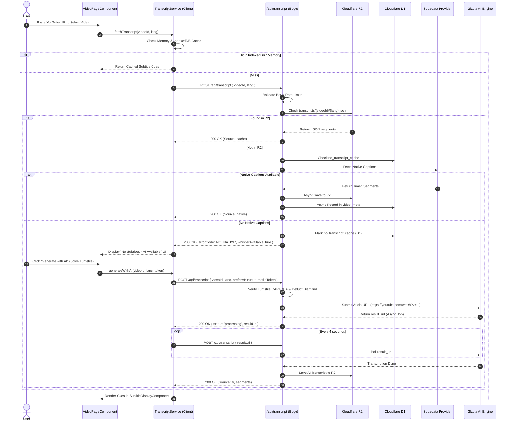
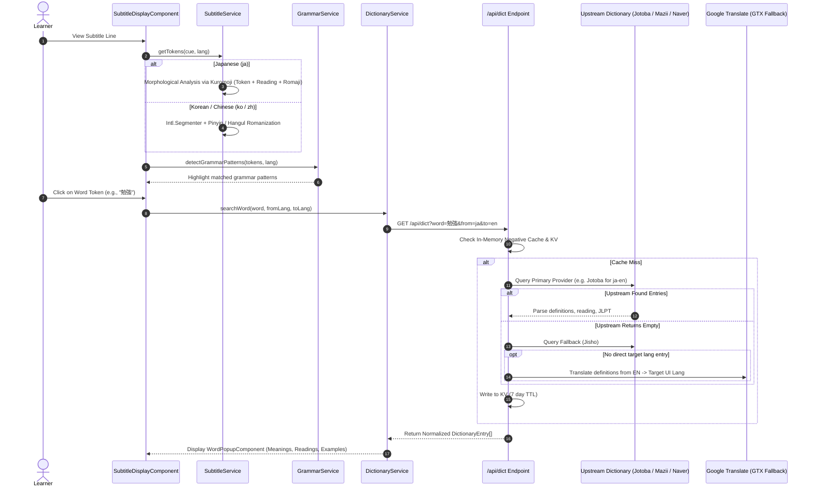
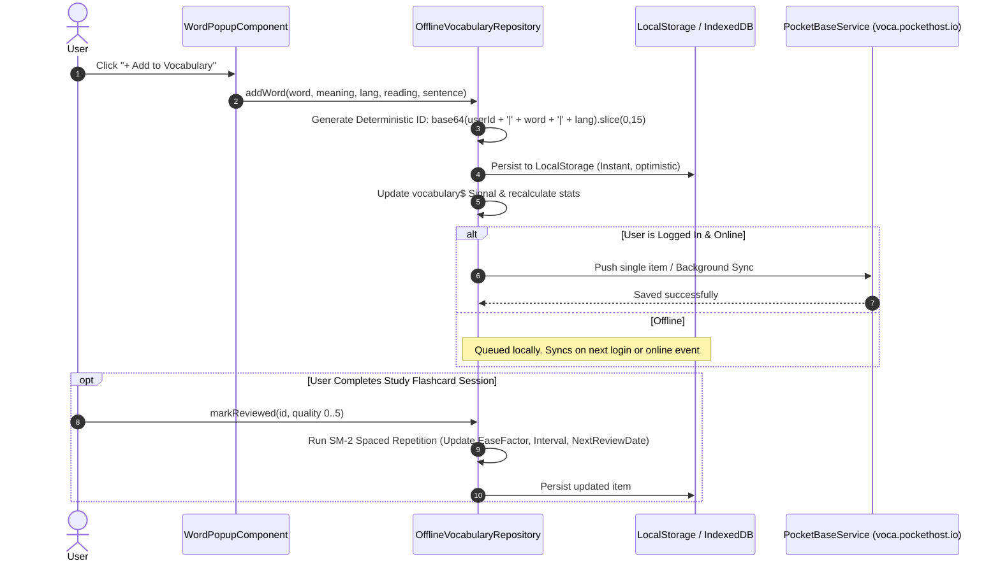

# System Architecture & Component Map

This document details the architectural layout, component hierarchy, data flow pathways, and execution lifecycle across **LinguaTube**.

---

## 1. High-Level Architecture Topology

```mermaid
graph TB
    subgraph Client["Frontend Client (Angular 19 PWA)"]
        UI[Angular UI Shell / Standalone Components]
        State[Signal State Stores]
        Repos[Offline-First Repositories]
        IDB[(IndexedDB / LocalStorage)]
    end

    subgraph Edge["Cloudflare Pages Functions (Edge Workers)"]
        MW_Bot[Bot Defense Middleware]
        MW_Rate[Distributed Rate Limiter]
        MW_Auth[PocketBase JWT Validator]
        
        API_Transcript["/api/transcript"]
        API_Dict["/api/dict"]
        API_Tokens["/api/tokenize"]
        API_Dual["/api/dual-subtitles"]
        API_VideoInfo["/api/video-info"]
        API_Diamonds["/api/diamonds"]
        API_Proxy["/proxy/[service]"]
    end

    subgraph CloudflareData["Cloudflare Infrastructure"]
        D1[(Cloudflare D1 SQLite)]
        R2[(Cloudflare R2 Transcripts)]
        KV[(Cloudflare KV Cache)]
    end

    subgraph External["External Services & APIs"]
        YouTube[YouTube IFrame API / TimedText]
        Supadata[Supadata Native Captions]
        Gladia[Gladia AI Transcription]
        Turnstile[Cloudflare Turnstile CAPTCHA]
        PocketHost[PocketBase Server voca.pockethost.io]
        DictAPIs[Jotoba / Mazii / Naver / MDBG / Glosbe]
    end

    UI --> State
    State --> Repos
    Repos <--> IDB
    Repos <--> PocketHost
    
    UI --> Edge
    Edge --> CloudflareData
    
    API_Transcript --> R2
    API_Transcript --> D1
    API_Transcript --> Supadata
    API_Transcript --> Gladia
    API_Transcript --> Turnstile
    
    API_Dict --> KV
    API_Dict --> DictAPIs
    
    API_Dual --> R2
    API_VideoInfo --> D1
    API_VideoInfo --> KV
```

---

## 2. Frontend Component Hierarchy & Routing

LinguaTube uses Angular 19 Standalone Components with deferred loading and dynamic imports.

```mermaid
graph TD
    App[AppComponent - Shell & Navigation]
    
    App --> Sidebar[SidebarComponent]
    App --> SettingsSheet[SettingsSheetComponent]
    App --> StreakDialog[StreakDialogComponent]
    App --> CreditsDialog[AiCreditsDialogComponent]
    App --> Onboarding[OnboardingComponent]
    App --> CommandPalette[CommandPaletteComponent]
    App --> BottomSheet[BottomSheetComponent]
    App --> RouterOutlet[<router-outlet>]
    
    RouterOutlet -->|/video| VideoPage[VideoPageComponent]
    RouterOutlet -->|/dictionary| DictPage[DictionaryPageComponent]
    RouterOutlet -->|/study| StudyPage[StudyPageComponent]
    RouterOutlet -->|/explore| PlaylistPage[PlaylistPageComponent]
    RouterOutlet -->|/history| HistoryPage[HistoryPageComponent]

    subgraph VideoPageChildren["Video Page Domain"]
        VideoPage --> VideoPlayer[VideoPlayerComponent]
        VideoPage --> SubtitleDisplay[SubtitleDisplayComponent]
        VideoPage --> WordPopup[WordPopupComponent]
        VideoPage --> GrammarPopup[GrammarPopupComponent]
        VideoPage --> VocabList[VocabularyListComponent]
        VideoPage --> PlaylistPanel[PlaylistPanelComponent]
    end

    subgraph VideoPlayerChildren["Video Player Subcomponents"]
        VideoPlayer --> VideoHeader[VideoHeaderComponent]
        VideoPlayer --> CenterControls[CenterControlsComponent]
        VideoPlayer --> ProgressBar[ProgressBarComponent]
        VideoPlayer --> BottomBar[VideoBottomBarComponent]
        VideoPlayer --> FullscreenSubtitle[FullscreenSubtitleComponent]
    end

    subgraph StudyPageChildren["Study Page Domain"]
        StudyPage --> StudyMode[StudyModeComponent - SM2 SRS Flashcards]
        StudyPage --> QuizInput[QuizInputComponent]
    end
```

---

## 3. Data Flow Sequences

### 3.1. Video Transcript Discovery & AI Fallback Flow

---

### 3.2. Tokenization & Multi-Source Dictionary Lookup Flow

---

### 3.3. Offline-First Vocabulary & Cloud Sync Flow

---

## 4. Directory & File Responsibility Matrix

| Directory | Layer | Primary Responsibility |
| :--- | :--- | :--- |
| `src/app/core/services` | Core / Shared | Auth (`PocketBase`), Storage, I18n translations, Settings, Error handler |
| `src/app/core/repositories` | Data Layer | Offline-first sync repositories for Vocab, Streaks, Playlists, History |
| `src/app/features/video` | Presentation / Logic | YouTube player wrapper, subtitle synchronization, gesture handling, keyboard shortcuts |
| `src/app/features/dictionary` | Linguistics | Multi-provider dictionary lookups, word popup, grammar popup |
| `src/app/features/vocabulary` | Study / Retention | Vocabulary notebook table, quick view panel, SM-2 flashcard study page |
| `src/app/features/playlist` | Organization | Custom user playlists and curated community language learning channels |
| `src/app/features/history` | Analytics | Watch history, resume points, completed learning logs |
| `src/app/features/quiz` | Assessment | Fill-in-the-blank and interactive vocabulary testing inputs |
| `src/app/services` | Cross-Cutting | Grammar pattern detector, Translation queue, Bottom sheet manager, Streaks |
| `src/app/data` | Static Data | Large CJK grammar rules and offline dictionary fallbacks |
| `functions-src/api` | Serverless Backend | Public HTTP endpoints for Cloudflare Pages Functions |
| `functions-src/middlewares` | Security / Filtering | Rate limiting, bot defense, PocketBase token verification, video validator |
| `functions-src/providers` | External Integrations | Third-party adapters for Gladia, Supadata, Lingva, Naver, Jotoba |
| `functions-src/data` | Edge Storage Access | D1 SQLite queries and R2 S3-compatible bucket reader/writer |
| `server/server.js` | Dev Environment | Local Express mock backend providing Gladia, MDBG, Naver, and tokenizer APIs |
