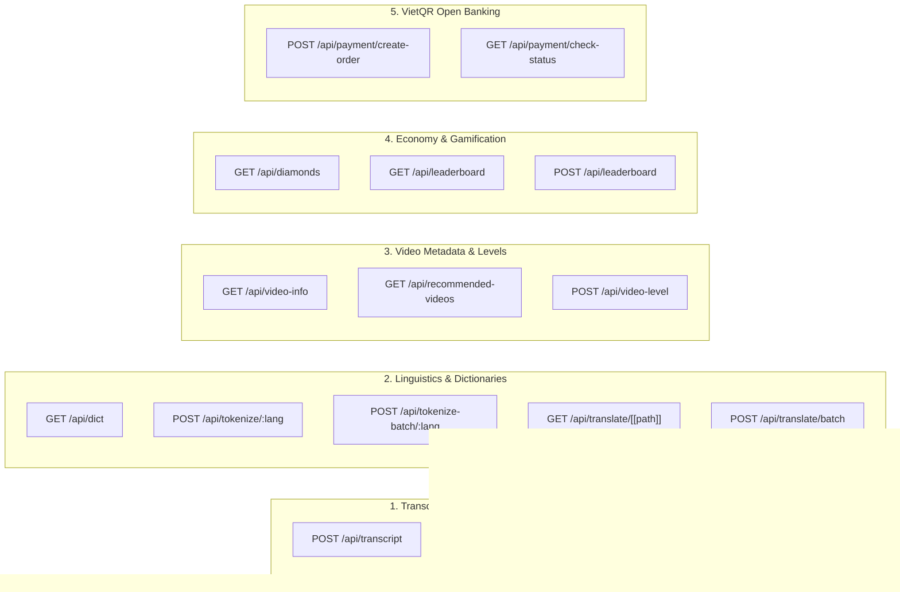

# Voca Mobile API Integration & Backend Specification Guide

**Target Audience:** Mobile Engineers (iOS/Swift, Android/Kotlin, Flutter/Dart, React Native)  
**Backend Architecture:** Cloudflare Pages Functions (Edge Workers) + Cloudflare D1/R2/KV + PocketBase BaaS  
**API Specification Version:** `v4.2.0` (Production Hardened)

---

## 1. System Topology & Environments

The Voca backend operates as a distributed edge API. Mobile clients interact with two backend layers:

```
┌─────────────────────────────────────────────────────────────┐
│                      VOCA MOBILE APP                        │
│             (Flutter / React Native / Native)               │
└───────────────┬─────────────────────────────┬───────────────┘
                │                             │
                │ HTTP REST                   │ PocketBase SDK / REST
                ▼                             ▼
  ┌───────────────────────────┐ ┌───────────────────────────┐
  │   Cloudflare Edge API     │ │      PocketBase BaaS      │
  │   (Transcripts, Dicts,    │ │   (Auth, User Profile,    │
  │    NLP, AI, Payments)     │ │   Vocabulary, Playlists)  │
  │   https://voca.study/api  │ │ https://voca.pockethost.io│
  └───────────────────────────┘ └───────────────────────────┘
```

### Environment Base URLs

| Environment | Edge API Base URL | PocketBase Base URL | Purpose |
| :--- | :--- | :--- | :--- |
| **Production** | `https://voca.study` | `https://voca.pockethost.io` | Live production edge |
| **Local Dev** | `http://<DEV_MACHINE_IP>:3001` | `https://voca.pockethost.io` | Local mock server with real Innertube YouTube scraping |

---

## 2. Authentication, Headers & Client Conventions

### 2.1. Request Headers

```http
Content-Type: application/json
Accept: application/json
Authorization: Bearer <POCKETBASE_USER_TOKEN>   # Optional for public reads, required for payments/diamonds
User-Agent: VocaMobile/1.0.0 (Android 14; Pixel 8) # DO NOT send 'python', 'curl', 'axios' (blocked by Bot Defense)
```

> [!IMPORTANT]
> **Bot Defense User-Agent Warning:**  
> The backend automatically blocks scraper and headless client User-Agents (e.g. `curl`, `python-requests`, `aiohttp`, `scrapy`, `axios`, `postmanruntime`). Ensure your mobile HTTP client sets a descriptive application User-Agent.

### 2.2. Standard Rate Limiting Headers

Every response includes standard RFC rate limiting headers:

```http
X-RateLimit-Limit: 100
X-RateLimit-Remaining: 94
X-RateLimit-Reset: 1725800000
Retry-After: 3600               # Included only on HTTP 429 Too Many Requests
```

### 2.3. Standard Error Response

```json
{
  "success": false,
  "errorCode": "INVALID_VIDEO_ID",
  "error": "Invalid YouTube video ID format",
  "timing": 12
}
```

Common error codes: `INVALID_VIDEO_ID`, `VIDEO_TOO_LONG`, `NO_DIAMONDS`, `NO_NATIVE`, `INVALID_RESULT_URL`, `UNAUTHORIZED`, `RATE_LIMITED`.

---

## 3. Complete API Endpoint Reference



---

### 3.1. Transcripts & Subtitles

#### `POST /api/transcript`
Fetches pre-cached transcripts from Cloudflare R2, extracts native YouTube captions, or queues/polls Gladia AI audio speech-to-text.

- **Auth:** Optional (Anonymous supported; pass Bearer token for higher rate limits and user Diamond quota).
- **Rate Limit:** 20/hr (anon), 40/hr (free), 80/hr (pro). Polling: 60-300/hr.
- **Request Body:**
  ```json
  {
    "videoId": "dQw4w9WgXcQ",           // Required: 11-char YouTube ID
    "lang": "ja",                       // Required: "ja" | "zh" | "ko" | "en"
    "preferAI": false,                  // Optional: true to trigger Gladia ASR
    "forceRefresh": false,              // Optional: bypass R2 cache
    "resultUrl": null,                  // Optional: polling URL returned from pending AI job
    "turnstileToken": "...",            // Required if preferAI is true and starting a new job
    "duration": 212                     // Optional: video duration in seconds
  }
  ```

- **Success Response (Native / Cached Hit - 200 OK):**
  ```json
  {
    "success": true,
    "videoId": "dQw4w9WgXcQ",
    "language": "ja",
    "source": "cache",                  // "cache" | "native" | "ai"
    "sourceDetail": "youtube",
    "segments": [
      {
        "start": 0.45,                  // Start offset in seconds
        "duration": 2.30,               // Duration in seconds
        "text": "こんにちは、世界！"
      }
    ],
    "availableLanguages": {
      "native": ["ja", "en"],
      "ai": []
    },
    "diamonds": 5,
    "maxDiamonds": 5,
    "nextRegenAt": 1725805000,
    "whisperAvailable": true,
    "timing": 45
  }
  ```

- **Pending Response (AI Generation Queued - 200 OK):**
  ```json
  {
    "success": false,
    "status": "processing",
    "resultUrl": "https://api.gladia.io/v2/pre-recorded/result/550e8400-e29b-41d4-a716-446655440000",
    "whisperAvailable": true,
    "diamonds": 4,
    "maxDiamonds": 5
  }
  ```
  *Mobile implementation:* When `status === "processing"`, start a polling timer every 3–5 seconds posting `resultUrl` until `success: true`.

---

#### `POST /api/dual-subtitles`
Translates video subtitle cues into a secondary language and returns dual synchronized subtitles.

- **Auth:** Optional.
- **Rate Limit:** 5/hr (anon), 10/hr (free), 50/hr (pro).
- **Request Body:**
  ```json
  {
    "videoId": "dQw4w9WgXcQ",
    "sourceLang": "ja",
    "targetLang": "vi",                 // "en" | "vi" | "zh" | "ko" | "ja"
    "segments": [
      { "start": 0.45, "duration": 2.3, "text": "こんにちは" }
    ],
    "onlyCache": false,                 // If true, returns immediately from R2 cache without translating
    "saveOnly": false                   // Requires Auth: cache pre-computed subtitles
  }
  ```
- **Success Response (200 OK):**
  ```json
  {
    "success": true,
    "videoId": "dQw4w9WgXcQ",
    "sourceLang": "ja",
    "targetLang": "vi",
    "source": "cache:r2",
    "subtitles": [
      {
        "start": 0.45,
        "duration": 2.3,
        "text": "こんにちは",
        "translation": "Xin chào"
      }
    ]
  }
  ```

---

### 3.2. Linguistics, Tokenization & Dictionaries

#### `GET /api/dict`
Unified dictionary lookup engine querying multi-source APIs (Jotoba, Mazii, Naver, MDBG, FreeDict) with automated English/Vietnamese translation fallbacks.

- **Query Parameters:**
  - `word` (string, required): Word or surface token to search (e.g. `食べる`, `你好`).
  - `from` (string, required): Learning language (`ja`, `zh`, `ko`, `en`).
  - `to` (string, required): Target explanation language (`en`, `vi`, `ja`, `zh`, `ko`).
- **Success Response (200 OK):**
  ```json
  {
    "word": "食べる",
    "from": "ja",
    "to": "en",
    "source": "jotoba",
    "entries": [
      {
        "word": "食べる",
        "reading": "たべる",
        "romaji": "taberu",
        "partOfSpeech": "Ichidan verb, Transitive verb",
        "definitions": [
          "to eat",
          "to live on (e.g. a salary); to make a living"
        ],
        "level": "JLPT N5",
        "audio": "https://assets.languagepod101.com/dictionary/japanese/audiomp3.php?kanji=食べる&kana=たべる",
        "examples": [
          {
            "sentence": "朝ご飯を食べる。",
            "reading": "あさごはんをたべる。",
            "translation": "I eat breakfast."
          }
        ]
      }
    ]
  }
  ```

---

#### `POST /api/tokenize/:lang`
Tokenizes a single text string into words, furigana readings, and romanization.

- **URL Parameter:** `lang` (`ja` | `zh` | `ko` | `en`)
- **Request Body:**
  ```json
  { "text": "日本語を勉強しています。" }
  ```
- **Success Response (200 OK):**
  ```json
  {
    "tokens": [
      {
        "surface": "日本語",
        "reading": "にほんご",
        "romaji": "nihongo",
        "pos": "名詞"
      },
      {
        "surface": "を",
        "reading": "を",
        "romaji": "wo",
        "pos": "助詞"
      },
      {
        "surface": "勉強",
        "reading": "べんきょう",
        "romaji": "benkyou",
        "pos": "名詞"
      },
      {
        "surface": "して",
        "reading": "して",
        "romaji": "shite",
        "pos": "動詞"
      },
      {
        "surface": "います",
        "reading": "います",
        "romaji": "imasu",
        "pos": "助動詞"
      }
    ]
  }
  ```

---

#### `POST /api/tokenize-batch/:lang`
Batch tokenizes an array of subtitle lines in a single network request.

- **URL Parameter:** `lang` (`ja` | `zh` | `ko` | `en`)
- **Request Body:**
  ```json
  {
    "texts": [
      "こんにちは",
      "今日はいい天気ですね"
    ]
  }
  ```
- **Success Response (200 OK):**
  ```json
  {
    "tokens": [
      [ { "surface": "こんにちは", "reading": "こんにちは", "romaji": "konnichiwa", "pos": "感動詞" } ],
      [ { "surface": "今日", "reading": "きょう", "romaji": "kyou", "pos": "名詞" }, ... ]
    ]
  }
  ```

---

#### `POST /api/translate/batch`
Translates up to 50 text items concurrently with server-side caching.

- **Request Body:**
  ```json
  {
    "texts": ["おはよう", "ありがとう", "さようなら"],
    "source": "ja",
    "target": "en"
  }
  ```
- **Success Response (200 OK):**
  ```json
  {
    "translations": [
      "Good morning",
      "Thank you",
      "Goodbye"
    ]
  }
  ```

---

### 3.3. Video Discovery & Level Classification

#### `GET /api/video-info`
Retrieves YouTube video metadata, cached duration, discovered subtitle languages, and proficiency levels.

- **Query Parameters:** `videoId` (string, 11-char YouTube ID)
- **Success Response (200 OK):**
  ```json
  {
    "videoId": "dQw4w9WgXcQ",
    "title": "Never Gonna Give You Up",
    "channel": "Rick Astley",
    "duration": 212,
    "thumbnail": "https://i.ytimg.com/vi/dQw4w9WgXcQ/mqdefault.jpg",
    "availableLanguages": ["en", "ja"],
    "levels": {
      "en": "CEFR B1",
      "ja": "JLPT N4"
    },
    "source": "cache:kv"
  }
  ```

---

#### `GET /api/recommended-videos`
Returns curated YouTube videos with pre-cached, verified transcripts stored in Cloudflare D1/R2 (<50ms loading latency, zero AI diamond cost).

- **Query Parameters:**
  - `lang` (optional, default `ja`): Target language (`ja`, `ko`, `zh`, `en`).
  - `limit` (optional, default `12`, max `50`).
- **Success Response (200 OK):**
  ```json
  {
    "success": true,
    "language": "ja",
    "count": 12,
    "videos": [
      {
        "videoId": "BZRT37f8zZY",
        "title": "Japanese Listening Practice - JLPT N4",
        "channel": "Japanese Immersion",
        "duration": 420,
        "thumbnail": "https://i.ytimg.com/vi/BZRT37f8zZY/mqdefault.jpg",
        "languages": ["ja", "en"],
        "level": "JLPT N4",
        "tier": "elementary",
        "updatedAt": 1725732000
      }
    ],
    "source": "cloudflare"
  }
  ```

---

#### `POST /api/video-level`
Records or updates the assessed CEFR / JLPT / HSK / TOPIK difficulty level for a video.

- **Request Body:**
  ```json
  {
    "videoId": "BZRT37f8zZY",
    "language": "ja",
    "level": "JLPT N4"                  // Validated against regex: JLPT N1-N5, HSK 1-6, TOPIK 1-6, CEFR A1-C2
  }
  ```
- **Success Response (200 OK):**
  ```json
  {
    "success": true,
    "videoId": "BZRT37f8zZY",
    "language": "ja",
    "level": "JLPT N4",
    "levels": { "ja": "JLPT N4" }
  }
  ```

---

### 3.4. Diamonds & Gamification Economy

#### `GET /api/diamonds`
Retrieves diamond credits, regen countdown, and video length allowances for the requesting user/device.

- **Auth:** Optional (Bearer token for registered user, IP-based for guest).
- **Success Response (200 OK):**
  ```json
  {
    "success": true,
    "diamonds": 5,                      // Current available balance
    "maxDiamonds": 5,                   // Max capacity (3 for anon, 5 for free, 20 for pro)
    "nextRegenAt": 1725805000,          // Epoch timestamp when +1 diamond regenerates
    "regenIntervalMs": 900000,          // Regeneration period (15 mins for free, 5 mins for pro)
    "tier": "free",                     // "anonymous" | "free" | "pro"
    "maxVideoDurationSec": 900          // Max video length allowed for AI transcription (600s/900s/1800s)
  }
  ```

---

#### `GET /api/leaderboard`
Fetches the global learner XP leaderboard and computes the requesting user's live rank.

- **Query Parameters:**
  - `lang` (optional): Filter by learning language (`ja`, `ko`, `zh`, `en`).
  - `userId` (optional): Current PocketBase user ID to compute exact position.
  - `limit` (optional, default `50`).
- **Success Response (200 OK):**
  ```json
  {
    "success": true,
    "leaderboard": [
      {
        "user_id": "usr_99812",
        "name": "Kenji Sato",
        "avatar": "",
        "xp": 14250,
        "level": 12,
        "streak": 42,
        "badges_count": 14,
        "target_lang": "ja",
        "country": "🇯🇵",
        "rank": 1
      }
    ],
    "userRank": {
      "user_id": "my_user_id",
      "rank": 18,
      "xp": 3450,
      "level": 4
    }
  }
  ```

---

#### `POST /api/leaderboard`
Synchronizes user XP and streak with the global leaderboard table.

- **Auth:** Recommended (User ID required).
- **Request Body:**
  ```json
  {
    "userId": "my_user_id",
    "name": "Alex",
    "avatar": "https://...",
    "xp": 3450,
    "level": 4,
    "streak": 12,
    "badgesCount": 5,
    "targetLang": "ja",
    "country": "🇻🇳"
  }
  ```

---

### 3.5. Mobile In-App Payments (VietQR payOS)

Voca supports direct VietQR open-banking payment links generated via payOS.

#### `POST /api/payment/create-order`
Creates a payment order with a cryptographically secure 8-digit order code and returns bank transfer metadata.

- **Auth:** Required (`Authorization: Bearer <pb_token>`).
- **Request Body:**
  ```json
  {
    "planId": "pro_1m",                 // "pro_1m" (49,000 VND) or "pro_1y" (490,000 VND)
    "returnUrl": "voca://payment/success", // Mobile deep-link scheme
    "cancelUrl": "voca://payment/cancel"
  }
  ```
- **Success Response (200 OK):**
  ```json
  {
    "success": true,
    "orderCode": 83920145,
    "plan": "pro_1m",
    "amount": 49000,
    "description": "VOCA83920145",
    "accountNumber": "0335889999",
    "accountName": "CONG TY VOCA",
    "bin": "970422",                    // MBBank BIN code
    "checkoutUrl": "https://pay.payos.vn/web/...",
    "qrCode": "https://api.qrserver.com/v1/create-qr-code/?size=300x300&data=...",
    "isMock": false
  }
  ```

*Mobile Implementation Pattern:*
1. Display `qrCode` image in the mobile payment sheet.
2. Provide a "Copy Bank Info" button using `accountNumber`, `bin`, and `description`.
3. Provide an "Open Banking App" button using a VietQR intent/URL scheme:
   `https://img.vietqr.io/image/970422-0335889999-compact2.png?amount=49000&addInfo=VOCA83920145`
4. Start polling `/api/payment/check-status?orderCode=83920145` every 3 seconds.

---

#### `GET /api/payment/check-status`
Polls payment confirmation status.

- **Query Parameters:** `orderCode` (number, e.g. `83920145`).
- **Response (Pending - 200 OK):**
  ```json
  { "success": true, "status": "PENDING" }
  ```
- **Response (Paid - 200 OK):**
  ```json
  {
    "success": true,
    "status": "PAID",
    "processedAt": "2026-09-08T12:30:00.000Z"
  }
  ```

---

## 4. Direct PocketBase BaaS Integration

For offline-first user data (vocabulary notebooks, streaks, custom playlists, and watch history), the mobile app communicates directly with PocketBase.

- **Host:** `https://voca.pockethost.io`
- **SDKs:**
  - Flutter: [`pocketbase`](https://pub.dev/packages/pocketbase)
  - React Native: `pocketbase` (NPM)
  - Swift: [`PocketBase`](https://github.com/pocketbase/swift-sdk)
  - Kotlin: Custom Retrofit/Ktor clients

### 4.1. Core PocketBase Collections Schema

#### Collection: `vocabulary`
Stores flashcards and SRS review progress.

| Field | Type | Description |
| :--- | :--- | :--- |
| `id` | `TEXT (15)` | Deterministic ID: `^[a-z0-9]{15}$` |
| `user` | `RELATION` | User ID |
| `word` | `TEXT` | Target word or surface form |
| `reading` | `TEXT` | Kana / Pinyin / Hangul reading |
| `meaning` | `TEXT` | Native/translated definition |
| `language` | `TEXT` | `ja` \| `zh` \| `ko` \| `en` |
| `level` | `TEXT` | `new` \| `learning` \| `known` \| `mastered` |
| `reviewCount` | `NUMBER` | Total reviews conducted |
| `easeFactor` | `NUMBER` | SuperMemo-2 ease multiplier (default `2.5`, floor `1.3`) |
| `interval` | `NUMBER` | Days until next scheduled review |
| `repetitions` | `NUMBER` | Consecutive correct reviews |
| `nextReview` | `DATE` | Next review timestamp |

---

### 4.2. Deterministic Record ID Generation (Critical)

PocketBase record IDs must strictly match `/^[a-z0-9]{15}$/`. To support offline-first creation without producing duplicate records on multi-device sync, use the **Cyrb53 Base36** deterministic hashing algorithm:

#### Dart / Flutter Implementation
```dart
String generateDeterministicRecordId(List<String> keys) {
  final raw = keys.map((k) => k.trim()).join('|');
  int h1 = 0xdeadbeef;
  int h2 = 0x41c64e6d;
  for (int i = 0; i < raw.length; i++) {
    final ch = raw.codeUnitAt(i);
    h1 = (h1 ^ ch) * 2654435761 & 0xFFFFFFFF;
    h2 = (h2 ^ ch) * 1597334677 & 0xFFFFFFFF;
  }
  h1 = ((h1 ^ (h1 >> 16)) * 2246822507) & 0xFFFFFFFF;
  h1 = (h1 ^ ((h2 ^ (h2 >> 13)) * 3266489909)) & 0xFFFFFFFF;
  h2 = ((h2 ^ (h2 >> 16)) * 2246822507) & 0xFFFFFFFF;
  h2 = (h2 ^ ((h1 ^ (h1 >> 13)) * 3266489909)) & 0xFFFFFFFF;
  final h3 = (h1 * h2 * 2166136261) & 0xFFFFFFFF;

  final p1 = h1.toRadixString(36).padLeft(7, '0');
  final p2 = h2.toRadixString(36).padLeft(7, '0');
  final p3 = h3.toRadixString(36).padLeft(7, '0');
  return (p1 + p2 + p3).substring(0, 15);
}

// Example usage:
// final id = generateDeterministicRecordId([userId, word, language]);
```

#### Swift (iOS) Implementation
```swift
func generateDeterministicRecordId(keys: [String]) -> String {
    let raw = keys.map { $0.trimmingCharacters(in: .whitespaces) }.joined(separator: "|")
    var h1: UInt64 = 0xdeadbeef
    var h2: UInt64 = 0x41c64e6d
    
    for byte in raw.utf8 {
        h1 = (h1 ^ UInt64(byte)) &* 2654435761 & 0xFFFFFFFF
        h2 = (h2 ^ UInt64(byte)) &* 1597334677 & 0xFFFFFFFF
    }
    h1 = ((h1 ^ (h1 >> 16)) &* 2246822507) & 0xFFFFFFFF
    h1 = (h1 ^ (((h2 ^ (h2 >> 13)) &* 3266489909) & 0xFFFFFFFF)) & 0xFFFFFFFF
    h2 = ((h2 ^ (h2 >> 16)) &* 2246822507) & 0xFFFFFFFF
    h2 = (h2 ^ (((h1 ^ (h1 >> 13)) &* 3266489909) & 0xFFFFFFFF)) & 0xFFFFFFFF
    let h3 = (h1 &* h2 &* 2166136261) & 0xFFFFFFFF
    
    let p1 = String(h1, radix: 36).leftPadding(toLength: 7, withPad: "0")
    let p2 = String(h2, radix: 36).leftPadding(toLength: 7, withPad: "0")
    let p3 = String(h3, radix: 36).leftPadding(toLength: 7, withPad: "0")
    return String((p1 + p2 + p3).prefix(15))
}
```

---

## 5. Mobile Player & Subtitle Lifecycle Playbook

```
┌─────────────────────────────────────────────────────────────┐
│ 1. USER OPENS VIDEO                                         │
│    POST /api/transcript { videoId, lang }                   │
└──────────────────────────────┬──────────────────────────────┘
                               │
            ┌──────────────────┴──────────────────┐
            ▼                                     ▼
   [Native/Cached 200 OK]                [Pending Status 200 OK]
   Load segments array                   Start 3s Polling Loop
            │                            POST /api/transcript { resultUrl }
            │                                     │
            │◄────────────────────────────────────┘
            ▼
┌─────────────────────────────────────────────────────────────┐
│ 2. TOKENIZATION PIPELINE                                    │
│    POST /api/tokenize-batch/:lang { texts: segments.map }   │
│    Attach Token[] to each subtitle cue                      │
└──────────────────────────────┬──────────────────────────────┘
                               │
                               ▼
┌─────────────────────────────────────────────────────────────┐
│ 3. VIDEO PLAYBACK TICKER LOOP                               │
│    Listen to YouTube Player currentTime                     │
│    Find active cue: start <= time < (start + duration)      │
│    Apply Sticky Subtitle Algorithm (hold until next cue)    │
└──────────────────────────────┬──────────────────────────────┘
                               │
                               ▼
┌─────────────────────────────────────────────────────────────┐
│ 4. INTERACTIVE TOKEN CLICK                                  │
│    GET /api/dict?word={token}&from={lang}&to={uiLang}       │
│    Render BottomSheet Definition & "Add to Notebook" button │
└─────────────────────────────────────────────────────────────┘
```

### 5.1. The Sticky Subtitle Display Rule
Raw YouTube timed-text cues often contain short 0.2s–0.8s dead zones between phrases. If rendered strictly using `start <= t <= start + duration`, subtitles will flicker.  
**Recommended Algorithm:**
1. Keep current cue on screen even if `currentTime > cue.start + cue.duration`.
2. Only dismiss the active cue if:
   - The next cue's `start` has arrived.
   - The gap to the next cue exceeds **3.0 seconds** (user is listening to background music or silence).
   - The user seeks to a new video timestamp.

---

## 6. SuperMemo-2 (SM-2) Flashcard Scheduling Specification

When implementing Study Mode in your mobile app, conform strictly to Voca's SM-2 implementation:

| Action Button | Quality Score | Calculation Rule | Level Transition |
| :--- | :---: | :--- | :--- |
| **Again** | `1` | `repetitions = 0`, `interval = 0`, `easeFactor = max(1.3, easeFactor - 0.20)` | Demoted to `learning` |
| **Hard** | `3` | `repetitions += 1`, `interval = reps <= 1 ? 1 : round(interval * 1.2)`, `easeFactor = max(1.3, easeFactor - 0.15)` | Retains current level |
| **Good** | `4` | `repetitions += 1`, `interval = reps == 1 ? 1 : (reps == 2 ? 6 : round(interval * easeFactor))` | `known` at reps $\ge 3$ |
| **Easy** | `5` | `repetitions += 1`, `interval = reps == 1 ? 2 : (reps == 2 ? 8 : round(interval * easeFactor * 1.3))`, `easeFactor += 0.15` | `mastered` at reps $\ge 5$ |

---

## 7. Testing & Mocking Checklist for Mobile QA

- [ ] **SSRF & Malformed Video IDs**: Verify app rejects inputs like `../../etc/passwd` or `https://` before sending to `/api/transcript`.
- [ ] **Gladia AI Polling**: Test slow connections; verify polling times out gracefully after 60 seconds if ASR fails.
- [ ] **Offline Card Creation**: Save vocabulary cards in Airplane Mode; reconnect to Wi-Fi and verify cards sync to PocketBase without duplicate IDs.
- [ ] **VietQR Intent**: Verify clicking "Pay with Mobile Banking" successfully triggers bank app deep links with valid payload descriptions (`VOCA{orderCode}`).
