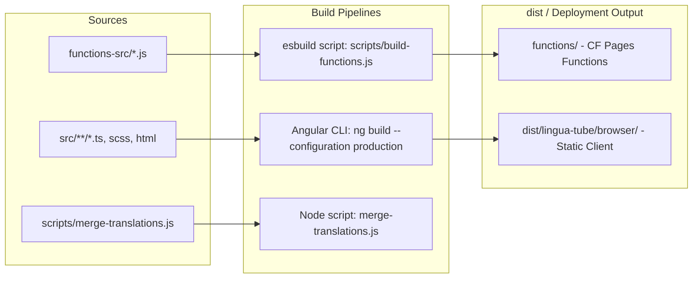

# Technology Stack & Tooling

This document provides a comprehensive breakdown of the languages, frameworks, libraries, linguistic NLP engines, cloud services, and build tooling used in **Voca** (formerly LinguaTube).

---

## 1. Technology Matrix Overview

| Category | Technology | Version | Purpose / Role |
| :--- | :--- | :--- | :--- |
| **Frontend Framework** | Angular | `^19.0.0` | Client framework (Signals, Standalone Components, SSR-ready) |
| **Language** | TypeScript | `~5.6.0` | Primary development language for client & types |
| **Reactive Streams** | RxJS | `~7.8.0` | Async operations, HTTP event pipelines, debounce/retry logic |
| **Component Kit** | Angular CDK | `^19.2.19` | UI utilities, overlays, responsive layout breakpoints |
| **PWA / Service Worker** | `@angular/service-worker` | `^19.0.0` | Offline asset caching, background updates, Web App Manifest |
| **Serverless Runtime** | Cloudflare Pages Functions | `ES2022 / Worker` | Global edge serverless API routes (`/api/*`, `/proxy/*`) |
| **Local Dev Server** | Express | `^5.2.1` | Local backend mock with CORS, dotenv, and Innertube |
| **YouTube Client (Dev)**| `youtubei.js` | `^18.0.0` | Innertube client for real YouTube native caption extraction locally |
| **Bundler (Backend)** | esbuild | `^0.27.2` | Bundling `functions-src/` route handlers to ESM format |
| **Backend as a Service** | PocketBase | `^0.26.5` | Authentication, user profiles, vocabulary/streak/playlist sync |
| **Edge Database** | Cloudflare D1 | `SQLite` | Serverless relational edge database for metadata & negative caching |
| **Edge Object Storage** | Cloudflare R2 | `S3-compatible` | Transcript file store (`transcripts/`) & translations store (`translations/`) |
| **Edge Key-Value** | Cloudflare KV | `Key-Value` | Distributed rate limits, fast metadata cache, batch translation cache |
| **ASR Speech AI** | Gladia AI API | `v2` | Asynchronous speech-to-text transcript generation |
| **Native Captions** | Supadata AI | `v1` | Fast extraction of YouTube native subtitle tracks at edge |
| **Translation Engine** | Lingva Translate + GTX | Public APIs | Dual-subtitle batch translation with Google GTX fallback |
| **CAPTCHA / Bot Defense** | Cloudflare Turnstile | Cloud Service | Human verification guarding AI generation from credit drain |
| **Japanese NLP** | `@patdx/kuromoji` | `^1.0.4` | Morphological tokenizer, kanji-kana readings & POS tags |
| **Chinese NLP** | `pinyin-pro` | `^3.27.0` | Hanzi to Pinyin conversion with tone symbols |
| **Korean NLP** | `hangul-romanization` | `^1.0.1` | Hangul to Revised Romanization conversion |
| **Word Segmentation** | `Intl.Segmenter` | Built-in ECMAScript | Zero-dependency word boundary segmentation for ZH, KO, EN |
| **Visual Assets** | Circle Flags | SVG CDN | Consistent cross-platform SVG national flag badges |
| **Linter** | ESLint + angular-eslint | `^9.39.4` | Code style, accessibility, and TypeScript linting |
| **Testing** | Node.js Test Runner / Karma | `Node 20+ / Karma 6.4` | Automated backend security tests & sync utility test runner (`node --test tests/*.test.mjs`) |

---

## 2. Frontend Architecture & Libraries

### 2.1. Angular 19 Modern Primitives
Voca fully embraces modern Angular paradigms:
- **Standalone Components Everywhere**: Zero `NgModule` overhead; every component, directive, and pipe is standalone.
- **Angular Signals (`signal`, `computed`, `effect`, `linkedSignal`, `model`)**: Native fine-grained reactivity driving all component state without heavy state libraries.
- **Modern Query Signals (`viewChild`, `viewChild.required`)**: Replaces legacy `@ViewChild` decorator queries with type-safe reactive signals.
- **`ChangeDetectionStrategy.OnPush`**: Configured on all components for optimal rendering performance.
- **Dependency Injection**: Functional `inject(ServiceName)` pattern used throughout services, repositories, and components.
- **RequestAnimationFrame Gestures**: Smooth draggable subtitle overlays with pointer capture and zero frame drops.

### 2.2. Progressive Web App (PWA)
- **Configuration**: Defined in `ngsw-config.json` and `public/manifest.webmanifest`.
- **Precached Assets**: App shell, HTML, CSS, JavaScript bundles, SVGs, and translation JSONs.
- **Performance**: Instant subsequent loads and offline navigation capability.

---

## 3. Linguistic & NLP Tooling

Correct segmentation and pronunciation generation are central to Voca:

### 3.1. Japanese Morphological Analysis (`@patdx/kuromoji` + Romaji)
- Standard JavaScript implementations of Kuromoji require large dictionary files (~17MB).
- **CDN Loading Strategy**: A custom dictionary loader (`cdnLoader` in `tokenizer.js`) pulls compressed array buffers on demand from `cdn.jsdelivr.net` to avoid bloating the initial bundle.
- **Token Output**: Extracts `surface_form`, `reading` (converted from Katakana to Hiragana via `katakanaToHiragana`), `basic_form`, `partOfSpeech`, and derives Hepburn Romanization via `getJapaneseRomaji()`.
- **5 Reading Display Modes**:
  - `native`: Original Japanese script only.
  - `annotated`: Ruby Furigana (`<ruby>漢<rt>かん</rt></ruby>`).
  - `reading`: Pure Kana reading.
  - `annotatedRomanized`: Kanji with Hepburn Romaji ruby annotations.
  - `romanized`: Full Romaji representation.

### 3.2. Chinese Word Segmentation & Pinyin (`pinyin-pro` + `Intl.Segmenter`)
- Sentences are segmented into multi-character words using `Intl.Segmenter('zh', { granularity: 'word' })`.
- Pronunciations are annotated with tone marks (e.g. `nǐ hǎo`) via `pinyin(word, { toneType: 'symbol' })`.

### 3.3. Korean Segmentation & Romanization (`hangul-romanization` + `Intl.Segmenter`)
- Words are segmented using space boundaries and `Intl.Segmenter('ko', { granularity: 'word' })`.
- Romanization is computed using the official Revised Romanization standard via `hangul-romanization`.

### 3.4. English Segmentation (`Intl.Segmenter`)
- Segmented into word tokens and punctuation boundaries via `Intl.Segmenter('en', { granularity: 'word' })`.

### 3.5. Multi-Language Grammar Engine & Translation Matrix
- **Static Grammar Data**:
  - `grammar-ja.ts` (1,000+ JLPT N5–N1 rules)
  - `grammar-ko.ts` (TOPIK I–II rules)
  - `grammar-zh.ts` (HSK 1–6 rules)
  - `grammar-en.ts` (CEFR A1–C2 rules)
- **Dynamic Translation Packs**:
  Located in `src/app/data/translations/`, supporting 16 combinations (JA, KO, ZH, EN translated into Vietnamese, Chinese, Japanese, Korean) plus native-to-native explanations (`ja_ja`, `ko_ko`, `zh_zh`). Packs are loaded dynamically via `import()` on demand.

---

## 4. Edge Infrastructure & Cloud Services

### 4.1. Cloudflare Pages Functions
- Built using modern JavaScript modules (`.js` files with `export async function onRequest...`).
- Configured via `wrangler.toml` with `compatibility_flags = ["nodejs_compat"]`.
- Deployed automatically with Cloudflare Pages at zero server maintenance cost.

### 4.2. Cloudflare D1 (Edge SQLite)
- Fast SQL database executed at edge locations near the client.
- Tables:
  - `video_languages`: Video duration, title, channel, and discovered caption languages.
  - `no_transcript_cache`: Negative cache preventing repeated failed subtitle fetches.
  - `video_meta`: Fast index of existing transcripts.
  - `transcripts`: Permanent metadata and pending job status.
- Generous free tier: **100,000 writes/day** and **5,000,000 reads/day**.

### 4.3. Cloudflare R2 (Object Storage)
- S3-compatible, zero-egress-fee bucket storage (`linguatube-transcripts`).
- Key layouts:
  - Transcripts: `transcripts/{videoId}/{lang}.json`
  - Dual Subtitles: `translations/{videoId}/{sourceLang}_{targetLang}.json`

### 4.4. Cloudflare KV (Edge Key-Value Cache)
- Namespace: `TRANSCRIPT_CACHE`.
- Primary uses:
  - Rate limiting buckets: `ratelimit:{prefix}:{clientId}`
  - Shared translation rate limits: `translate-texts`
  - Batch translation cache: `trbatch:v1:{source}:{target}:{hash}`
  - Precomputed tokens: `tokens:{lang}:{hash}`
  - Fast video info: `video-info:{videoId}`
  - Dictionary cache: `dict:v4:{from}:{to}:{word}`

### 4.5. PocketBase (`https://voca.pockethost.io`)
- Open-source Go/SQLite backend hosting user authentication and synchronized collections (`users`, `vocabulary`, `streaks`, `playlists`).
- Server hooks (`streaks.pb.js`) execute automated streak calculations and daily maintenance.

---

## 5. Build, Bundling & Tooling Pipeline

---

## 6. Testing & Code Quality Tools

### 6.1. Backend Security Test Suite (`tests/backend-security.test.mjs`)
- Runs directly on Node's native test runner (`npm run test:backend`).
- Tests:
  - Language detection from video titles (handling emojis, non-Latin scripts, CJK characters).
  - Validation of supported languages.
  - Strict SSRF defense ensuring Gladia `result_url` cannot be spoofed to internal or malicious endpoints.

### 6.2. ESLint 9 Flat Configuration (`eslint.config.js`)
- Utilizes modern ESLint flat config format.
- Combines `@eslint/js`, `typescript-eslint`, and `angular-eslint`.
- Enforces strict typing, component selector prefixes (`app`), and template accessibility rules.
