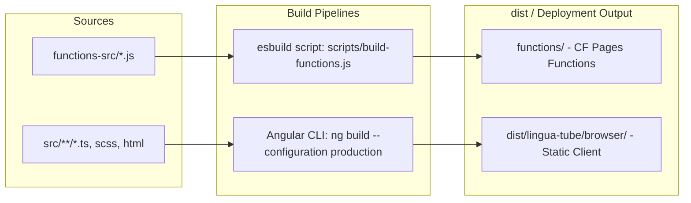

# Technology Stack & Tooling

This document provides a comprehensive breakdown of the languages, frameworks, libraries, linguistic NLP engines, cloud services, and build tooling used in **LinguaTube**.

---

## 1. Technology Matrix Overview

| Category | Technology | Version | Purpose / Role |
| :--- | :--- | :--- | :--- |
| **Framework** | Angular | `^19.0.0` | Client framework (Signals, Standalone Components, SSR-ready) |
| **Language** | TypeScript | `~5.6.0` | Primary development language for client & types |
| **Reactive Streams** | RxJS | `~7.8.0` | Async operations, HTTP event pipelines, debounce/retry logic |
| **Component Kit** | Angular CDK | `^19.2.19` | UI utilities, overlays, responsive layout breakpoints |
| **PWA / Service Worker** | `@angular/service-worker` | `^19.0.0` | Offline asset caching, background updates, Web App Manifest |
| **Serverless Runtime** | Cloudflare Pages Functions | `ES2022 / Worker` | Global edge serverless API routes (`/api/*`, `/proxy/*`) |
| **Local Dev Server** | Express | `^5.2.1` | Local backend mock for offline/local development |
| **Bundler (Backend)** | esbuild | `^0.27.2` | Bundling `functions-src/` route handlers to ESM format |
| **Backend as a Service** | PocketBase | `^0.26.5` | Authentication, user profiles, vocabulary/streak/playlist sync |
| **Edge Database** | Cloudflare D1 | `SQLite` | Serverless relational edge database for metadata & caching |
| **Edge Object Storage** | Cloudflare R2 | `S3-compatible` | Transcript file store (`transcripts/{videoId}/{lang}.json`) |
| **Edge Key-Value** | Cloudflare KV | `Key-Value` | Distributed rate limits, fast metadata cache |
| **ASR Speech AI** | Gladia AI API | `v2` | Asynchronous speech-to-text transcript generation |
| **Native YouTube Captions**| Supadata AI | `v1` | Fast reliable extraction of YouTube native subtitle tracks |
| **CAPTCHA / Bot Defense** | Cloudflare Turnstile | Cloud Service | Human verification guarding AI generation from credit drain |
| **Japanese NLP** | `@patdx/kuromoji` | `^1.0.4` | Morphological tokenizer, kanji-kana readings & POS tags |
| **Chinese NLP** | `pinyin-pro` | `^3.27.0` | Hanzi to Pinyin conversion with tone symbols |
| **Korean NLP** | `hangul-romanization` | `^1.0.1` | Hangul to Revised Romanization conversion |
| **Native Tokenization** | `Intl.Segmenter` | Built-in ECMAScript | Zero-dependency word boundary segmentation for all languages |
| **Linter** | ESLint + angular-eslint | `^9.39.4` | Code style, accessibility, and TypeScript linting |
| **Testing** | Node.js Test Runner / Karma | `Node 20+ / Karma 6.4` | Backend security unit tests and Angular Karma specs |

---

## 2. Frontend Architecture & Libraries

### 2.1. Angular 19 Modern Primitives
LinguaTube fully embraces modern Angular paradigms:
- **Standalone Components Everywhere**: Zero `NgModule` overhead; every component, directive, and pipe is standalone.
- **Angular Signals (`signal`, `computed`, `effect`)**: Replaced heavy state management libraries (NgRx, Akita) with native fine-grained reactivity.
- **`ChangeDetectionStrategy.OnPush`**: Configured on all components for optimal rendering performance.
- **Dependency Injection**: Functional `inject(ServiceName)` pattern used throughout services and components.

### 2.2. Progressive Web App (PWA)
- **Configuration**: Defined in `ngsw-config.json` and `public/manifest.webmanifest`.
- **Precached Assets**: App shell, HTML, CSS, JavaScript bundles, SVGs, and translation JSONs.
- **Performance**: Instant subsequent loads and offline navigation capability.

---

## 3. Linguistic & NLP Tooling

Correct segmentation and pronunciation generation are central to LinguaTube:

### 3.1. Japanese Morphological Analysis (`@patdx/kuromoji`)
- Standard JavaScript implementations of Kuromoji require large dictionary files (~17MB).
- **CDN Loading Strategy**: A custom dictionary loader (`cdnLoader` in `tokenizer.js`) pulls compressed array buffers on demand from `cdn.jsdelivr.net` to avoid bloating the initial bundle.
- **Token Output**: Extracts `surface_form`, `reading` (converted from Katakana to Hiragana via `katakanaToHiragana`), `basic_form`, `partOfSpeech`, and derives Hepburn Romanization via `getJapaneseRomaji()`.

### 3.2. Chinese Word Segmentation & Pinyin (`pinyin-pro` + `Intl.Segmenter`)
- Sentences are segmented into multi-character words using `Intl.Segmenter('zh', { granularity: 'word' })`.
- Pronunciations are annotated with tone marks (e.g. `nǐ hǎo`) via `pinyin(word, { toneType: 'symbol' })`.

### 3.3. Korean Segmentation & Romanization (`hangul-romanization` + `Intl.Segmenter`)
- Words are segmented using space boundaries and `Intl.Segmenter('ko', { granularity: 'word' })`.
- Romanization is computed using the official Revised Romanization standard via `hangul-romanization`.

---

## 4. Edge Infrastructure & Cloud Services

### 4.1. Cloudflare Pages Functions
- Built using modern JavaScript modules (`.js` files with `export async function onRequest...`).
- Configured via `wrangler.toml` with `compatibility_flags = ["nodejs_compat"]`.
- Deployed automatically with Cloudflare Pages at zero server maintenance cost.

### 4.2. Cloudflare D1 (Edge SQLite)
- Fast SQL database executed at edge locations near the client.
- Used for queryable metadata (`video_languages`, `video_meta`, `no_transcript_cache`).
- Generous free tier: **100,000 writes/day** and **5,000,000 reads/day**.

### 4.3. Cloudflare R2 (Object Storage)
- S3-compatible, zero-egress-fee bucket storage.
- Bucket name: `linguatube-transcripts`.
- Transcripts are stored as formatted JSON payloads:
  `transcripts/{videoId}/{lang}.json`

### 4.4. Cloudflare KV (Edge Key-Value Cache)
- Ultra-low-latency distributed key-value store.
- Namespace: `TRANSCRIPT_CACHE`.
- Primary uses: Distributed IP rate limit buckets, transient token caches (30-day TTL), and video info caches (24-hour TTL).

### 4.5. PocketBase (`https://voca.pockethost.io`)
- Open-source Go/SQLite backend hosting user authentication and synchronized collections.
- Client uses official `pocketbase` SDK lazy-loaded dynamically when auth is required.
- Server hooks (`streaks.pb.js`) execute automated streak calculations and daily maintenance.

---

## 5. Build, Bundling & Tooling Pipeline

### 5.1. The `scripts/build-functions.js` Script
- Cloudflare Pages treats every file inside `functions/` as a public HTTP route.
- Internal modules (e.g. `functions-src/middlewares`, `functions-src/providers`, `functions-src/services`) must **not** be exposed as routes.
- The build script discovers only route handlers in `functions-src/api/` and `functions-src/proxy/` and bundles all internal dependencies directly into each entry point using `esbuild`.

---

## 6. Testing & Code Quality Tools

### 6.1. Backend Security Test Suite (`tests/backend-security.test.mjs`)
- Runs directly on Node's native test runner (`node --test`).
- Tests:
  - Language detection from video titles (handling emojis, non-Latin scripts, CJK characters).
  - Validation of supported languages.
  - Strict SSRF defense ensuring Gladia `result_url` cannot be spoofed to internal or malicious endpoints.

### 6.2. ESLint 9 Flat Configuration (`eslint.config.js`)
- Utilizes modern ESLint flat config format.
- Combines `@eslint/js`, `typescript-eslint`, and `angular-eslint`.
- Enforces Angular component selector prefixes (`app`), template rules, and strict TypeScript types.
